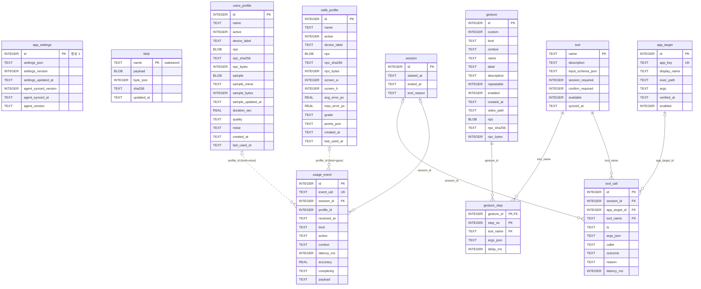

# SIA ERD

SIA 백엔드의 데이터 모델이다. 통신 계약은 [프로토콜.md](프로토콜.md), REST · MCP 규격은 [API명세서.md](API명세서.md)에 있다.

## 목차

| 절 | 내용 |
|---|---|
| [0](#0-개요) | 개요 — DBMS · 마이그레이션 · 표기 규칙 |
| [1](#1-erd) | ERD 다이어그램 |
| [2](#2-테이블-정의) | 테이블 정의 (11개) |
| [3](#3-관계--제약--인덱스) | 관계 · 제약 · 인덱스 |
| [4](#4-열거값) | 열거값 |
| [5](#5-초기-데이터) | 초기 데이터 |
| [6](#6-보존-정책과-파일-시스템) | 보존 정책과 파일 시스템 |
| [7](#7-부록--erdcloud-import-sql) | 부록 — ERDCloud import SQL |

---

## 0. 개요

| 항목 | 값 |
|---|---|
| DBMS | SQLite (WAL 모드, `foreign_keys = ON`, `busy_timeout = 5000`) |
| DB 파일 | `sia.db`. 환경변수 `SIA_DB_URL` 로 JDBC URL 을 대체할 수 있다 (기본 `jdbc:sqlite:sia.db`) |
| 스키마 관리 | Flyway. `src/main/resources/db/migration/V1__init_schema.sql` 이 스키마의 정의다 |
| 접근 방식 | JdbcTemplate 직접 SQL. ORM 을 쓰지 않는다 |
| 테이블 수 | 11 |

### 표기 규칙

| 논리 타입 | SQLite 물리 타입 | 규칙 |
|---|---|---|
| BIGINT PK | `INTEGER PRIMARY KEY AUTOINCREMENT` | id 는 서버가 발급한다 |
| TINYINT 0/1 | `INTEGER` + `CHECK (col IN (0, 1))` | boolean 은 0/1 정수로 저장한다 |
| TIMESTAMPTZ | `TEXT` | UTC `yyyy-MM-dd HH:mm:ss.SSS` 23자 고정폭. 시각 생성 · 비교 값은 전부 Java 가 바인딩한다. SQL 의 `datetime('now')` 는 쓰지 않는다 |
| VARCHAR(n) | `TEXT` | 길이 제한은 서비스 계층이 절단으로 강제한다 |
| DECIMAL | `REAL` | |
| BLOB | `BLOB` | npz · 오디오 바이너리 원본 |

- 모든 제약(PK · FK · UNIQUE · CHECK)은 `CREATE TABLE` 안에 인라인으로 선언된다.
- FK 컬럼 인덱스는 명시적으로 생성한다 (§3.3).

---

## 1. ERD



점선 관계(`voice_profile` · `calib_profile` → `usage_event`)는 FK 가 없는 논리 관계다. `usage_event.kind` 가 참조 대상 테이블을 결정한다.

### 테이블 역할 요약

| 그룹 | 테이블 | 역할 |
|---|---|---|
| 설정 | `app_settings` | 설정 JSON 싱글턴과 AI 동기화 상태 |
| 사용자 데이터 | `blob` | 이름이 고정된 전역 npz (호출어 모델) |
| 사용자 데이터 | `voice_profile` | 보이스(화자) 프로필. 최대 4개 |
| 사용자 데이터 | `calib_profile` | 시선 보정 프로필. 최대 4개 |
| 도구 | `tool` | MCP 도구 카탈로그의 DB 투영 |
| 도구 | `app_target` | `app.launch` 가 실행할 수 있는 앱 화이트리스트 |
| 제스처 | `gesture` | 제스처 정의 (기본 제공 + 커스텀) |
| 제스처 | `gesture_step` | 제스처 매크로의 단계 (도구 + 인자) |
| 기록 | `session` | 세션 수명 기록 |
| 기록 | `tool_call` | 도구 호출 기록 |
| 기록 | `usage_event` | AI 가 보내는 통계 이벤트 |

---

## 2. 테이블 정의

### 2.1 `app_settings` — 설정 싱글턴

행은 항상 1개(`id = 1`)다.

| 컬럼 | 타입 | NULL | 기본값 | 설명 |
|---|---|:-:|---|---|
| `id` | INTEGER | N | — | PK. `CHECK (id = 1)` |
| `settings_json` | TEXT | N | — | 설정 JSON 원문. 알려진 키 8종(`wakeWord` · `sessionSeconds` · `autoStart` · `gazeCursor` · `micDevice` · `cameraDevice` · `micDeviceId` · `cameraDeviceId`)은 서비스 계층이 존재 · 타입을 보장하고, 그 밖의 키는 그대로 보존한다 |
| `settings_version` | INTEGER | N | `1` | 저장마다 +1 |
| `settings_updated_at` | TEXT | Y | — | 마지막 저장 시각 |
| `agent_synced_version` | INTEGER | Y | — | AI 가 마지막으로 받은 `settings_version`. 이 값이 `settings_version` 보다 작으면 AI 에 미반영 |
| `agent_synced_at` | TEXT | Y | — | AI 가 마지막으로 설정을 받은 시각 |
| `agent_version` | TEXT | Y | — | AI 가 `hello` 로 보낸 빌드 버전 |

### 2.2 `blob` — 고정 이름 전역 npz

| 컬럼 | 타입 | NULL | 기본값 | 설명 |
|---|---|:-:|---|---|
| `name` | TEXT | N | — | PK. `CHECK (name IN ('wakeword'))` |
| `payload` | BLOB | N | — | npz 바이너리 원본 |
| `byte_size` | INTEGER | N | — | `CHECK (byte_size BETWEEN 1 AND 5242880)` |
| `sha256` | TEXT | N | — | AI 캐시 무효화 기준. REST GET 의 ETag |
| `updated_at` | TEXT | N | — | 마지막 저장 시각 |

| `name` | 내용 |
|---|---|
| `wakeword` | 호출어 모델 (이름 불러보기 10샘플) |

커스텀 제스처 템플릿은 이 테이블이 아니라 `gesture.npz` 에 제스처별로 저장한다 (§2.8). 보이스 · 보정 npz 는 `voice_profile` · `calib_profile` 이다.

### 2.3 `voice_profile` — 보이스(화자) 프로필

최대 4개. 사용 중(`active = 1`)은 최대 1개. 개수 · 활성 규칙은 서비스 계층이 강제한다. 등록 진행 중 임시본은 DB 가 아니라 메모리에 있으며 커밋된 확정본만 행이 된다.

| 컬럼 | 타입 | NULL | 기본값 | 설명 |
|---|---|:-:|---|---|
| `id` | INTEGER | N | 자동 | PK |
| `name` | TEXT | N | — | 표시 이름. 기본 `내 목소리 N` |
| `active` | INTEGER | N | `0` | `CHECK (0, 1)`. 사용 중 = 1 |
| `device_label` | TEXT | Y | — | 등록 당시 마이크 이름 (OS 원문). 장비 교체 자동 맵핑 키. NULL 이면 맵핑 후보에서 제외 |
| `npz` | BLOB | Y | — | 화자 임베딩 npz |
| `npz_sha256` | TEXT | Y | — | ETag · 캐시 무효화 기준 |
| `npz_bytes` | INTEGER | Y | — | npz 크기 |
| `sample` | BLOB | Y | — | 재생용 샘플 오디오. 등록 녹음이며 이후 화자 인식 시 마지막 발화로 갱신된다 |
| `sample_mime` | TEXT | Y | — | `audio/webm` \| `audio/wav` |
| `sample_bytes` | INTEGER | Y | — | 샘플 크기 |
| `sample_updated_at` | TEXT | Y | — | 샘플 갱신 시각 |
| `duration_sec` | REAL | Y | — | 샘플 길이(초) |
| `quality` | TEXT | Y | — | 녹음 품질 표기. AI 판정 문자열 그대로 (예: `양호`) |
| `noise` | TEXT | Y | — | 주변 소음 표기. `낮음` \| `높음` |
| `created_at` | TEXT | N | — | 등록일 |
| `last_used_at` | TEXT | Y | — | 최근 사용일. 활성 전환 시각 |

### 2.4 `calib_profile` — 시선 보정 프로필

규칙은 `voice_profile` 과 같다. 보정 정확도와 오차 등급, 산점도, 학습 해상도를 함께 저장한다.

| 컬럼 | 타입 | NULL | 기본값 | 설명 |
|---|---|:-:|---|---|
| `id` | INTEGER | N | 자동 | PK |
| `name` | TEXT | N | — | 표시 이름. 기본 `내 보정 N` |
| `active` | INTEGER | N | `0` | `CHECK (0, 1)`. 사용 중 = 1 |
| `device_label` | TEXT | Y | — | 등록 당시 카메라 이름 (OS 원문). 장비 교체 자동 맵핑 키 |
| `npz` | BLOB | Y | — | 보정 npz |
| `npz_sha256` | TEXT | Y | — | ETag · 캐시 무효화 기준 |
| `npz_bytes` | INTEGER | Y | — | npz 크기 |
| `screen_w` | INTEGER | Y | — | 학습 화면 폭. 현재 해상도와 다르면 재보정 대상 |
| `screen_h` | INTEGER | Y | — | 학습 화면 높이 |
| `avg_error_px` | REAL | Y | — | 평균 오차 |
| `max_error_px` | REAL | Y | — | 최대 오차 |
| `grade` | TEXT | Y | — | `CHECK ('excellent', 'good', 'poor')`. 오차 등급. 판정 기준은 AI 서버가 관리하고 BE 는 받아 적는다. V2 이전에 만든 행은 `NULL` |
| `points_json` | TEXT | Y | — | 산점도 `[{n, dx, dy}]`. 목표점을 원점으로 둔 오차 벡터 |
| `created_at` | TEXT | N | — | 등록일 |
| `last_used_at` | TEXT | Y | — | 최근 사용일. 활성 전환 시각 |

### 2.5 `tool` — 도구 카탈로그

도구 목록의 원천은 코드(`ToolCatalog`)다. 기동 시 코드가 이 테이블에 UPSERT 한다. 기록 테이블이 FK 로 참조하므로 행은 삭제하지 않고 `available` 로 가용 여부를 표시한다.

| 컬럼 | 타입 | NULL | 기본값 | 설명 |
|---|---|:-:|---|---|
| `name` | TEXT | N | — | PK. MCP 도구 이름 (예: `app.launch`) |
| `description` | TEXT | N | — | LLM 에 노출되는 설명 원문 |
| `input_schema_json` | TEXT | N | — | 인자 JSON Schema |
| `session_required` | INTEGER | N | `0` | `CHECK (0, 1)`. S 플래그 |
| `confirm_required` | INTEGER | N | `0` | `CHECK (0, 1)`. C 플래그. MCP `destructiveHint` 로 노출된다 |
| `available` | INTEGER | N | `1` | `CHECK (0, 1)`. 이번 기동에 등록되었는가 |
| `synced_at` | TEXT | N | — | 마지막 동기화 시각 |

### 2.6 `session` — 세션 기록

| 컬럼 | 타입 | NULL | 기본값 | 설명 |
|---|---|:-:|---|---|
| `id` | INTEGER | N | 자동 | PK |
| `started_at` | TEXT | N | — | 개시 시각 (BE 시계) |
| `ended_at` | TEXT | Y | — | 종료 시각. NULL 이면 진행 중. `CHECK (ended_at IS NULL OR ended_at >= started_at)` |
| `end_reason` | TEXT | Y | — | `CHECK (NULL \| 'EXPIRED' \| 'STOPPED' \| 'WATCHDOG' \| 'SHUTDOWN')` |

### 2.7 `app_target` — 앱 화이트리스트

행은 사용자 등록(`POST /api/apps`) · 스캔 일괄 등록(`POST /api/apps/scan`) · BE 기동 시드(Windows 기본 앱 `notepad` · `calc`)로 생긴다. `app.launch` 는 이 테이블의 `enabled = 1` 행만 실행한다.

| 컬럼 | 타입 | NULL | 기본값 | 설명 |
|---|---|:-:|---|---|
| `id` | INTEGER | N | 자동 | PK |
| `app_key` | TEXT | N | — | UNIQUE. `app.launch` 가 받는 키 (`app:<key>`) |
| `display_name` | TEXT | N | — | 표시 이름 |
| `exec_path` | TEXT | N | — | 실행 파일 절대 경로. 사용자 등록 또는 스캔 일괄 등록으로 채워진다. LLM 이 채울 수 없다 |
| `args` | TEXT | N | `''` | 실행 인자 |
| `verified_at` | TEXT | Y | — | 마지막으로 실행 파일 존재를 확인한 시각. NULL 이면 마지막 검사에서 없었다 |
| `enabled` | INTEGER | N | `1` | `CHECK (0, 1)`. 0 이면 `app.launch` · `app.list` 대상에서 제외 |

### 2.8 `gesture` — 제스처 정의

매핑의 원천 테이블이다. 기본 제공 제스처는 `custom = 0`, 커스텀 제스처는 `custom = 1` 이며 템플릿 npz 를 같은 행에 갖는다 (제스처별 npz 1개).

| 컬럼 | 타입 | NULL | 기본값 | 설명 |
|---|---|:-:|---|---|
| `id` | INTEGER | N | 자동 | PK. AI 가 템플릿을 내려받는 키 (`GET /api/agent/gestures/{id}/npz`) |
| `custom` | INTEGER | N | `0` | `CHECK (0, 1)`. 1 = 사용자 등록 (템플릿 보유), 0 = 기본 제공 |
| `kind` | TEXT | N | — | `CHECK ('HAND' \| 'FACE')` |
| `context` | TEXT | Y | — | 적용 컨텍스트 (`video` \| `youtube`). NULL = 컨텍스트 제약 없는 기본 매핑 |
| `name` | TEXT | N | — | 제스처 이름. 기본 제공은 MediaPipe 이름, 커스텀은 사용자 지정 |
| `label` | TEXT | Y | — | UI 표시용 이름 |
| `description` | TEXT | Y | — | 설명 |
| `repeatable` | INTEGER | N | `0` | `CHECK (0, 1)`. 반복 가능 여부. 반복 단위는 매크로 전체다 |
| `enabled` | INTEGER | N | `1` | `CHECK (0, 1)`. 0 이면 AI 감지 제외 + BE 실행 차단 |
| `created_at` | TEXT | Y | — | 등록일. 기본 제공은 NULL |
| `video_path` | TEXT | Y | — | 등록 영상 파일명 (`gestures/` 디렉터리). 기본 제공은 NULL |
| `npz` | BLOB | Y | — | 템플릿 npz. 커스텀은 항상 값이 있고 기본 제공은 NULL. PC 밖 반출 금지 |
| `npz_sha256` | TEXT | Y | — | AI 캐시 무효화 기준. REST GET 의 ETag |
| `npz_bytes` | INTEGER | Y | — | npz 크기 (1 ~ 5242880) |

UNIQUE `(kind, context, name)`.

### 2.9 `gesture_step` — 매크로 단계

| 컬럼 | 타입 | NULL | 기본값 | 설명 |
|---|---|:-:|---|---|
| `gesture_id` | INTEGER | N | — | FK → `gesture.id` (`ON DELETE CASCADE`) |
| `tool_name` | TEXT | N | — | FK → `tool.name`. C 도구는 서비스 계층이 거절한다 |
| `step_no` | INTEGER | N | — | 1부터. 이 순서로 실행한다. `CHECK (step_no >= 1)`. 최대 5단계 (서비스 계층 강제) |
| `args_json` | TEXT | N | `'{}'` | 이 단계에 고정된 인자 (예: `{"dir":"up"}`, `{"path":"C:\\..."}`) |
| `delay_ms` | INTEGER | Y | — | 이 단계 실행 전 대기(ms) |

UNIQUE `(gesture_id, step_no)`.

### 2.10 `tool_call` — 도구 호출 기록

모든 도구 호출이 기록된다. 예외: `session.extend` · `session.cancel`.

| 컬럼 | 타입 | NULL | 기본값 | 설명 |
|---|---|:-:|---|---|
| `id` | INTEGER | N | 자동 | PK |
| `session_id` | INTEGER | Y | — | FK → `session.id` (`ON DELETE SET NULL`). 세션 없이 실행된 읽기 전용 도구는 NULL |
| `app_target_id` | INTEGER | Y | — | FK → `app_target.id` (`ON DELETE SET NULL`). `app.launch` 만 채워진다 |
| `tool_name` | TEXT | N | — | FK → `tool.name` |
| `ts` | TEXT | N | — | 호출 시각 (BE 시계) |
| `args_json` | TEXT | N | `'{}'` | 인자 JSON. 500자를 넘으면 `{"_truncated","_preview"}` 객체로 대체 — 깨진 JSON 을 저장하지 않는다 |
| `caller` | TEXT | N | — | `CHECK ('LLM' \| 'GESTURE' \| 'UI')`. 실제 생성 값은 `LLM` · `GESTURE` |
| `outcome` | TEXT | N | — | `CHECK ('EXECUTED' \| 'BLOCKED' \| 'FAILED')` |
| `reason` | TEXT | Y | — | 차단 · 실패 사유. 255자로 절단. 성공은 NULL |
| `latency_ms` | INTEGER | Y | — | 게이트 진입부터 반환까지(ms) |

### 2.11 `usage_event` — 통계 이벤트

AI 가 `POST /api/agent/events` 로 보내는 이벤트와 BE 가 스스로 기록하는 `calibration` 이벤트다.

| 컬럼 | 타입 | NULL | 기본값 | 설명 |
|---|---|:-:|---|---|
| `id` | INTEGER | N | 자동 | PK |
| `event_uid` | TEXT | N | — | UNIQUE. 이벤트 UUID. 재전송 중복 제거 기준 |
| `session_id` | INTEGER | Y | — | FK → `session.id` (`ON DELETE SET NULL`). 존재하지 않는 id 는 NULL 로 낮춰 저장 |
| `profile_id` | INTEGER | Y | — | `kind = voice` 면 `voice_profile.id`, `kind = gaze` 면 `calib_profile.id`. FK 없음 |
| `received_at` | TEXT | N | — | 수신 시각 (BE 시계) |
| `kind` | TEXT | N | — | 자유 문자열. 대시보드 축은 `voice` · `gaze` · `gesture` · `command` · `voice-rejected` · `calibration` |
| `action` | TEXT | Y | — | 자유 문자열 |
| `context` | TEXT | Y | — | 자유 문자열 |
| `latency_ms` | INTEGER | Y | — | 지연(ms). `kind = command` 면 사용자 체감 응답 시간 |
| `accuracy` | REAL | Y | — | `CHECK (NULL \| 0.0 ~ 1.0)`. 인식 신뢰도. 범위 밖 값은 서비스 계층이 NULL 로 낮춘다 |
| `complexity` | TEXT | Y | — | `CHECK (NULL \| 'SIMPLE' \| 'COMPLEX')`. `kind = command` 의 축 |
| `payload` | TEXT | N | — | 나머지 지표 JSON. 1000자를 넘으면 `{"_truncated","_preview"}` 객체로 대체 |

---

## 3. 관계 · 제약 · 인덱스

### 3.1 외래 키

| 자식 | 컬럼 | 부모 | ON DELETE | 비고 |
|---|---|---|---|---|
| `gesture_step` | `gesture_id` | `gesture.id` | CASCADE | 제스처 삭제 시 단계도 삭제. 템플릿 npz 는 같은 행이라 함께 사라진다 |
| `gesture_step` | `tool_name` | `tool.name` | (제한) | `tool` 행은 삭제하지 않는다 |
| `tool_call` | `session_id` | `session.id` | SET NULL | |
| `tool_call` | `app_target_id` | `app_target.id` | SET NULL | 앱 등록 해제 후에도 기록은 남는다 |
| `tool_call` | `tool_name` | `tool.name` | (제한) | |
| `usage_event` | `session_id` | `session.id` | SET NULL | |

`usage_event.profile_id` 는 FK 를 걸지 않는다. `kind` 가 참조 테이블(`voice_profile` 또는 `calib_profile`)을 결정한다.

### 3.2 UNIQUE · CHECK

| 테이블 | 제약 |
|---|---|
| `app_settings` | `CHECK (id = 1)` |
| `blob` | `CHECK (name IN ('wakeword'))`, `CHECK (byte_size BETWEEN 1 AND 5242880)` |
| `voice_profile` · `calib_profile` | `CHECK (active IN (0, 1))` |
| `calib_profile` | `CHECK (grade IS NULL OR grade IN ('excellent', 'good', 'poor'))` |
| `tool` | `CHECK (session_required IN (0, 1))`, `CHECK (confirm_required IN (0, 1))`, `CHECK (available IN (0, 1))` |
| `session` | `CHECK (end_reason IS NULL OR end_reason IN ('EXPIRED', 'STOPPED', 'WATCHDOG', 'SHUTDOWN'))`, `CHECK (ended_at IS NULL OR ended_at >= started_at)` |
| `app_target` | `UNIQUE (app_key)`, `CHECK (enabled IN (0, 1))` |
| `gesture` | `UNIQUE (kind, context, name)`, `CHECK (custom IN (0, 1))`, `CHECK (kind IN ('HAND', 'FACE'))`, `CHECK (repeatable IN (0, 1))`, `CHECK (enabled IN (0, 1))` |
| `gesture_step` | `UNIQUE (gesture_id, step_no)`, `CHECK (step_no >= 1)` |
| `tool_call` | `CHECK (caller IN ('LLM', 'GESTURE', 'UI'))`, `CHECK (outcome IN ('EXECUTED', 'BLOCKED', 'FAILED'))` |
| `usage_event` | `UNIQUE (event_uid)`, `CHECK (accuracy IS NULL OR (accuracy >= 0.0 AND accuracy <= 1.0))`, `CHECK (complexity IS NULL OR complexity IN ('SIMPLE', 'COMPLEX'))` |

SQLite 의 UNIQUE 는 NULL 값끼리 충돌하지 않는다. `gesture (kind, context, name)` 에서 `context IS NULL` 인 행의 중복 검사는 서비스 계층이 직접 조회해 수행한다.

### 3.3 인덱스

| 인덱스 | 테이블 | 컬럼 | 용도 |
|---|---|---|---|
| `idx_tool_call_ts` | `tool_call` | `ts DESC` | 실행 기록 최신순 조회 |
| `idx_tool_call_tool` | `tool_call` | `tool_name, ts DESC` | 도구별 집계 |
| `idx_tool_call_session` | `tool_call` | `session_id` | 세션별 호출 수 |
| `idx_event_recv` | `usage_event` | `received_at DESC` | 기간 조회 |
| `idx_event_kind` | `usage_event` | `kind, received_at DESC` | 종류별 기간 집계 |
| `idx_event_session` | `usage_event` | `session_id` | 세션별 조회 |
| `idx_event_profile` | `usage_event` | `profile_id, kind, received_at DESC` | 프로필별 정확도 집계 |
| `idx_session_started` | `session` | `started_at DESC` | 세션 기록 최신순 |
| `idx_gesture_step_tool` | `gesture_step` | `tool_name` | 도구 가용성 조인 |
| `idx_gesture_custom` | `gesture` | `custom` | 커스텀 / 기본 필터 |

### 3.4 서비스 계층이 강제하는 규칙

| 규칙 | 대상 |
|---|---|
| 프로필 종류별 최대 4개, 활성 최대 1개 | `voice_profile` · `calib_profile` |
| 사용 중 프로필과 마지막 1개는 삭제 불가 | `voice_profile` · `calib_profile` |
| 매크로 단계 최대 5개, C 도구 금지 | `gesture_step` |
| 기본 제공 제스처(`custom = 0`)는 삭제 · 수정 불가 (켜기/끄기만 허용). 같은 이름으로 커스텀을 만들 수 없다 | `gesture` |
| 커스텀 제스처는 `kind = 'HAND'` 고정 | `gesture` |
| 커스텀 제스처는 템플릿 npz (1 ~ 5MB) 없이 저장할 수 없다 | `gesture` |
| `tool` 행은 삭제하지 않고 `available` 로 표시 | `tool` |
| 길이 제한: `tool_call.args_json` 500자 · `usage_event.payload` 1000자 — 넘치면 `{"_truncated","_preview"}` 객체로 대체해 JSON 을 유지한다. `tool_call.reason` 255자는 평문이라 그대로 자른다 | `tool_call` · `usage_event` |
| `usage_event.accuracy` 범위 밖 · `complexity` 미지 값은 NULL 로 낮춘다 | `usage_event` |

---

## 4. 열거값

| 테이블.컬럼 | 값 |
|---|---|
| `blob.name` | `wakeword` |
| `session.end_reason` | `EXPIRED` · `STOPPED` · `WATCHDOG` · `SHUTDOWN` |
| `gesture.kind` | `HAND` · `FACE` |
| `gesture.context` | NULL(기본) · `video` · `youtube` |
| `tool_call.caller` | `LLM` · `GESTURE` (`UI` 는 CHECK 에만 있는 예약값) |
| `tool_call.outcome` | `EXECUTED` · `BLOCKED` · `FAILED` |
| `usage_event.kind` (대시보드 축) | `voice` · `gaze` · `gesture` · `command` · `voice-rejected` · `calibration` |
| `usage_event.complexity` | `SIMPLE` · `COMPLEX` |
| `voice_profile.sample_mime` | `audio/webm` · `audio/wav` |
| `voice_profile.noise` | `낮음` · `높음` |

---

## 5. 초기 데이터

### 5.1 마이그레이션 시드 — `app_settings`

V1 마이그레이션이 넣는 행은 설정 싱글턴 하나다.

```json
{"wakeWord":"시아","sessionSeconds":15,"autoStart":true,"gazeCursor":false,"micDevice":null,"cameraDevice":null,"micDeviceId":null,"cameraDeviceId":null}
```

### 5.2 기동 시 코드가 넣는 데이터

| 순서 | 대상 | 조건 | 내용 |
|---|---|---|---|
| 1 | `tool` | 매 기동 | 코드의 도구 카탈로그 30개를 UPSERT 한다. 카탈로그에 없는 기존 행은 `available = 0` 으로 바꾼다 |
| 2 | `gesture` · `gesture_step` | `gesture` 가 비어 있을 때만 | 기본 제스처 매핑 11건 |

`tool` 28행:

| name | S | C |
|---|:-:|:-:|
| `context.get` | 0 | 0 |
| `app.list` | 0 | 0 |
| `app.launch` | 1 | 0 |
| `window.list` | 0 | 0 |
| `window.focus` | 1 | 0 |
| `window.minimize` | 1 | 0 |
| `window.maximize` | 1 | 0 |
| `window.restore` | 1 | 0 |
| `window.resize` | 1 | 0 |
| `window.close` | 1 | 1 |
| `window.next` | 1 | 0 |
| `window.prev` | 1 | 0 |
| `explorer.items` | 0 | 0 |
| `scroll.step` | 1 | 0 |
| `media.play_pause` | 1 | 0 |
| `media.mute_toggle` | 1 | 0 |
| `media.next` | 1 | 0 |
| `media.prev` | 1 | 0 |
| `volume.step` | 1 | 0 |
| `volume.set` | 1 | 0 |
| `files.open` | 1 | 0 |
| `files.delete` | 1 | 1 |
| `files.save` | 1 | 0 |
| `system.lock` | 1 | 0 |
| `screen.capture` | 1 | 0 |
| `screen.capture_region` | 1 | 0 |
| `session.extend` | 1 | 0 |
| `session.cancel` | 1 | 0 |

기본 제스처 매핑 11건 (`custom = 0`, `npz = NULL`, `enabled = 1`, `created_at = NULL`):

| kind | context | name | label | repeatable | step 1 tool | step 1 args |
|---|---|---|---|:-:|---|---|
| HAND | NULL | `Open_Palm` | 세션 연장 | 0 | `session.extend` | `{}` |
| HAND | NULL | `Thumb_Up` | 위로 스크롤 | 1 | `scroll.step` | `{"dir":"up"}` |
| HAND | NULL | `Thumb_Down` | 아래로 스크롤 | 1 | `scroll.step` | `{"dir":"down"}` |
| HAND | NULL | `Closed_Fist` | 재생/일시정지 | 0 | `media.play_pause` | `{}` |
| HAND | `video` | `Open_Palm` | 재생/일시정지 | 0 | `media.play_pause` | `{}` |
| HAND | `video` | `Victory` | 음소거 | 0 | `media.mute_toggle` | `{}` |
| HAND | `video` | `Thumb_Up` | 볼륨 올리기 | 1 | `volume.step` | `{"dir":"up"}` |
| HAND | `video` | `Thumb_Down` | 볼륨 내리기 | 1 | `volume.step` | `{"dir":"down"}` |
| HAND | `youtube` | `Pointing_Up` | 다음 영상 | 0 | `media.next` | `{}` |
| FACE | NULL | `brow_raise` | 예 | 0 | (없음) | — |
| FACE | NULL | `smile` | 아니오 | 0 | (없음) | — |

FACE 2건은 단계가 없다. 확인 응답(예/아니오)은 AI 가 직접 처리하므로 BE 쪽 실행 대상이 없다. `GET /api/gestures?dangling=true` 에 `runnable: false` 로 나타난다.

전체 삭제(`DELETE /api/data`) 후에도 같은 11건이 복원된다.

---

## 6. 보존 정책과 파일 시스템

### 6.1 보존 정책

| 대상 | 보존 | 실행 |
|---|---|---|
| `usage_event` (`received_at` 기준) | 400일 롤링 | BE 기동 시 1회 + 매일 04:00 |
| `tool_call` (`ts` 기준) | 400일 롤링 | 같음 |
| `session` (`started_at` 기준, 종료된 세션만) | 400일 롤링 | 같음 |
| `app_settings` · `blob` · `voice_profile` · `calib_profile` · `tool` · `app_target` · `gesture` · `gesture_step` | 영구 | 정리 대상 아님 |

### 6.2 파일 시스템 자산

DB 밖에 두는 자산이다. 루트는 `%APPDATA%/SIA` 이며 (`APPDATA` 가 없으면 `~/.sia`), 환경변수 `SIA_DATA_DIR` 로 대체할 수 있다.

| 경로 | 내용 | 참조 |
|---|---|---|
| `runtime.json` | `{token, port, pid}`. BE 기동 시 1회 기록 | AI 가 접속 시 읽는다 |
| `previews/{tempId}-{take}.webm` | 제스처 등록 미리보기 영상 (임시) | `GET /api/previews/{tempId}-{take}.webm` |
| `gestures/g{gestureId}.webm` | 제스처 등록 영상 (영구). 파일명이 `gesture.video_path` | `GET /api/gestures/{id}/video` |
| `models/` | 다운로드 · sha256 검증이 끝난 모델 파일 | `model_load {name, path}` |
| `models.json` | 모델 목록. 없으면 classpath 의 `models.json` | 부팅 시 읽는다 |
| `tmp/` | 다운로드 임시 파일 | — |
| `~/Documents/SIA/` | `files.save` 의 저장 위치 | MCP `files.save` |
| `~/Pictures/SIA/capture_yyyyMMdd_HHmmss.png` | `screen.capture` · `screen.capture_region` 이 저장한 캡처 PNG | MCP `screen.capture` · `screen.capture_region` · `GET /api/captures/{file}` |

`previews/` · `gestures/` 의 영상은 사용자 카메라 영상이며 PC 밖으로 내보내지 않는다. 전체 삭제 시 `gestures/` 의 파일은 모두 삭제된다.

---

## 7. 부록 — ERDCloud import SQL

ERDCloud 에 붙여 넣기 위한 MySQL 문법 표현이다. 물리 스키마는 SQLite 이며 타입 대응은 §0 의 표기 규칙을 따른다.

```sql
CREATE TABLE `app_settings` (
	`id`	BIGINT	NOT NULL	COMMENT '항상 1. 싱글턴',
	`settings_json`	TEXT	NOT NULL	COMMENT '설정 JSON 원문. 알려진 키 8종(wakeWord·sessionSeconds·autoStart·gazeCursor·micDevice·cameraDevice·micDeviceId·cameraDeviceId)은 서비스 계층이 존재·타입 보장, 그 밖의 키는 보존',
	`settings_version`	INT	NOT NULL	DEFAULT 1	COMMENT '저장마다 +1',
	`settings_updated_at`	TIMESTAMPTZ	NULL	COMMENT 'UTC yyyy-MM-dd HH:mm:ss.SSS',
	`agent_synced_version`	INT	NULL	COMMENT 'AI 가 마지막으로 받은 settings_version',
	`agent_synced_at`	TIMESTAMPTZ	NULL	COMMENT 'UTC yyyy-MM-dd HH:mm:ss.SSS',
	`agent_version`	VARCHAR(64)	NULL	COMMENT 'AI 가 hello 로 보낸 빌드 버전'
);

CREATE TABLE `blob` (
	`name`	VARCHAR(32)	NOT NULL	COMMENT 'wakeword',
	`payload`	BLOB	NOT NULL	COMMENT 'npz 바이너리 원본',
	`byte_size`	INT	NOT NULL	COMMENT '1 ~ 5242880 바이트',
	`sha256`	VARCHAR(64)	NOT NULL	COMMENT 'AI 캐시 무효화 기준. GET 의 ETag',
	`updated_at`	TIMESTAMPTZ	NOT NULL	COMMENT 'UTC yyyy-MM-dd HH:mm:ss.SSS'
);

CREATE TABLE `voice_profile` (
	`id`	BIGINT	NOT NULL,
	`name`	VARCHAR(64)	NOT NULL	COMMENT '기본 "내 목소리 N". 사용자 변경 가능',
	`active`	TINYINT	NOT NULL	DEFAULT 0	COMMENT '0 | 1. 사용 중 = 1. 최대 1개',
	`device_label`	VARCHAR(128)	NULL	COMMENT '등록 당시 마이크 이름(OS 원문). 장비 교체 자동 맵핑 키. NULL 이면 맵핑 후보 제외',
	`npz`	BLOB	NULL	COMMENT '화자 임베딩 npz. PC 밖 반출 금지',
	`npz_sha256`	VARCHAR(64)	NULL	COMMENT 'AI 캐시 무효화 기준. GET 의 ETag',
	`npz_bytes`	INT	NULL,
	`sample`	BLOB	NULL	COMMENT '재생용 샘플 오디오. 등록 녹음이며 화자 인식 시 마지막 발화로 갱신',
	`sample_mime`	VARCHAR(32)	NULL	COMMENT 'audio/webm | audio/wav',
	`sample_bytes`	INT	NULL,
	`sample_updated_at`	TIMESTAMPTZ	NULL,
	`duration_sec`	DECIMAL(6,2)	NULL	COMMENT '샘플 길이(초)',
	`quality`	VARCHAR(16)	NULL	COMMENT '녹음 품질 표기. AI 판정 문자열 그대로',
	`noise`	VARCHAR(16)	NULL	COMMENT '주변 소음 표기. 낮음 | 높음',
	`created_at`	TIMESTAMPTZ	NOT NULL	COMMENT '등록일',
	`last_used_at`	TIMESTAMPTZ	NULL	COMMENT '최근 사용일. 활성 전환 시각'
);

CREATE TABLE `calib_profile` (
	`id`	BIGINT	NOT NULL,
	`name`	VARCHAR(64)	NOT NULL	COMMENT '기본 "내 보정 N". 사용자 변경 가능',
	`active`	TINYINT	NOT NULL	DEFAULT 0	COMMENT '0 | 1. 사용 중 = 1. 최대 1개',
	`device_label`	VARCHAR(128)	NULL	COMMENT '등록 당시 카메라 이름(OS 원문). 장비 교체 자동 맵핑 키. NULL 이면 맵핑 후보 제외',
	`npz`	BLOB	NULL	COMMENT '보정 npz. PC 밖 반출 금지',
	`npz_sha256`	VARCHAR(64)	NULL,
	`npz_bytes`	INT	NULL,
	`screen_w`	INT	NULL	COMMENT '학습 화면 폭. 현재 해상도와 다르면 재보정 대상',
	`screen_h`	INT	NULL,
	`avg_error_px`	DECIMAL(7,2)	NULL	COMMENT '평균 오차',
	`max_error_px`	DECIMAL(7,2)	NULL	COMMENT '최대 오차',
	`grade`	VARCHAR(16)	NULL	COMMENT 'excellent | good | poor. 오차 등급. 판정 기준은 AI 서버 관리',
	`points_json`	TEXT	NULL	COMMENT '산점도 [{n,dx,dy}]. 목표점 기준 오차 벡터',
	`created_at`	TIMESTAMPTZ	NOT NULL	COMMENT '등록일',
	`last_used_at`	TIMESTAMPTZ	NULL	COMMENT '최근 사용일. 활성 전환 시각'
);

CREATE TABLE `tool` (
	`name`	VARCHAR(64)	NOT NULL	COMMENT 'MCP 도구 이름. 카탈로그 30개',
	`description`	TEXT	NOT NULL	COMMENT 'LLM 에 노출되는 설명 원문',
	`input_schema_json`	TEXT	NOT NULL	COMMENT '인자 JSON Schema',
	`session_required`	TINYINT	NOT NULL	DEFAULT 0	COMMENT '0 | 1. S 플래그',
	`confirm_required`	TINYINT	NOT NULL	DEFAULT 0	COMMENT '0 | 1. C 플래그. MCP destructiveHint 로 노출',
	`available`	TINYINT	NOT NULL	DEFAULT 1	COMMENT '0 | 1. 이번 기동에 등록되었는가. 행은 삭제하지 않는다',
	`synced_at`	TIMESTAMPTZ	NOT NULL	COMMENT 'UTC yyyy-MM-dd HH:mm:ss.SSS'
);

CREATE TABLE `session` (
	`id`	BIGINT	NOT NULL,
	`started_at`	TIMESTAMPTZ	NOT NULL	COMMENT '개시 시각 (BE 시계)',
	`ended_at`	TIMESTAMPTZ	NULL	COMMENT 'NULL 이면 진행 중. started_at 이상',
	`end_reason`	VARCHAR(16)	NULL	COMMENT 'EXPIRED | STOPPED | WATCHDOG | SHUTDOWN'
);

CREATE TABLE `app_target` (
	`id`	BIGINT	NOT NULL,
	`app_key`	VARCHAR(64)	NOT NULL	COMMENT 'app.launch 가 받는 키 (app:<key>)',
	`display_name`	VARCHAR(128)	NOT NULL,
	`exec_path`	VARCHAR(512)	NOT NULL	COMMENT '실행 파일 절대 경로. 사용자 등록 또는 스캔 일괄 등록. LLM 이 채울 수 없다',
	`args`	VARCHAR(512)	NOT NULL	DEFAULT '',
	`verified_at`	TIMESTAMPTZ	NULL	COMMENT '실행 파일 존재를 마지막으로 확인한 시각. NULL 이면 마지막 검사에서 없었다',
	`enabled`	TINYINT	NOT NULL	DEFAULT 1	COMMENT '0 | 1'
);

CREATE TABLE `gesture` (
	`id`	BIGINT	NOT NULL,
	`custom`	TINYINT	NOT NULL	DEFAULT 0	COMMENT '0 | 1. 1 = 사용자 등록(템플릿 npz 보유), 0 = 기본 제공',
	`kind`	VARCHAR(8)	NOT NULL	COMMENT 'HAND | FACE',
	`context`	VARCHAR(32)	NULL	COMMENT 'NULL = 기본 매핑. video | youtube',
	`name`	VARCHAR(64)	NOT NULL	COMMENT '기본 제공은 MediaPipe 이름, 커스텀은 사용자 지정',
	`label`	VARCHAR(64)	NULL	COMMENT 'UI 표시용 이름',
	`description`	VARCHAR(500)	NULL,
	`repeatable`	TINYINT	NOT NULL	DEFAULT 0	COMMENT '0 | 1. 반복 단위는 매크로 전체',
	`enabled`	TINYINT	NOT NULL	DEFAULT 1	COMMENT '0 | 1. 0 이면 AI 감지 제외 + BE 실행 차단',
	`created_at`	TIMESTAMPTZ	NULL	COMMENT '등록일. 기본 제공은 NULL',
	`video_path`	VARCHAR(128)	NULL	COMMENT '등록 영상 파일명 (gestures/ 디렉터리). 기본 제공은 NULL',
	`npz`	BLOB	NULL	COMMENT '템플릿 npz. 제스처별 1개. 기본 제공은 NULL. PC 밖 반출 금지',
	`npz_sha256`	VARCHAR(64)	NULL	COMMENT 'AI 캐시 무효화 기준. GET 의 ETag',
	`npz_bytes`	INT	NULL
);

CREATE TABLE `gesture_step` (
	`gesture_id`	BIGINT	NOT NULL,
	`tool_name`	VARCHAR(64)	NOT NULL	COMMENT 'tool.name. C 도구 금지',
	`step_no`	INT	NOT NULL	COMMENT '1부터. 실행 순서. 최대 5단계',
	`args_json`	VARCHAR(500)	NOT NULL	DEFAULT '{}'	COMMENT '이 단계에 고정된 인자',
	`delay_ms`	INT	NULL	COMMENT '이 단계 실행 전 대기(ms)'
);

CREATE TABLE `tool_call` (
	`id`	BIGINT	NOT NULL,
	`session_id`	BIGINT	NULL	COMMENT '세션 없이 실행된 읽기 전용 도구는 NULL',
	`app_target_id`	BIGINT	NULL	COMMENT 'app.launch 만 채워진다',
	`tool_name`	VARCHAR(64)	NOT NULL	COMMENT 'tool.name',
	`ts`	TIMESTAMPTZ	NOT NULL	COMMENT '호출 시각 (BE 시계)',
	`args_json`	VARCHAR(500)	NOT NULL	DEFAULT '{}'	COMMENT '500자 초과 시 {"_truncated","_preview"} 객체로 대체',
	`caller`	VARCHAR(8)	NOT NULL	COMMENT 'LLM | GESTURE',
	`outcome`	VARCHAR(16)	NOT NULL	COMMENT 'EXECUTED | BLOCKED | FAILED',
	`reason`	VARCHAR(255)	NULL	COMMENT '차단·실패 사유. 성공은 NULL',
	`latency_ms`	INT	NULL
);

CREATE TABLE `usage_event` (
	`id`	BIGINT	NOT NULL,
	`event_uid`	VARCHAR(64)	NOT NULL	COMMENT '이벤트 UUID. 재전송 중복 제거 기준',
	`session_id`	BIGINT	NULL	COMMENT '존재하지 않는 id 는 NULL 로 저장',
	`profile_id`	BIGINT	NULL	COMMENT 'kind=voice → voice_profile.id / kind=gaze → calib_profile.id. FK 없음',
	`received_at`	TIMESTAMPTZ	NOT NULL	COMMENT '수신 시각 (BE 시계)',
	`kind`	VARCHAR(32)	NOT NULL	COMMENT '자유 문자열. 대시보드 축: voice | gaze | gesture | command | voice-rejected | calibration',
	`action`	VARCHAR(64)	NULL,
	`context`	VARCHAR(32)	NULL,
	`latency_ms`	INT	NULL	COMMENT 'kind=command 면 사용자 체감 응답 시간',
	`accuracy`	DECIMAL(4,3)	NULL	COMMENT '0.000 ~ 1.000 인식 신뢰도',
	`complexity`	VARCHAR(8)	NULL	COMMENT 'SIMPLE | COMPLEX',
	`payload`	TEXT	NOT NULL	COMMENT '나머지 지표 JSON. 1000자 초과 시 {"_truncated","_preview"} 객체로 대체'
);

ALTER TABLE `app_settings` ADD CONSTRAINT `PK_APP_SETTINGS` PRIMARY KEY (`id`);
ALTER TABLE `blob` ADD CONSTRAINT `PK_BLOB` PRIMARY KEY (`name`);
ALTER TABLE `voice_profile` ADD CONSTRAINT `PK_VOICE_PROFILE` PRIMARY KEY (`id`);
ALTER TABLE `calib_profile` ADD CONSTRAINT `PK_CALIB_PROFILE` PRIMARY KEY (`id`);
ALTER TABLE `tool` ADD CONSTRAINT `PK_TOOL` PRIMARY KEY (`name`);
ALTER TABLE `session` ADD CONSTRAINT `PK_SESSION` PRIMARY KEY (`id`);
ALTER TABLE `app_target` ADD CONSTRAINT `PK_APP_TARGET` PRIMARY KEY (`id`);
ALTER TABLE `gesture` ADD CONSTRAINT `PK_GESTURE` PRIMARY KEY (`id`);
ALTER TABLE `gesture_step` ADD CONSTRAINT `PK_GESTURE_STEP` PRIMARY KEY (`gesture_id`, `step_no`);
ALTER TABLE `tool_call` ADD CONSTRAINT `PK_TOOL_CALL` PRIMARY KEY (`id`);
ALTER TABLE `usage_event` ADD CONSTRAINT `PK_USAGE_EVENT` PRIMARY KEY (`id`);

ALTER TABLE `app_target` ADD CONSTRAINT `UQ_APP_TARGET_APP_KEY` UNIQUE (`app_key`);
ALTER TABLE `gesture` ADD CONSTRAINT `UQ_GESTURE_KIND_CONTEXT_NAME` UNIQUE (`kind`, `context`, `name`);
ALTER TABLE `usage_event` ADD CONSTRAINT `UQ_USAGE_EVENT_EVENT_UID` UNIQUE (`event_uid`);

ALTER TABLE `gesture_step` ADD CONSTRAINT `FK_gesture_TO_gesture_step_1` FOREIGN KEY (`gesture_id`) REFERENCES `gesture` (`id`);
ALTER TABLE `gesture_step` ADD CONSTRAINT `FK_tool_TO_gesture_step_1` FOREIGN KEY (`tool_name`) REFERENCES `tool` (`name`);
ALTER TABLE `tool_call` ADD CONSTRAINT `FK_session_TO_tool_call_1` FOREIGN KEY (`session_id`) REFERENCES `session` (`id`);
ALTER TABLE `tool_call` ADD CONSTRAINT `FK_app_target_TO_tool_call_1` FOREIGN KEY (`app_target_id`) REFERENCES `app_target` (`id`);
ALTER TABLE `tool_call` ADD CONSTRAINT `FK_tool_TO_tool_call_1` FOREIGN KEY (`tool_name`) REFERENCES `tool` (`name`);
ALTER TABLE `usage_event` ADD CONSTRAINT `FK_session_TO_usage_event_1` FOREIGN KEY (`session_id`) REFERENCES `session` (`id`);
```
