# SIA 통신 프로토콜

SIA 백엔드(BE)와 프론트엔드(FE) · AI 에이전트(AI) · 브라우저 확장(확장) 사이의 통신 계약이다.
REST 엔드포인트 · MCP 도구별 인자와 반환값 · WS 메시지의 필드 단위 양식(타입 · 필수 여부 · 예시)은 [API명세서.md](API명세서.md) (WS 는 §4), 데이터 모델은 [ERD.md](ERD.md)에 있다.

## 목차

| 절 | 내용 |
|---|---|
| [1](#1-채널-구성과-공통-규약) | 채널 구성과 공통 규약 — 주소 · 인증 · 시각 · WS 봉투 |
| [2](#2-세션-계약) | 세션 계약 |
| [3](#3-사용자-데이터-규칙) | 사용자 데이터 규칙 — 프로필 · npz 저장 위치 · 동기화 페이로드 |
| [4](#4-wsagent--ai--be) | `/ws/agent` — AI ↔ BE 이벤트 전량 |
| [5](#5-wsfe--fe--be) | `/ws/fe` — FE ↔ BE 이벤트 전량 |
| [6](#6-wsext--브라우저-확장--be) | `/ws/ext` — 브라우저 확장 ↔ BE |
| [7](#7-mcp-mcp--도구-호출) | MCP `/mcp` — 전송 · 반환 형식 · 게이트 · 카탈로그 · 시선 교차 규칙 |
| [8](#8-시나리오) | 시나리오 — 부팅 · 세션 · 삭제 확인 · 등록 · 온보딩 · 보정 |
| [9](#9-부록--상수와-열거형) | 부록 — 상수 · 상한 · 열거형 |
| [10](#10-부록--흐름도-대응표) | 부록 — 흐름도 대응표 (기획 시퀀스 다이어그램 4장 ↔ 이벤트) |

---

## 1. 채널 구성과 공통 규약

### 1.1 채널

| 채널 | 주소 | 용도 | 인증 |
|---|---|---|---|
| WS (FE) | `ws://127.0.0.1:8080/ws/fe` | FE ↔ BE 이벤트 (JSON) | 없음 |
| WS (AI) | `ws://127.0.0.1:8080/ws/agent` | AI ↔ BE 이벤트 (JSON) | 없음 |
| WS (확장) | `ws://127.0.0.1:8080/ws/ext` | 브라우저 확장 ↔ BE — 페이지 본문 공급 | 없음 |
| MCP | `http://127.0.0.1:8080/mcp` | AI → BE 도구 호출 (MCP Streamable HTTP) | `Authorization: Bearer <token>` + `X-Caller` |
| REST (AI) | `http://127.0.0.1:8080/api/agent/**` | npz · 오디오 업/다운로드, 통계 배치 | 없음 |
| REST (FE) | `http://127.0.0.1:8080/api/**` | 조회 · 설정 · 프로필 관리, webm · 오디오 서빙 | 없음 |

- BE 는 `127.0.0.1` 에만 바인딩한다. 다른 호스트에서는 접속할 수 없다.
- `/ws/fe` · `/ws/agent` 의 허용 Origin 은 `http://localhost:*`, `http://127.0.0.1:*` 이다. Origin 헤더가 없는 네이티브 클라이언트는 허용된다.
- `/ws/ext` 는 위 두 패턴에 `chrome-extension://*` 를 추가로 허용한다.
- CORS 는 `/api/**` 에만 적용되며 허용 Origin 은 `http://localhost:*`, `http://127.0.0.1:*` 이다.
- 이벤트는 WS 로, 바이너리(npz · webm · 오디오)는 REST 로 오간다.
- **AI 와 FE 사이에 직접 채널은 없다.** AI 가 화면에 표시할 내용은 `/ws/agent` 로 BE 에 보내고, BE 가 `/ws/fe` 로 중계한다. FE 조작이 AI 에 닿는 경로도 BE 중계다.
- **사용자에게 보이는 결과 · 안내 문구는 FE 가 화면에 표시한다.** `tool_result` · `gesture_result` 는 BE 가 FE 에 직접 보내고, AI 의 답변 · 안내는 `notice {message}` 로 FE 에 중계된다. AI 의 음성 출력(TTS)은 이 계약에 없다.

### 1.2 AI 접속 정보 — `runtime.json`

BE 가 기동 시 `%APPDATA%/SIA/runtime.json` 을 쓴다. AI 는 이 파일을 읽어 접속한다.

```json
{"token":"sia-mcp-server","port":8080,"pid":24196}
```

| 필드 | 의미 |
|---|---|
| `token` | MCP 토큰. 기본값 `sia-mcp-server`. 환경변수 `SIA_AGENT_TOKEN` 이 있으면 그 값 |
| `port` | HTTP · WS 포트 |
| `pid` | BE 프로세스 id. AI 가 BE 의 생존 · 재시작 감지에 쓴다 |

### 1.3 MCP 인증 헤더

| 헤더 | 값 | 규칙 |
|---|---|---|
| `Authorization` | `Bearer <token>` | `X-MC-Token: <token>` 으로 대체할 수 있다. 없거나 틀리면 HTTP 401 |
| `X-Caller` | `LLM` \| `GESTURE` | 통계 구분용. 없거나 알 수 없는 값이면 `LLM` 으로 처리한다 |

### 1.4 시각 표기

| 자리 | 형식 | 예 |
|---|---|---|
| WS 의 절대 시각 (`deadlineMs`, `tsMs`) | epoch millis 정수 | `1788148327913` |
| REST 응답 · DB 의 모든 시각 | UTC `yyyy-MM-dd HH:mm:ss.SSS` (23자 고정) | `2026-08-31 04:12:07.913` |

### 1.5 WS 메시지 봉투

세 WS 채널이 같은 봉투를 쓴다.

```json
{"type":"session_state","data":{"state":"ACTIVE","sessionId":128,"deadlineMs":1788148327913,"remainingSec":15}}
```

| 규칙 | 내용 |
|---|---|
| 형식 | `type` 은 이벤트 이름, `data` 는 JSON 객체 |
| `data` | 항상 객체다. `null` 로 오지 않는다. 보낼 내용이 없으면 `{}` |
| 모르는 `type` | 무시한다. 오류 응답을 보내지 않는다 |
| 형식 오류 | `type` 이 없거나 JSON 파싱에 실패하면 보낸 소켓에만 `error` 회신 |
| 처리 실패 | 검증 실패는 보낸 소켓에만 `error {message, of}` 회신. `of` 는 실패한 원본 `type` |
| 발신 범위 | BE 발신은 해당 채널 구독자 전원에게 브로드캐스트 |
| 프레임 상한 | 텍스트 프레임 4MB. idle 타임아웃 없음 |

```json
{"type":"error","data":{"message":"세션 트리거는 WAKEWORD 또는 UI 만 허용됩니다","of":"session_open"}}
```

---

## 2. 세션 계약

세션은 음성 명령과 제스처 매크로의 **실행**을 허용하는 시간 창이다. 인식 파이프라인(호출어 · 시선 · 제스처 감지)은 세션과 무관하게 상시 동작한다.

| 항목 | 규칙 |
|---|---|
| 타이머 소유 | BE. 시작 · 만료 · 전파 모두 BE 시계 기준 |
| 개시 | AI `wakeword_detected` 를 BE 가 수신한 순간. 활성 세션이 있으면 개시하지 않고 통지도 하지 않는다 |
| 명시적 개시 | AI `session_open {trigger}`. 활성 세션이 있으면 그 세션을 `WATCHDOG` 으로 닫고 새 세션을 발급한다. 호출어 경로에서는 보내지 않는다 |
| 유지 시간 | 설정 `sessionSeconds` (기본 15초). 변경은 다음 개시 · 갱신부터 적용된다 |
| 만료 | 마지막 갱신 + `sessionSeconds`. BE 가 `session_state {state:"PASSIVE", reason:"EXPIRED"}` 를 AI · FE 양쪽에 push 한다 |
| 갱신 | AI `session_renew` 또는 MCP `session.extend`. **유효 명령으로 판정한 직후, 도구 호출보다 먼저** 보낸다 |
| 종료 | AI `session_end` 또는 MCP `session.cancel`. `reason` 은 `STOPPED`. 전체 삭제(`DELETE /api/data`)도 활성 세션을 `STOPPED` 로 닫는다 (§8.11) |
| 도구 실행과 세션 | 도구 실행 성공은 세션을 연장하지 않는다 |
| 게이트 | S 도구는 활성 세션에서만 실행된다. S 도구가 하나라도 든 제스처 매크로도 활성 세션에서만 실행된다 — 게이트는 **매크로 단위**라 세션이 없으면 첫 스텝도 실행되지 않는다 (§8.6) |
| 꺼진 제스처 | `enabled=0` 인 제스처는 AI 가 감지에서 제외한다. `gesture_exec` 가 와도 BE 가 실행을 거부한다 |
| 발화 판정 | AI 는 `deadlineMs` 를 캐시하고 **발화 시작 시각** 기준으로 세션 유효를 판정한다 |
| 재기동 | BE 기동 시 미종료 세션은 `SHUTDOWN` 으로 일괄 종료된다 |

`session_state` 페이로드는 AI · FE 에 동일하다.

```json
{"state":"ACTIVE","sessionId":128,"deadlineMs":1788148327913,"remainingSec":15}
```
```json
{"state":"PASSIVE","reason":"EXPIRED"}
```
```json
{"state":"PASSIVE"}
```

- `ACTIVE` 는 개시 · 갱신 시 양쪽에 간다.
- `PASSIVE` + `reason` 은 종료 시 양쪽에 간다. `reason` 은 `EXPIRED | STOPPED | WATCHDOG | SHUTDOWN`.
- `reason` 없는 `PASSIVE` 는 AI 부팅 완료(`recognition_started`) 시 FE 에만 가는 초기 상태 통지다.

---

## 3. 사용자 데이터 규칙

### 3.1 프로필 — 보이스 · 시선 보정

| 규칙 | 값 |
|---|---|
| 개수 상한 | 종류별 최대 4개 (사용 중 1 + 보관 3) |
| 초과 등록 | BE 가 `voice_reg_denied` / `calib_denied` 로 거절한다 |
| 첫 프로필 | 자동으로 사용 중(active) 이 된다 |
| 추가 프로필 | 보관 상태로 저장된다. 활성화는 `POST /api/voices/{id}/activate` · `POST /api/calibs/{id}/activate` |
| 활성 교체 통지 | AI 에 `voice_changed` / `calib_changed` 가 간다. AI 는 `GET /api/agent/{voices\|calibs}/active/npz` 로 갈아끼운다 |
| 삭제 | 사용 중 프로필과 마지막 1개는 삭제할 수 없다 (409 `PROFILE_IN_USE`) |
| 장치 목록 | `GET /api/devices` 로 BE 가 낸다 — 마이크는 이름 · 엔드포인트 ID · 기본 장치 여부, 카메라는 이름 · 장치 인터페이스 경로. FE 가 고른 값은 설정의 `micDevice`/`micDeviceId` · `cameraDevice`/`cameraDeviceId` 로 저장되고, AI 는 `id` 로 장치를 연다 |
| 장비 라벨 | OS 가 보고하는 장치 이름 원문. 커밋의 `deviceLabel` → 설정 `micDevice` / `cameraDevice` 순으로 결정한다. 둘 다 없으면 `null` 로 저장되고 자동 맵핑 후보에서 빠진다 |
| 장비 교체 | `POST /api/devices/remap {kind, deviceLabel}`. 완전 일치 프로필이 1개면 자동 활성화, 2개 이상이면 최근 사용일 내림차순 목록 반환(사용자 선택), 0개면 빈 목록 |
| 최근 사용일 | 활성 전환 시 이전 · 새 활성 프로필 모두 갱신된다 |
| 프로필별 정확도 | AI 가 통계 이벤트(`kind: voice` / `gaze`)에 `profileId` 를 싣는다. `GET /api/voices` 의 `accuracy` 로 조회한다 |
| 등록 임시본 | 커밋 전 데이터(npz · 샘플 · 결과)는 BE 메모리에만 있다. BE 재기동 시 진행 중 등록은 사라진다 |
| 동시 진행 | 제스처 등록 · 보이스 등록 · 시선 보정은 각각 동시 1건이다. 새 시작이 오면 진행 중이던 건은 폐기된다 |

### 3.2 npz 저장 위치

npz 는 전부 BE 의 SQLite 에 있다. 파일 시스템에 두는 npz 는 없다.

| 종류 | 단위 | AI 업로드 | 저장 위치 | AI 다운로드 |
|---|---|---|---|---|
| 커스텀 제스처 템플릿 | 제스처당 1개 | `PUT /api/agent/gestures/{tempId}/npz` — `reg_captured` 를 보내기 전 | `gesture` 행 (`npz` · `npz_sha256`) | `GET /api/agent/gestures/{id}/npz` |
| 호출어 모델 (이름 불러보기 5샘플) | 전역 1개 (`blob:wakeword`) | `PUT /api/agent/blobs/wakeword` — `wakeword_done` 을 보내기 전 | `blob` 행 | `GET /api/agent/blobs/wakeword` |
| 화자 임베딩 | 프로필당 1개, 최대 4개 | `PUT /api/agent/voices/{tempId}/npz` — `voice_captured` 전 | `voice_profile` 행 | `GET /api/agent/voices/active/npz` |
| 시선 보정 | 프로필당 1개, 최대 4개 | `PUT /api/agent/calibs/{tempId}/npz` — `calib_result` 전 | `calib_profile` 행 | `GET /api/agent/calibs/active/npz` |

- `blob` 은 이름이 고정된 전역 npz 이며 이름은 `wakeword` 하나다.
- 커스텀 제스처 템플릿은 제스처별 npz 다. 등록 중 올린 npz 는 `macro_assign` 시점에 `gesture` 행으로 확정되고, 제스처를 삭제하면 함께 사라진다. 이름 변경 · 삭제에 AI 의 npz 재업로드는 없다.
- 등록 진행 중 npz (제스처 · 보이스 · 보정) 는 확정 전까지 BE 메모리에만 있다.
- 모든 GET 은 `ETag` = sha256 이며 `If-None-Match` 일치 시 304 다.

### 3.3 AI 동기화 페이로드 — `blobs`

`hello_ack` · `recognition_start` · `settings_changed` 가 같은 형식을 쓴다.

```json
{
  "gestures": [
    { "id": 14, "name": "손가락 하트", "sha256": "8c22b1de44a0…", "hands": 2, "motion": "DYNAMIC" },
    { "id": 15, "name": "브이", "sha256": "5e91aa03c7f2…", "hands": 1, "motion": "STATIC" }
  ],
  "wakeword": "b02f11ac37d9…",
  "voice": { "id": 1, "sha256": "a17c04ff9b32…" },
  "calib": { "id": 2, "sha256": "3f5a9c21e0b7…", "screenW": 1920, "screenH": 1080 }
}
```

- `gestures` 는 템플릿을 가진 커스텀 제스처 전부의 참조 목록이다. 없으면 빈 배열 `[]` 이다. AI 는 목록에 없는 로컬 템플릿을 지우고, sha256 이 다른 항목만 `GET /api/agent/gestures/{id}/npz` 로 다시 내려받는다.
- `gestures[].hands` (`1` = 한손 · `2` = 양손)와 `gestures[].motion` (`STATIC` · `DYNAMIC`)은 그 템플릿의 형태다. AI 는 내려받은 npz 의 배열 모양을 역산하지 않고 이 두 값으로 매처를 고른다. 값이 없으면 `null` 이다.
- `wakeword` 는 sha256 문자열 또는 `null` 이다.
- `voice` · `calib` 은 활성 프로필 참조 또는 `null` 이다.
- `null` 은 서버에 데이터가 없다는 뜻이다. AI 는 해당 로컬 캐시를 지운다.
- sha256 은 REST GET 의 `ETag` 값과 같다. AI 는 값이 바뀐 항목만 다시 내려받는다.
- `gestures[].name` 은 `gesture_exec {name}` 에 쓰는 이름이다. `voice.id` · `calib.id` 는 통계 이벤트의 `profileId` 로 되돌려 보내는 값이다.

---

## 4. `/ws/agent` — AI ↔ BE

### 4.1 AI → BE

| type | data | BE 동작 |
|---|---|---|
| `hello` | `{agentVersion?}` | 접속 직후 1회. `hello_ack` 회신 후 부팅 시퀀스 시작 (§8.1) |
| `wakeword_detected` | `{}` | FE 에 `listening` 중계. 활성 세션이 없으면 세션 개시 → `session_state(ACTIVE)` |
| `session_open` | `{trigger}` | `trigger` 는 `WAKEWORD` \| `UI`. 세션 개시 → `session_state(ACTIVE)`. 활성 세션이 있으면 `WATCHDOG` 으로 닫고 새로 발급 |
| `session_renew` | `{sessionId?}` | 만료 시각 갱신 → `session_state(ACTIVE)`. 활성 세션이 없거나 id 가 다르면 `error` |
| `session_end` | `{sessionId?, reason?}` | 세션 종료 → `session_state(PASSIVE)`. `reason` 생략 시 `STOPPED`. 활성 세션이 있는데 `sessionId` 가 그 세션이 아니면 해당 세션의 DB 행만 종료 처리하고 `session_state` 는 보내지 않는다 |
| `notice` | `{message, kind?, transcript?, choiceId?, choices?, timeoutSec?}` | FE 에 `notice` 로 그대로 중계. BE 는 필드를 해석 · 저장하지 않는다 |
| `gaze_cursor` | `{x, y}` | FE 에 그대로 중계. 저장 · 로그 없음 |
| `cam_preview_state` | `{phase, message?}` | FE 에 그대로 중계. `phase` 는 `STARTING \| READY \| STOPPED \| ERROR` (§5.4) |
| `cam_preview_frame` | `{seq, jpegB64, tsMs?}` | FE 에 `cam_preview_frame {seq, jpegB64}` 로 중계. 미리보기가 꺼져 있으면 버린다. 저장 · 인코딩 없음 |
| `mic_preview_state` | `{phase, message?}` | FE 에 그대로 중계. `phase` 는 `STARTING \| READY \| STOPPED \| ERROR` (§5.5) |
| `mic_preview_level` | `{seq, level, tsMs?}` | FE 에 `mic_preview_level {seq, level}` 로 중계. 미리보기가 꺼져 있으면 버린다. 저장 없음 |
| `voice_rejected` | `{}` | FE 에 `voice_rejected {message}` 중계 |
| `gesture_exec` | `{name, hwnd?, context?}` | 매크로 실행 → AI · FE 양쪽에 `gesture_result`. 이 요청에 대한 즉시 응답은 없다 |
| `reg_started` | `{tempId}` | FE 에 `reg_state(MODE_STARTED)` |
| `reg_take` | `{tempId, take, phase}` | FE 에 `reg_take` 그대로 중계 |
| `reg_frame` | `{tempId, take, seq, tsMs, jpegB64}` | 회차별 버퍼링 + FE 에 `reg_frame` 중계. 첫 프레임에서 `reg_state(RECORDING)` 1회 |
| `reg_rejected` | `{tempId, reason, similarTo?, similarity?}` | 등록 상태 해제 + FE 에 `reg_state(REJECTED)` |
| `reg_captured` | `{tempId, hands}` | FE 에 `reg_state(CAPTURED)`. 템플릿 npz 를 `PUT /api/agent/gestures/{tempId}/npz` 로 **먼저 올린 뒤** 보낸다. `hands` 는 `1`(한손) 또는 `2`(양손) — 랜드마크를 본 AI 만 아는 관측값이다 |
| `wakeword_sample` | `{n, total}` | FE 에 `wakeword_progress` 그대로 중계 |
| `wakeword_rejected` | `{n, total, reason, code?}` | FE 에 `wakeword_rejected` 그대로 중계. 순번도 `total` 도 BE 가 고치지 않는다 — AI 가 같은 `n` 을 계속 기다린다. 호출어 모델 저장 실패도 이 이벤트로 온다 |
| `wakeword_done` | `{}` | 등록 중이던 후보 단어를 `settings.wakeWord` 로 확정(version+1 · `settings_changed` · `settings_sync`)한 뒤 FE 에 `wakeword_done`. 후보가 없으면 설정은 그대로 두고 중계만 한다 |
| `voice_ready` | `{tempId}` | 1번 낭독 문장을 FE(`voice_sentence`) · AI(`voice_collect`) 에 발급 |
| `voice_progress` | `{tempId, n}` | FE 에 `voice_progress {tempId, n, total:5}`. 다음 문장은 발급하지 않는다 — 사용자가 판독 결과를 확인하고 보내는 `voice_sentence_next` 가 방아쇠다. 발급한 문장과 다른 `n` 이면 통과로 보지 않는다 |
| `voice_sentence_rejected` | `{tempId, n, reason, code?}` | FE 에 `voice_sentence_rejected {tempId, n, total, reason, code?}`. 문장은 재발급하지 않는다 — AI 가 같은 `n` 을 계속 기다린다. `tempId` 가 진행 중 등록과 다르면 무시 |
| `voice_quality_warn` | `{tempId, reason, noise}` | FE 에 `voice_quality_warn` |
| `voice_captured` | `{tempId, durationSec, quality, noise}` | FE 에 `voice_review`. 샘플 · npz 를 REST 로 **먼저 올린 뒤** 보낸다 |
| `calib_precheck` | `{face, distance, lighting}` | FE 에 `calib_precheck` 그대로 중계 |
| `calib_point_ready` | `{n, total}` | FE 에 `calib_point` 그대로 중계. 좌표는 싣지 않는다 — 점을 그리는 FE 가 정한다 |
| `calib_point_done` | `{n}` | 로그만 남긴다 |
| `calib_result` | `{tempId, avgErrorPx, maxErrorPx, points, grade, pass}` | FE 에 `calib_result` (재측정 카운트 동봉) + 통계 `kind: calibration` 기록. npz 를 REST 로 **먼저 올린 뒤** 보낸다 |
| `model_loaded` | `{name}` | 적재 성공 기록. 모든 모델이 적재되면 `recognition_start` 발신 |
| `model_load_failed` | `{name, reason}` | FE 에 `model_error` |
| `recognition_started` | `{}` | FE 에 `session_state {state:"PASSIVE"}` |

#### `notice` 의 `kind`

| kind | 추가 필드 | 용도 |
|---|---|---|
| (없음) | — | 지능형 결과 · 일반 안내 문구 |
| `confirm` | — | 파괴적 명령 실행 전 확인 질문 (§8.3) |
| `unknown_command` | `transcript` | 명령 처리 불가. `transcript` 는 인식된 발화 원문. BE 는 저장하지 않는다 |
| `choices` | `choiceId`, `choices: [{n, label, detail?}]`, `timeoutSec` | 후보 목록 질문. FE 의 클릭은 `user_choice` 로 돌아온다 (§8.4) |

`notice` 의 모든 필드는 AI ↔ FE 계약이다. BE 는 `data` 가 객체이면 그대로, 객체가 아니면 `{}` 로 중계한다.

#### `gaze_cursor` 규칙

- 설정 `gazeCursor` 가 `true` 일 때만 보낸다. `recognition_start` · `settings_changed` 의 `settings` 로 판단한다.
- 권장 주기는 10~30Hz 다.
- 좌표계는 가상 스크린 물리 픽셀이다. `explorer.items` 의 `bounds` 와 같은 좌표계다.

#### `gesture_exec` 규칙

| 필드 | 필수 | 규칙 |
|---|:-:|---|
| `name` | O | 제스처 이름 |
| `context` | | 주면 이 값 하나로만 매핑을 찾고, 없으면 `context IS NULL` 매핑으로 폴백한다 |
| `hwnd` | | `context` 가 없을 때 컨텍스트 판정 기준 창. 생략 시 포그라운드 창 |

#### `reg_frame` 규칙

- `take` 는 1~3 이다. 생략하면 1 로 처리한다.
- `tsMs` 는 미리보기 webm 의 재생 타이밍 근거다.
- 프레임 버퍼 상한은 전 회차 합계 3000장 / 256MB 다. 초과하면 오래된 프레임부터 버린다.

### 4.2 BE → AI

| type | data | 의미 |
|---|---|---|
| `hello_ack` | `{settingsVersion, blobs}` | `hello` 응답. `blobs` 형식은 §3.3 |
| `model_load` | `{name, path}` | sha256 검증을 통과한 모델 파일 적재 지시. 모델마다 1회 |
| `recognition_start` | `{settingsVersion, settings, blobs, disabledGestures}` | 상시 인식 시작 지시. 모든 모델 적재 완료(또는 모델 0개) 시 정확히 1회 |
| `settings_changed` | `{settingsVersion, settings, blobs, disabledGestures}` | 설정 · blob · 프로필 활성 교체 · 제스처 켜기/끄기 통지. 형식은 `recognition_start` 와 같다. 프로필 교체와 제스처 토글에는 `voice_changed` / `calib_changed` / `gesture_toggled` 가 먼저 가고 `settings_changed` 가 뒤따른다 — AI 는 어느 쪽만 들어도 놓치지 않는다 (§8.10) |
| `session_state` | `{state, sessionId?, deadlineMs?, remainingSec?, reason?}` | 세션 상태 (§2) |
| `cam_preview_start` | `{}` | 촬영 전 카메라 미리보기 송출 시작 지시. 카메라를 새로 열라는 뜻이 아니라 **이미 도는 상시 인식 루프의 프레임을 보내라**는 신호다 (§5.4) |
| `cam_preview_stop` | `{}` | 미리보기 송출 중지 지시. FE 요청 · FE 연결 종료 · 등록/보정 시작 때 나간다 |
| `mic_preview_start` | `{}` | 마이크 입력 레벨 송출 시작 지시. 마이크를 새로 열라는 뜻이 아니라 **이미 도는 호출어 감지 루프의 진폭을 보내라**는 신호다 (§5.5) |
| `mic_preview_stop` | `{}` | 레벨 송출 중지 지시. FE 요청 · FE 연결 종료 때 나간다 — **등록 시작으로는 나가지 않는다** |
| `reg_mode_start` | `{tempId, motion, takes: 3, countdownSec: 3, takeDurationSec: 2, replaceGestureName?}` | 제스처 등록 모드 진입 지시. `motion` 은 `STATIC` 또는 `DYNAMIC` 이고, `STATIC` 이면 회차당 사진 한 장이라 구간이 없어 **`takeDurationSec` 를 아예 보내지 않는다**. AI 는 `motion` 으로 단일 프레임 템플릿과 시퀀스 템플릿 중 무엇을 만들지 촬영 전에 정한다. `replaceGestureName` 이 있으면 기존 제스처의 동작 재촬영이다. 등록 모드 동안 제스처 명령 실행을 정지한다 |
| `reg_finish` | `{tempId}` | 등록 구간 종료 지시 |
| `gesture_registered` | `{tempId, take, id, name, label, sha256}` | 매크로 지정 완료. `take` 회차 템플릿이 `id` 로 확정됐다. AI 는 `GET /api/agent/gestures/{id}/npz` 로 내려받아 적재한다. `label` 은 `null` 일 수 있다 |
| `gesture_renamed` | `{id, oldName, newName}` | 커스텀 제스처 이름 변경. AI 는 `id` 의 이름표만 바꾼다. npz 재업로드는 없다 |
| `gesture_removed` | `{id, name}` | 커스텀 제스처 삭제. AI 는 `id` 의 로컬 템플릿을 지운다. npz 재업로드는 없다 |
| `gesture_toggled` | `{name, context, enabled}` | 제스처 켜기/끄기. 꺼진 제스처는 감지에서 제외한다 |
| `wakeword_enroll_start` | `{wakeWord}` | 이름 불러보기(호출어 샘플 5개) 시작 지시. `wakeWord` 는 이번에 등록할 단어이자 샘플 판정(`MISMATCH`)의 기준이다 — 아직 설정에 저장되지 않은 후보이므로 `settings.wakeWord` 가 아니라 이 값을 쓴다. 완성된 한글 3~6글자만 온다 |
| `wakeword_enroll_cancel` | `{}` | 수집 중단 지시. 모은 샘플은 버리고 기존 호출어 템플릿은 그대로 둔다. 수집 중이 아니면 AI 가 무시한다. 설정의 호출어도 바뀌지 않은 상태다 |
| `voice_reg_start` | `{tempId, total: 5}` | 보이스 등록 모드 진입 지시. 온보딩의 "명령하듯 말해보세요" 5문장 단계가 곧 이것이다 (§8.7) |
| `voice_collect` | `{tempId, n}` | 낭독 문장 n 수집 시작. 원문은 AI 가 보유한 공통 상수의 n 번째다 (§8.7). 같은 n 이 다시 오면 그 문장을 교체 수집한다 |
| `voice_finalize` | `{tempId}` | 음질 경고를 사용자가 "그대로 진행"으로 넘겼다. 현재 수집분으로 임베딩을 마무리하고 샘플 · npz 업로드 후 `voice_captured` 를 보낸다 |
| `voice_reg_cancel` | `{tempId}` | 등록 중단. 수집물을 폐기한다 |
| `voice_registered` | `{id, name, active}` | 보이스 프로필 확정 통지. `active: true` 면 `voice_changed` 가 이보다 먼저 간다 |
| `voice_changed` | `{id, sha256}` | 사용 중 보이스 교체. AI 는 `GET /api/agent/voices/active/npz` 로 갱신한다 |
| `calib_start` | `{tempId}` | 시선 보정 실행 지시. `tempId` 는 이 보정 세션의 업로드 대상 |
| `calib_collect_start` | `{n, x, y}` | 점 n 수집 시작 신호 (FE 가 점을 표시한 뒤). `x, y` 는 FE 가 실제로 그린 점의 좌표다 — AI 는 이 좌표를 기준으로 오차를 잰다 |
| `calib_restart` | `{tempId}` | 재측정. 같은 세션에서 9점 수집을 다시 한다 |
| `calib_cancel` | `{tempId}` | 보정 중단. 수집물 폐기 |
| `calib_registered` | `{id, active}` | 보정 프로필 확정 통지. `active: true` 면 `calib_changed` 가 이보다 먼저 간다 |
| `calib_changed` | `{id, sha256, screenW, screenH}` | 사용 중 보정 교체. AI 는 `GET /api/agent/calibs/active/npz` 로 갱신한다 |
| `user_choice` | `{choiceId?, n?, cancelled?}` | FE 후보 목록 클릭의 중계. BE 는 필드를 검사하지 않는다 (§8.4) |
| `gesture_result` | `{name, ok, message, steps: [{tool, outcome, message?}]}` | 제스처 매크로 실행 결과. BE 가 매핑을 조회해 실행한 뒤 보내는 보고다. `message` 는 BE 가 제스처의 `label` 로 만든 문장, `steps` 는 실제로 실행한 도구다. AI 는 매핑을 미리 알지 못한다. 사용자 표시는 FE 가 같은 페이로드로 한다 |
| `wipe` | `{}` | 전체 삭제 발생. AI 는 로컬 캐시(npz 등)를 지운다 |
| `error` | `{message, of?}` | 직전 메시지 처리 실패 |

### 4.3 페이로드 예시

```json
{ "type": "hello_ack", "data": { "settingsVersion": 5, "blobs": { "gestures": [], "wakeword": "b02f11ac37d9…", "voice": { "id": 1, "sha256": "a17c04ff9b32…" }, "calib": { "id": 2, "sha256": "3f5a9c21e0b7…", "screenW": 1920, "screenH": 1080 } } } }
```

```json
{
  "type": "recognition_start",
  "data": {
    "settingsVersion": 5,
    "settings": { "wakeWord": "시아야", "sessionSeconds": 15, "autoStart": true, "gazeCursor": false, "micDevice": "마이크(Realtek(R) Audio)", "cameraDevice": "HD Webcam", "micDeviceId": "{0.0.1.00000000}.{a53af75a…}", "cameraDeviceId": "\\?\usb#vid_046d…" },
    "blobs": { "gestures": [{ "id": 14, "name": "손가락 하트", "sha256": "8c22b1de44a0…", "hands": 2, "motion": "DYNAMIC" }], "wakeword": "b02f11ac37d9…", "voice": { "id": 1, "sha256": "a17c04ff9b32…" }, "calib": { "id": 2, "sha256": "3f5a9c21e0b7…", "screenW": 1920, "screenH": 1080 } },
    "disabledGestures": ["V_Sign"]
  }
}
```

```json
{ "type": "model_load", "data": { "name": "whisper-small", "path": "C:\\Users\\me\\AppData\\Roaming\\SIA\\models\\whisper-small.bin" } }
```

```json
{ "type": "reg_mode_start", "data": { "tempId": "9f3a2c17", "motion": "DYNAMIC", "takes": 3, "countdownSec": 3, "takeDurationSec": 2 } }
{ "type": "reg_mode_start", "data": { "tempId": "5b1c88d4", "motion": "STATIC", "takes": 3, "countdownSec": 3 } }
```

```json
{ "type": "gesture_registered", "data": { "tempId": "9f3a2c17", "take": 2, "id": 14, "name": "손가락 하트", "label": "음악 재생", "sha256": "8c22b1de44a0…" } }
```

```json
{ "type": "voice_collect", "data": { "tempId": "9f3a2c17", "n": 2 } }
```

```json
{ "type": "gesture_result", "data": { "name": "손가락 하트", "ok": true, "message": "'음악 재생' 동작을 실행했습니다", "steps": [ { "tool": "app.launch", "outcome": "EXECUTED" }, { "tool": "files.open", "outcome": "EXECUTED" } ] } }
```

```json
{ "type": "gesture_result", "data": { "name": "Thumb_Up", "ok": false, "message": "세션이 활성화되지 않았습니다", "steps": [] } }
```

```json
{ "type": "gesture_result", "data": { "name": "창 정리", "ok": false, "message": "관리자 권한으로 실행된 창은 제어할 수 없습니다", "steps": [ { "tool": "window.focus", "outcome": "EXECUTED" }, { "tool": "window.resize", "outcome": "BLOCKED", "message": "관리자 권한으로 실행된 창은 제어할 수 없습니다" } ] } }
```

`gesture_result` 규칙:
- 매핑(어느 제스처에 어떤 도구가 걸려 있는지)은 BE 만 안다. AI 는 인식한 이름을 `gesture_exec {name, hwnd?}` 로 보내고, BE 가 `gesture` · `gesture_step` 을 조회해 실행한 뒤 이 결과를 돌려준다. `message` 는 `'<label>' 동작을 실행했습니다` 형식으로 BE 가 만들고, `steps` 는 실행한 도구 목록이다. 사용자 표시는 FE 가 이 페이로드로 한다. AI 는 같은 결과를 받아 후속 판단에 쓴다.
- 스텝 하나가 `BLOCKED` · `FAILED` 면 뒤 스텝은 실행하지 않는다. 이때 `ok` 는 `false`, `message` 는 그 스텝의 사유다.
- 세션 게이트는 매크로 단위다 (§8.6). S 도구가 든 매크로를 세션 없이 부르면 첫 스텝도 실행되지 않으므로 `steps` 는 `[]` 다 — 스텝 하나가 `BLOCKED` 로 찍히는 경우와 구분된다.
- 미등록 제스처: `{name, ok:false, message:"등록되지 않은 제스처예요", steps:[]}`
- 꺼진 제스처: `{name, ok:false, message:"꺼져 있는 제스처예요. 제스처 목록에서 켠 뒤 사용할 수 있습니다", steps:[]}`
- 기능이 지정되지 않은 제스처: `{name, ok:false, message:"아직 기능이 지정되지 않은 제스처예요. 제스처 목록에서 기능을 지정해 주세요", steps:[]}` — 기본 제공 제스처 9종은 기능이 빈칸으로 제공되므로 지정 전에는 실행이 아니라 이 안내다
- `steps[].outcome` 은 `EXECUTED | BLOCKED | FAILED` 다.

---

## 5. `/ws/fe` — FE ↔ BE

### 5.1 FE → BE

| type | data | BE 동작 |
|---|---|---|
| `cam_preview_start` | `{}` | 촬영 전 카메라 미리보기 시작. AI 에 그대로 중계한다. AI 가 연결돼 있지 않으면 `error`, 이미 켜져 있으면 중복 전달하지 않는다 (§5.4) |
| `cam_preview_stop` | `{}` | 미리보기 종료. 이미 꺼져 있으면 아무것도 하지 않는다 |
| `mic_preview_start` | `{}` | 마이크 입력 레벨 미리보기 시작. AI 에 그대로 중계한다. AI 가 연결돼 있지 않으면 `error`, 이미 켜져 있으면 중복 전달하지 않는다 (§5.5) |
| `mic_preview_stop` | `{}` | 레벨 미리보기 종료. 이미 꺼져 있으면 아무것도 하지 않는다 |
| `reg_start` | `{replaceGestureId?, motion?}` | 커스텀 제스처 등록 시작. `tempId` 발급 후 AI 에 `reg_mode_start`. `motion` 은 정적/동적 등록 창 중 사용자가 고른 쪽(`STATIC` \| `DYNAMIC`)이고, 생략하면 `DYNAMIC` 이다 — 두 값이 아니면 `error`. `replaceGestureId` 가 있으면 기존 제스처의 동작 재촬영 |
| `reg_stop` | `{tempId}` | 등록 구간 종료. AI 에 `reg_finish`, FE 에 `reg_state(ENCODING)` 후 회차별 webm 인코딩. `tempId` 가 다르면 무시 |
| `macro_assign` | `{tempId, take?, name, label?, context?, description?, repeatable?, steps: [{tool, args?, delayMs?}]}` | 매크로 지정 · 저장 → FE `macro_saved`, AI `gesture_registered`. 진행 중 등록과 `tempId` 가 다르거나 템플릿 npz 미도착이면 `error`. 검증 실패도 `error` |
| `wakeword_enroll_start` | `{wakeWord?}` | 이번에 등록할 호출어. 생략하면 지금 설정된 호출어를 쓴다(온보딩). 완성된 한글 3~6글자가 아니면 `error` 회신 후 수집을 시작하지 않는다. AI 에 `wakeword_enroll_start {wakeWord}` 중계. 설정은 아직 바뀌지 않는다 — 확정은 `wakeword_done` 때다 |
| `wakeword_enroll_cancel` | `{}` | AI 에 `wakeword_enroll_cancel` 중계하고 보관하던 후보 단어를 버린다. `tempId` 가 없다 — 호출어 템플릿은 전역 1개(§3.3)라 지목할 대상이 없다. 등록 중이 아니어도 그대로 흘린다. 회신은 없다 |
| `voice_reg_start` | `{}` | 보이스 등록 시작 (온보딩에서는 `wakeword_done` 뒤 바로 보낸다). 프로필 4개면 `voice_reg_denied`. 아니면 `tempId` 발급 후 AI 에 `voice_reg_start {tempId, total:5}` |
| `voice_sentence_next` | `{tempId}` | 판독 결과를 확인하고 "다음". 다음 문장을 FE(`voice_sentence`) · AI(`voice_collect`) 에 발급한다. 통과하지 않은 문장(거절 뒤 · 재녹음 중)과 마지막 문장에서는 무시 |
| `voice_sentence_retry` | `{tempId}` | 화면에 떠 있는 문장의 `voice_collect` 재발급. 통과 표시가 내려가므로 다시 읽어 통과할 때까지 `voice_sentence_next` 는 무시된다 |
| `voice_reg_retry` | `{tempId}` | 1번 문장부터 다시. 임시본 폐기 |
| `voice_accept_anyway` | `{tempId}` | 음질 경고 무시. AI 에 `voice_finalize` |
| `voice_commit` | `{tempId, name?, deviceLabel?}` | 프로필 확정 저장 → FE `voice_saved`, AI `voice_registered`. npz 미도착이면 `error` |
| `voice_reg_cancel` | `{tempId}` | 임시본 폐기 + AI 에 `voice_reg_cancel` |
| `calib_start` | `{}` | 시선 보정 시작. 프로필 4개면 `calib_denied`. 아니면 `tempId` 발급, 재측정 카운트 0, AI 에 `calib_start {tempId}` |
| `calib_point_shown` | `{n, x, y}` | AI 에 `calib_collect_start {n, x, y}`. `x, y` 는 FE 가 점을 그린 좌표다 |
| `calib_restart` | `{}` | 재측정. 세션당 최대 3회. 초과하면 AI 에 보내지 않고 FE 에 `calib_limit` |
| `calib_commit` | `{name?, deviceLabel?}` | 보정 프로필 확정 저장 → FE `calib_saved`, AI `calib_registered`. 결과 미도착이면 `error` |
| `calib_cancel` | `{}` | 측정 데이터 폐기 + AI 에 `calib_cancel`. 이전 보정은 유지된다 |
| `user_choice` | `{choiceId?, n?, cancelled?}` | AI 에 `user_choice` 로 그대로 중계 |

#### `macro_assign` 필드

| 필드 | 필수 | 규칙 |
|---|:-:|---|
| `tempId` | O | 진행 중 등록의 id 와 같아야 한다. 다르면 `error`. `reg_start {replaceGestureId}` 로 시작한 등록(재촬영)이면 신규 대신 그 제스처를 갱신한다 |
| `name` | O | 공백 불가. 같은 (HAND, context, name) 조합의 커스텀 제스처가 있으면 갱신. 기본 제공 제스처와 같은 이름은 거절 |
| `steps` | O | 최소 1개. 개수 상한은 없다. 순서대로 실행된다. 재촬영이면 생략 · 빈 배열로 기존 스텝을 유지할 수 있다 |
| `steps[].tool` | O | `GET /api/tools` 에 있는 이름. C 도구(`window.close`, `files.delete`)는 금지 |
| `steps[].args` | | 생략 시 `{}` |
| `steps[].delayMs` | | 그 스텝 실행 전 대기 시간(ms) |
| `take` | | 1~3, 기본 1. **대표 미디어 선택 전용**이다 — 고른 회차의 미리보기가 제스처 영상으로 승격된다. 템플릿과는 무관하다: AI 는 `take` 가 정해지기 전에 `PUT /api/agent/gestures/{tempId}/npz` 로 템플릿을 통째로 올리므로, 세 회차는 모두 학습에 쓰이고 어느 회차를 고르든 템플릿은 같다 |
| `context` | | 검증 없이 그대로 저장된다(공백이면 `null`). 재촬영이면 무시되고 기존 값이 유지된다 |
| `label` / `description` | | 선택 |
| `repeatable` | | 생략 시 `false` |

`macro_assign` 검증 실패 `error` 문구:

| message |
|---|
| `제스처 이름이 필요합니다` |
| `각 단계에는 tool 이 필요합니다` |
| `진행 중인 제스처 등록이 없습니다. 등록을 다시 시작해 주세요` |
| `제스처 템플릿이 아직 도착하지 않았습니다. 잠시 후 다시 시도해 주세요` |
| `매크로에는 최소 한 단계가 필요합니다` |
| `등록되지 않은 도구입니다: <tool>` |
| `사용자 동의가 필요한 도구는 제스처로 실행할 수 없습니다: <tool>` |
| `기본 제공 제스처와 같은 이름은 쓸 수 없어요: <name>` |
| `기본 제공 제스처는 켜기/끄기와 기능 변경만 가능합니다` |
| `이미 같은 이름의 제스처가 있어요` |

#### `voice_commit` · `calib_commit` 의 `deviceLabel`

실제 녹음 · 보정에 쓴 장치의 OS 장치 이름이다. 주면 설정 `micDevice` / `cameraDevice` 보다 우선한다. 설정이 `null`(시스템 기본)이면 FE 가 이 값을 채워 보내야 프로필이 장비 자동 맵핑 후보가 된다.

### 5.2 BE → FE

| type | data | 의미 |
|---|---|---|
| `listening` | `{}` | 호출어 감지 |
| `session_state` | `{state, sessionId?, deadlineMs?, remainingSec?, reason?}` | 세션 상태 (§2) |
| `tool_result` | `{tool, outcome, caller, message?, latencyMs}` | 개별 도구 실행 결과. `message` 는 사유가 있을 때만 |
| `gesture_result` | `{name, ok, message, steps}` | 제스처 매크로 실행 결과. AI 와 같은 페이로드 (§4.3) |
| `notice` | `{message, kind?, transcript?, choiceId?, choices?, timeoutSec?}` | AI 안내 · 결과 문구. AI 가 보낸 `data` 그대로 (§4.1) |
| `voice_rejected` | `{message}` | 화자 게이트 기각. `message` 는 `"등록된 목소리로 한 명령이 아닙니다."` |
| `gaze_cursor` | `{x, y}` | 시선 커서 좌표 중계 |
| `capture_saved` | `{path, url, width, height}` | `screen.capture` · `screen.capture_region` 저장 완료 (§8.12). `url` 은 `GET /api/captures/{file}` |
| `cam_preview_state` | `{phase, message?}` | 미리보기 상태 중계. `phase` 는 `STARTING \| READY \| STOPPED \| ERROR` — `ERROR` 면 `message` 를 그대로 보여준다 |
| `cam_preview_frame` | `{seq, jpegB64}` | 미리보기 프레임. `data:image/jpeg;base64,{jpegB64}` 로 표시한다 |
| `mic_preview_state` | `{phase, message?}` | 레벨 미리보기 상태 중계. `phase` 는 `STARTING \| READY \| STOPPED \| ERROR` — `ERROR` 면 `message` 를 그대로 보여준다 |
| `mic_preview_level` | `{seq, level}` | 그 순간의 마이크 입력 진폭 하나. `level` 은 `0.0`(무음) ~ `1.0`(포화). 한 메시지가 파형 막대 하나다 (§5.5) |
| `reg_state` | `{tempId, phase, reason?, similarTo?, similarity?}` | 등록 진행 상태. `phase` 는 `MODE_STARTED \| RECORDING \| REJECTED \| CAPTURED \| ENCODING` |
| `reg_take` | `{tempId, take, phase}` | 촬영 회차 진행. 동적은 `COUNTDOWN → RECORDING → DONE`, 정적은 촬영 구간이 없어 `COUNTDOWN → DONE` 이다 (§5.2 규칙) |
| `reg_frame` | `{tempId, take, seq, jpegB64}` | 실시간 미리보기 프레임 |
| `reg_recorded` | `{tempId, takes: [{take, mediaType, previewUrl}], reason?}` | 회차별 미리보기 완료. `mediaType` 은 `VIDEO`(webm) \| `IMAGE`(jpg) 이고 FE 는 이 값으로 `<video>` / `` 를 고른다. 실패 회차는 `previewUrl: null` — `mediaType` 은 그대로 채운다. 전 회차 실패면 `reason` |
| `macro_saved` | `{id, name, videoUrl}` | 매크로 저장 완료. 영상 승격 실패 시 `videoUrl: null` |
| `wakeword_progress` | `{n, total}` | 이름 불러보기 진행 (total 5) |
| `wakeword_rejected` | `{n, total, reason, code?}` | 샘플 n 실패. `reason` 은 그대로 보여줄 문장, `code` 는 사유 분류(`TOO_SHORT` · `TOO_LONG` · `NOISY` · `INCONSISTENT` · `MISMATCH`). `code` 가 없거나 모르는 값이면 `reason` 을 쓴다. 순번은 오르지 않는다 — 같은 순번을 다시 부른다. 5/5 뒤에 오면 모델 저장 실패이고, 다시 부르면 저장을 재시도한다 |
| `wakeword_done` | `{}` | 호출어 모델 생성 완료. 이 시점에 설정의 호출어가 등록한 단어로 확정된다 — 직전에 `settings_sync` 가 먼저 간다 |
| `voice_sentence` | `{tempId, n, total}` | 읽을 낭독 문장의 순번 (total 5). 원문은 FE 가 보유한 공통 상수의 n 번째다 (§8.7). `tempId` 는 FE→BE 재시도·취소·커밋에 그대로 되돌려 보낸다 |
| `voice_progress` | `{tempId, n, total}` | 문장 n 낭독 완료 |
| `voice_sentence_rejected` | `{tempId, n, total, reason, code?}` | 문장 n 낭독 실패. `reason` 은 그대로 보여줄 문장, `code` 는 사유 분류(`TOO_SHORT` · `TOO_LONG` · `NOISY` · `INCONSISTENT`). `code` 가 없거나 모르는 값이면 `reason` 을 쓴다. 순번은 그대로다 — 같은 문장을 다시 읽는다 |
| `voice_quality_warn` | `{tempId, reason, noise}` | 음질 미달. `noise` 는 `낮음 \| 높음 \| null` |
| `voice_review` | `{tempId, sampleUrl, durationSec, quality, noise}` | 녹음 확인. `sampleUrl` 은 `/api/voice-reg/{tempId}/sample` |
| `voice_saved` | `{id, name, active}` | 보이스 프로필 저장 완료. `active` 는 첫 프로필만 `true` |
| `voice_reg_denied` | `{message}` | 등록 불가 (프로필 4개 초과) |
| `calib_precheck` | `{face, distance, lighting}` | 위치 확인 상태. `distance` 는 `ok \| near \| far`, `lighting` 은 `ok \| low` |
| `calib_point` | `{n, total}` | 점 n 표시 지시 (total 9). 좌표는 FE 가 정한다 — 화면을 3×3 으로 나눈 n 번째 칸의 중앙점 |
| `calib_result` | `{avgErrorPx, maxErrorPx, points, grade, pass, remeasuresUsed, remeasuresLeft}` | 보정 결과. `grade` 는 `excellent \| good \| poor` 이고 판정 기준은 AI 서버가 관리한다. `points` 는 `[{n, dx, dy}]` — 목표점을 원점으로 둔 오차 벡터 |
| `calib_limit` | `{message, remeasuresUsed}` | 재측정 한도(3회) 초과 |
| `calib_saved` | `{id, name, avgErrorPx, active}` | 보정 프로필 저장 완료. `active` 는 첫 프로필만 `true` |
| `calib_denied` | `{message}` | 보정 시작 불가 (프로필 4개 초과) |
| `model_progress` | `{name, pct}` | 모델 다운로드 진행률. 5% 단위 |
| `model_ready` | `{}` | 모델 1개 적재 완료. 모델마다 1회 |
| `model_downloaded` | `{name}` | 모델 다운로드 · sha256 검증 완료. 최초 확보와 재다운로드 공통. 파일이 이미 검증되어 있어 다운로드가 없었으면 나가지 않는다 |
| `model_error` | `{name, reason}` | 다운로드 2회 실패 또는 AI 적재 실패. 재다운로드는 `POST /api/models/{name}/redownload` (§8.1) |
| `agent_status` | `{connected}` | AI WS 연결 상태 변화 |
| `ext_status` | `{connected}` | 브라우저 확장 WS 연결 상태 변화 |
| `settings_sync` | `{settingsVersion, agentSyncedVersion}` | AI 가 설정을 받아 갈 때와 전체 삭제 후 |
| `error` | `{message, of?}` | 직전 메시지 처리 실패. 보낸 소켓에만 |

#### 등록 진행 이벤트 규칙

- `reg_take.phase` 와 `reg_state.phase` 는 **다른 축**이다. `reg_take` 는 AI 가 보고하는 회차별 촬영 단계이고, `reg_state` 는 BE 가 내는 등록 전체의 상태다.
- 회차 진행은 등록 창에 따라 갈린다. **동적**은 `COUNTDOWN → RECORDING → DONE` 이고, **정적**은 회차당 사진 한 장이라 촬영 구간이 없어 `COUNTDOWN → DONE` 이다 — `RECORDING` 이 나가지 않는다.
- 그래도 **정적 등록에서도 `reg_state {RECORDING}` 은 뜬다.** BE 가 첫 `reg_frame` 도착 시 1회 보내는 것이고, 정적도 회차당 프레임이 한 장 오기 때문이다. `reg_take` 에 `RECORDING` 이 없는 것과 모순이 아니다.

### 5.3 페이로드 예시

```json
{ "type": "tool_result", "data": { "tool": "app.launch", "outcome": "EXECUTED", "caller": "LLM", "latencyMs": 148 } }
```
```json
{ "type": "tool_result", "data": { "tool": "window.resize", "outcome": "BLOCKED", "caller": "GESTURE", "message": "관리자 권한으로 실행된 창은 제어할 수 없습니다", "latencyMs": 3 } }
```

```json
{ "type": "notice", "data": { "message": "명령을 이해하지 못했습니다.", "kind": "unknown_command", "transcript": "그거 좀 의워줘" } }
```
```json
{
  "type": "notice",
  "data": {
    "kind": "choices",
    "choiceId": "c-7f31",
    "message": "어떤 것을 닫을까요?",
    "choices": [
      { "n": 1, "label": "동영상 플레이어", "detail": "시선 89% · 우측 상단" },
      { "n": 2, "label": "Chrome — 문서", "detail": "시선 8% · 현재 활성 창" }
    ],
    "timeoutSec": 12
  }
}
```

```json
{ "type": "reg_state", "data": { "tempId": "9f3a2c17", "phase": "REJECTED", "reason": "이미 등록된 제스처와 너무 비슷해요", "similarTo": "주먹 쥐기", "similarity": 0.87 } }
```
```json
{ "type": "reg_recorded", "data": { "tempId": "9f3a2c17", "takes": [ { "take": 1, "mediaType": "VIDEO", "previewUrl": "/api/previews/9f3a2c17-1.webm" }, { "take": 2, "mediaType": "VIDEO", "previewUrl": "/api/previews/9f3a2c17-2.webm" }, { "take": 3, "mediaType": "VIDEO", "previewUrl": null } ] } }
{ "type": "reg_recorded", "data": { "tempId": "5b1c88d4", "takes": [ { "take": 1, "mediaType": "IMAGE", "previewUrl": "/api/previews/5b1c88d4-1.jpg" }, { "take": 2, "mediaType": "IMAGE", "previewUrl": "/api/previews/5b1c88d4-2.jpg" }, { "take": 3, "mediaType": "IMAGE", "previewUrl": "/api/previews/5b1c88d4-3.jpg" } ] } }
```
```json
{ "type": "macro_saved", "data": { "id": 14, "name": "손가락 하트", "videoUrl": "/api/gestures/14/video" } }
```

```json
{ "type": "voice_review", "data": { "tempId": "9f3a2c17", "sampleUrl": "/api/voice-reg/9f3a2c17/sample", "durationSec": 4.2, "quality": "양호", "noise": "낮음" } }
```
```json
{ "type": "voice_reg_denied", "data": { "message": "보이스는 최대 4개까지 등록할 수 있어요. 사용하지 않는 보이스를 삭제한 뒤 다시 시도해 주세요." } }
```

```json
{ "type": "calib_result", "data": { "avgErrorPx": 38.0, "maxErrorPx": 62.0, "points": [ { "n": 1, "dx": 11, "dy": 12 } ], "grade": "good", "pass": true, "remeasuresUsed": 1, "remeasuresLeft": 2 } }
```
```json
{ "type": "calib_limit", "data": { "message": "재측정은 최대 3회까지 할 수 있어요. 지금 결과로 완료하거나 그만둘 수 있습니다.", "remeasuresUsed": 3 } }
```
```json
{ "type": "calib_saved", "data": { "id": 2, "name": "내 보정 2", "avgErrorPx": 34.0, "active": false } }
```

---

### 5.4 촬영 전 카메라 미리보기

제스처 등록 화면에서 "카메라에 내가 잘 잡히나"를 촬영 **전에** 확인하는 경로다. 등록을 시작해야만 흐르는 `reg_frame` 으로는 볼 수 없어 따로 뒀다.

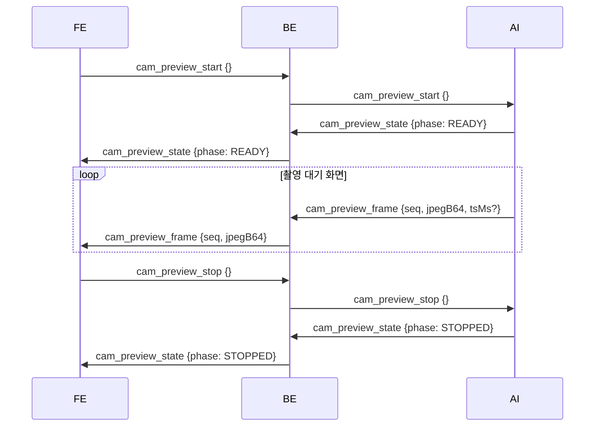

- **카메라를 새로 여는 것이 아니다.** AI 는 `recognition_start` 이후 상시 인식을 위해 카메라를 계속 열고 있다. `cam_preview_start` 는 그 루프의 프레임을 JPEG 로 떠서 보내라는 신호이고, 따라서 **미리보기 중에도 제스처 인식은 멈추지 않는다**. 준비 단계가 사실상 없으므로 `STARTING` 은 생략되고 바로 `READY` 가 오는 것이 정상이다.
- **수명은 BE 가 관리한다.** AI 는 `start` 로 켜고 `stop` 으로 끄기만 하면 된다. BE 가 대신 끊는 경우는 셋이다 — ① 마지막 FE 구독자가 나갈 때(탭이 여러 개면 하나가 닫혀도 유지), ② `reg_start`(같은 프레임이 `reg_frame` 으로 이중 송출되지 않게), ③ `calib_start`(보정 중에는 영상을 보내지 않는다 — 자세 안내는 `calib_precheck` 가 한다).
- **늦은 프레임은 BE 가 버린다.** `stop` 이후 도착한 `cam_preview_frame` 은 FE 로 가지 않으므로 AI 가 칼같이 멈출 필요가 없다.
- `cam_preview_state` 는 상태와 무관하게 중계한다 — `STOPPED` 는 이미 꺼진 뒤에 오기 때문이다.
- 등록과 달리 **버퍼링 · 인코딩 · 저장이 없다.** `tsMs` 는 BE 가 쓰지 않아 FE 로 넘기지 않는다(재생 타이밍을 맞출 webm 이 없다).
- 프레임 크기는 WS 텍스트 상한 4MB 를 따른다. Base64 가 원본의 약 4/3 이라 실효 상한은 JPEG 원본 3MB 다. 대기 화면 확인 용도라 10~15fps 를 권장한다.
- 이름에 `gesture_` 가 아니라 `cam_` 을 쓴 것은 제스처 등록 전용이 아니기 때문이다 — 설정 화면의 카메라 확인 등으로 호출 지점이 늘 수 있다.

### 5.5 마이크 입력 레벨 미리보기 — 등록 화면의 파형

호출어 등록 · 보이스 등록 화면에서 "내 목소리가 들어가고 있나"를 말하는 동안 눈으로 확인시키는 경로다. 등록 흐름은 순번(`wakeword_progress` · `voice_progress`)만 알려줄 뿐 말하는 중에는 아무 신호가 없어서, 사용자는 녹음이 끝나고 판독 결과가 뜰 때까지 마이크가 살아 있는지 알 수 없다.

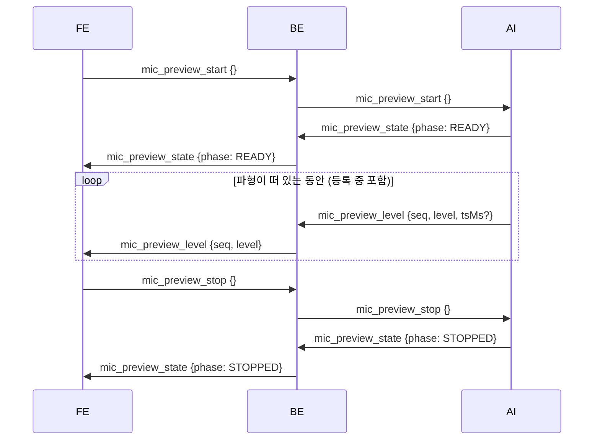

- **마이크를 새로 여는 것이 아니다.** AI 는 `recognition_start` 이후 호출어 상시 감지를 위해 마이크를 계속 열고 있다. `mic_preview_start` 는 그 루프의 진폭을 보내라는 신호이고, 따라서 **미리보기 중에도 호출어 감지는 멈추지 않는다**. 준비 단계가 사실상 없으므로 `STARTING` 은 생략되고 바로 `READY` 가 오는 것이 정상이다.
- **한 메시지가 진폭 하나다.** 여러 개를 배열로 묶어 보내지 않는다 — 묶는 만큼 파형이 늦게 움직인다. 권장 주기는 `gaze_cursor` 와 같은 10~30Hz 이고, FE 는 메시지 하나당 막대 하나를 밀어 넣는다.
- `level` 은 `0.0`(무음) ~ `1.0`(포화)로 정규화한 값이다. RMS 로 낼지 피크로 낼지는 AI 가 정한다. **범위를 벗어난 값은 BE 가 버리지 않고 0~1 로 자른다** — 포화 한 번에 막대가 빠지면 파형이 끊겨 보이고, 그건 잘못된 값을 그리는 것보다 나쁘다. 반대로 `level` 이 없거나 숫자가 아니면 버린다 (0 으로 읽으면 무음과 구분되지 않는다).
- **등록이 시작돼도 끊지 않는다.** 카메라 미리보기는 `reg_start` · `calib_start` 에 BE 가 껐지만(§5.4) 마이크는 반대다 — 파형을 보여주려는 때가 바로 낭독 중이고, 레벨이 등록 경로로 이중 송출되지도 않는다. BE 가 대신 끊는 경우는 **마지막 FE 구독자가 나갈 때** 하나뿐이다 (탭이 여러 개면 하나가 닫혀도 유지).
- **늦은 레벨은 BE 가 버린다.** `stop` 이후 도착한 `mic_preview_level` 은 FE 로 가지 않으므로 AI 가 칼같이 멈출 필요가 없다.
- `mic_preview_state` 는 상태와 무관하게 중계한다 — `STOPPED` 는 이미 꺼진 뒤에 오기 때문이다.
- 버퍼링 · 인코딩 · 저장이 없다. `tsMs` 는 BE 가 쓰지 않아 FE 로 넘기지 않는다.
- 이름에 `voice_` 가 아니라 `mic_` 을 쓴 것은 보이스 등록 전용이 아니기 때문이다 — 온보딩의 이름 불러보기, 설정 화면의 마이크 확인 등으로 호출 지점이 늘 수 있다.


## 6. `/ws/ext` — 브라우저 확장 ↔ BE

크롬 확장(MV3)이 페이지 본문(`browser.dom_text`)의 **1순위** 공급원이자 `browser.search`(§7.4)의 탭 열기 경로다. 확장이 없으면 BE 가 화면 접근성으로 직접 읽는다 (§6.6).

이 절은 전부 BE ↔ 확장 사이의 계약이다. AI 는 이 채널을 보지 않는다 — 본문은 MCP 도구 `browser.dom_text`(§7.4) 로 가져가고, `requestId` 도 도구 표면에는 나타나지 않는다.

### 6.1 확장 → BE

| type | data | BE 동작 |
|---|---|---|
| `hello` | `{extVersion}` | 접속 직후 1회. 로그만 남긴다 |
| `dom_text` | `{requestId, available, url?, title?, text?, truncated?, reason?}` | `dom_text_request` 응답. 기다리던 `browser.dom_text` 호출을 깨운다 |
| `browser_open` | `{requestId, ok, url?, title?, tabId?, reason?}` | `browser_open_request` 응답. 기다리던 `browser.search` 호출을 깨운다 |
| `ping` | `{}` | 하트비트. 20초 주기. `pong` 회신 |

### 6.2 BE → 확장

| type | data | 의미 |
|---|---|---|
| `dom_text_request` | `{requestId}` | 활성 탭 본문 요청 |
| `browser_open_request` | `{requestId, url}` | 새 탭으로 `url` 열기 요청. `url` 은 항상 `http(s)` 다 |
| `pong` | `{}` | `ping` 응답 |
| `error` | `{message, of?}` | 직전 메시지 처리 실패. `type` 이 없거나 처리 중 예외가 나면 보낸 소켓에만 |

### 6.3 본문 규칙

- 확장은 활성 탭에서 `article` → `main` → `[role=main]` → `body` 순으로 `innerText` 를 추출한다.
- 본문은 20,000자로 잘린다. 확장이 자르고 BE 가 다시 강제한다. 잘리면 `truncated: true`.
- 확장이 보내는 실패 `reason` 은 다음 셋이다.

| reason | 조건 |
|---|---|
| `활성 탭이 웹 페이지가 아닙니다` | 활성 탭 URL 이 `http(s)` 가 아니다 |
| `페이지에서 읽을 본문이 없습니다` | 추출된 텍스트가 비어 있다 |
| `이 페이지에서는 본문을 읽을 수 없습니다` | 스크립트 주입이 금지된 페이지 |

### 6.4 타임아웃 — `browser.dom_text` 가 받는 값

확장 경로에서 도구 호출이 어떻게 끝나는지다. 확장이 아예 붙어 있지 않으면 이 표를 타지 않고 접근성 폴백으로 넘어간다 (§6.6).

| 상황 | 도구 결과 |
|---|---|
| 성공 | `isError:false`, `{via:"extension", url, title, text, truncated}` |
| 4초 무응답 | `isError:true`, `code:"FAILED"`, `message:"브라우저 확장이 응답하지 않습니다"` |
| 확장이 실패 보고 | `isError:true`, `code:"FAILED"`, `message:<확장의 reason>`. 확장이 `reason` 을 생략하면 `"본문을 추출하지 못했습니다"` 로 채운다 |

읽지 못한 경우는 빈 결과가 아니라 실패다 — `available:false` 같은 별도 어휘를 두지 않는다. 도구의 실패 어휘는 `isError` 하나이고(§7.2), 그래야 `tool_call` 에도 `FAILED` 로 남는다. 타임아웃 뒤에 도착한 확장 응답은 무시한다.

```json
{ "content": [{ "type": "text", "text": "{\"via\":\"extension\", …}" }], "isError": false,
  "structuredContent": { "via": "extension", "url": "https://news.example.com/article/12345",
    "title": "반도체 수출 3개월 연속 증가", "text": "지난달 반도체 수출액이 …", "truncated": false } }
```

### 6.5 탭 열기 — `browser.search` 의 확장 경로

`browser.search`(§7.4)는 확장 연결 여부로 여는 경로가 갈린다. 판정은 BE 가 하고, AI 는 반환의 `via` · `domAvailable` 만 본다.

| 확장 | 여는 주체 | AI 가 받는 값 |
|---|---|---|
| 연결됨 | 확장이 `chrome.tabs.create` 로 활성 크롬 창에 새 탭 | `{ok:true, via:"extension", url, title, tabId, domAvailable:true}` |
| 미연결 | OS 기본 브라우저 | `{ok:true, via:"os", url, domAvailable:false}` |

- 확장은 `browser_open_request` 를 받으면 탭을 연 뒤 로딩 완료를 **최대 2.5초** 기다렸다가 제목을 실어 `browser_open` 으로 답한다. 그 안에 못 끝내도 실패가 아니다 — `title` 만 비운다.
- BE 는 `browser_open` 을 **4초** 기다린다. 무응답이거나 `ok:false` 면 OS 경로로 폴백해 `via:"os"` 로 답한다. 폴백 뒤 늦게 도착한 `browser_open` 은 무시한다.
- `domAvailable:true` 는 "같은 브라우저 안이라 `browser.dom_text` 로 이 페이지 본문을 이어서 읽을 수 있다"는 뜻이다. `false` 면 AI 는 본문을 읽었다고 말하지 않는다.
- 확장도 `http(s)` 가 아닌 `url` 은 거절한다. 루프백 소켓이어도 신뢰 경계라 BE 와 확장 양쪽에서 막는다.

### 6.6 확장이 없을 때 — 접근성 폴백

확장이 붙어 있지 않으면 BE 가 **화면 접근성(UI Automation)으로 브라우저 창을 직접 읽는다**. `browser.dom_text` 의 반환 형식은 그대로고, 달라지는 건 `via` 뿐이다.

| 확장 | 공급원 | 도구가 돌려주는 값 |
|---|---|---|
| 연결됨 | 확장이 활성 탭에서 `innerText` 추출 | `{via:"extension", url, title, text, truncated}` |
| 미연결 | BE 가 UIA 로 브라우저 창의 Document 를 읽음 | `{via:"accessibility", url, title, text, truncated}` |

- **대상 창** — 포그라운드 창이 브라우저면 그 창, 아니면 Z 순서상 가장 앞의 (최소화되지 않은) 브라우저 창이다. 대상 판정은 창 프로세스의 실행 파일명(`chrome` · `msedge` · `firefox` · `whale` · `brave` · `opera` · `vivaldi`)으로 한다.
- **품질이 같지 않다** — 확장은 `article` → `main` → `[role=main]` → `body` 순으로 **본문만** 고르지만, 접근성 경로가 주는 것은 접근성 트리의 텍스트 전체라 메뉴 · 사이드바 · 광고 문구가 섞인다. `via: "accessibility"` 를 싣는 이유가 이것이다 — AI 는 이 값을 보고 요약의 확신 수준을 낮춘다.
- `url` 은 Document 의 Value 속성에서 얻는다. Chromium 계열은 현재 주소를 여기 싣지만 다른 엔진은 안 실을 수 있어 `null` 일 수 있다. `title` 은 Document 의 Name 이다.
- 20,000자 상한과 공백 정리 규칙은 확장 경로와 같다 (§6.3).
- 정상 경로는 **300ms 안쪽**이다. 접근성 트리가 아직 안 켜져 있으면 600ms · 1500ms 간격으로 두 번 더 보고, 그래도 안 되면 **4.5초**에 끊는다. 브라우저 창이 없거나 못 읽으면 `isError:true`, `code:"FAILED"` 에 아래 `reason` 이 `message` 로 실린다.
- 재시도로 성공하면 BE 가 `접근성 트리 예열에 재시도 N회가 필요했다` 를 INFO 로 남긴다 — 개발기에서는 첫 시도가 늘 성공해 이 경로가 검증되지 않았고, 현장 로그가 유일한 관측 수단이다.

| `reason` | 조건 |
|---|---|
| `열려 있는 브라우저 창을 찾지 못했습니다` | 포그라운드에도 Z 순서에도 브라우저 창이 없다 |
| `브라우저에서 본문을 읽지 못했습니다` | UIA 실패 · Document 없음 · TextPattern 미지원 · 제한 시간 초과 |
| `페이지에서 읽을 본문이 없습니다` | 읽었지만 텍스트가 비었다 (확장 경로와 같은 문구) |

**사용자 알림** — 이 경로를 탈 때 BE 가 FE 에 `notice {message}` 를 직접 보내 팝업을 띄운다. `notice` 는 원래 AI 소유 채널이지만(§4 · API명세서 §4.3) 확장 부재는 대화가 아니라 시스템 상태이고 AI 가 언급을 생략해도 사용자는 알아야 해서 두는 예외다. 한 번의 발화가 `browser.dom_text` 를 여러 번 부를 수 있으므로 **60초에 한 번만** 띄운다.

| 상황 | `message` |
|---|---|
| 읽기 성공 | `브라우저 확장이 설치되어 있지 않아 화면 읽기로 내용을 가져왔습니다. 일부가 빠지거나 섞일 수 있어요.` |
| 읽기 실패 | `브라우저 확장이 설치되어 있지 않아 페이지 내용을 가져오지 못했습니다.` |

★ 부작용 — UIA 클라이언트가 붙으면 Chromium 이 렌더러 접근성 트리를 켜고, 켜진 뒤에는 브라우저에 상시 성능 비용이 남는다. 그래서 이 경로는 `browser.dom_text` 가 실제로 불릴 때만 탄다 (기동이나 폴링으로 미리 켜지 않는다). 확장을 설치하면 이 경로 자체를 타지 않는다.

---

## 7. MCP `/mcp` — 도구 호출

### 7.1 전송

MCP Streamable HTTP 다. `initialize` → `notifications/initialized` → `tools/list` · `tools/call` 순서로 진행한다.

```
POST http://127.0.0.1:8080/mcp
Content-Type: application/json
Accept: application/json, text/event-stream
Authorization: Bearer sia-mcp-server
X-Caller: LLM
```

```json
{ "jsonrpc": "2.0", "id": 1, "method": "initialize",
  "params": { "protocolVersion": "2025-11-25", "capabilities": {}, "clientInfo": { "name": "sia-agent", "version": "0.4.2" } } }
```

- `initialize` 응답 헤더의 `Mcp-Session-Id` 를 이후 모든 요청에 실어 보낸다.
- `serverInfo` 는 `{ "name": "sia", "version": "1.0.0" }` 이다.
- 지원 개정판은 `2024-11-05` · `2025-03-26` · `2025-06-18` · `2025-11-25` 다. 상한은 `2025-11-25` 이며, 더 새 개정판을 요청하면 `2025-11-25` 로 협상된다. AI 는 `2025-11-25` 를 요청한다.
- 토큰이 없거나 틀리면 HTTP 401 `{"code":"UNAUTHORIZED","message":"MCP 토큰이 필요합니다"}` 가 돌아온다. JSON-RPC 응답이 아니다.

도구 호출:

```json
{ "jsonrpc": "2.0", "id": 3, "method": "tools/call", "params": { "name": "window.focus", "arguments": { "winRef": "win:2" } } }
```

### 7.2 반환 형식 — `CallToolResult`

판정은 `isError` 로 한다. 도구 실행 오류는 HTTP 200 + `isError: true` 로 돌아온다.

성공 — `structuredContent` 가 정본이고 `content[0].text` 는 그 JSON 직렬화다.

```json
{ "content": [{ "type": "text", "text": "{\"apps\":[]}" }], "isError": false, "structuredContent": { "apps": [] } }
```

반환 데이터가 없는 도구(`window.focus`, `scroll.step` 등)는 `structuredContent` 키가 없고 텍스트 한 줄만 온다.

```json
{ "content": [{ "type": "text", "text": "실행했습니다" }], "isError": false }
```

실패 · 차단 — `content[0].text` 는 LLM 에 들어가는 한국어 완결 문장, `structuredContent` 는 `{code, message}` 다. 사용자에게 보여 줄 문장은 AI 가 `notice {message}` 로 보내고 FE 가 표시한다.

```json
{ "content": [{ "type": "text", "text": "세션이 활성화되지 않았습니다" }], "isError": true, "structuredContent": { "code": "SESSION_REQUIRED", "message": "세션이 활성화되지 않았습니다" } }
```

`code` 는 다음 여덟 값 중 하나다. 앞의 여섯은 정책 게이트가 막은 경우로 `tool_call.outcome = BLOCKED` 이고, `INVALID_REQUEST` 와 `FAILED` 는 둘 다 `outcome = FAILED` 로 기록된다 — 기록의 어휘는 세 값(`EXECUTED` · `BLOCKED` · `FAILED`)뿐이다.

| `code` | 뜻 |
|---|---|
| `SESSION_REQUIRED` | 활성 세션이 없다 (S 도구) |
| `REF_NOT_FOUND` | `win:N` / `app:key` 를 찾을 수 없다 |
| `APP_NOT_REGISTERED` | 등록되지 않은 앱 |
| `APP_PATH_INVALID` | 등록된 실행 파일이 없다 |
| `ELEVATED_WINDOW` | 관리자 권한 창 |
| `FOREGROUND_BLOCKED` | 창을 앞으로 가져오지 못했다 (`window.focus` · `window.next` · `window.prev`). Windows 의 포그라운드 잠금이며 권한 문제가 아니다 — BE 가 작업 표시줄을 깜빡여 두므로 사용자가 직접 누르면 된다 |
| `FILE_NOT_FOUND` | 파일이 없다 (`files.open`) |
| `INVALID_REQUEST` | 인자 형식 오류 — 같은 인자로 재시도하면 또 실패한다. 인자를 고쳐 다시 호출해야 한다 (자리 목록은 API명세서 §3.1) |
| `FAILED` | 그 외 실패 (실행 자체가 실패) |

- 모르는 도구 이름 · 스키마 위반 요청은 JSON-RPC `error` (Protocol Error) 로 돌아온다. 예: `{"code":-32602,"message":"Unknown tool: no.such.tool"}`
- `tools/list` 의 도구에는 `outputSchema` 가 없다.
- "대기" 상태는 없다. 도구는 실행되거나 실행되지 않거나 둘 중 하나다.

### 7.3 게이트 규칙

| 플래그 | 의미 | 집행 |
|---|---|---|
| **S** (`sessionRequired`) | 활성 세션에서만 실행 | BE. 세션이 없으면 도구 본체 실행 전에 `SESSION_REQUIRED` |
| **C** (`confirmRequired`) | 호출 전 사용자 동의가 필요 | **AI**. BE 는 동의가 끝난 요청으로 보고 그대로 실행한다. `tools/list` 의 `annotations.destructiveHint: true` 로 표시된다 |

- C 도구는 `window.close` · `files.delete` 둘이다.
- C 도구는 제스처 매크로에 넣을 수 없다. `macro_assign` · `PUT /api/gestures/{id}` 가 거절한다.
- 읽기 전용 도구 5개(`context.get` · `app.list` · `browser.dom_text` · `window.list` · `explorer.items`)는 `readOnlyHint: true`, `destructiveHint: false` 다. C 도구 2개(`window.close` · `files.delete`)는 `destructiveHint: true`, 나머지 24개는 `destructiveHint: false` 다.
- 모든 도구 호출은 `tool_call` 에 `outcome`(`EXECUTED | BLOCKED | FAILED`) · `caller` · `latencyMs` 로 기록되고 FE 에 `tool_result` 로 중계된다. 예외: `session.extend` · `session.cancel` 은 기록도 `tool_result` 도 남기지 않는다.
- 제스처 매크로가 부르는 도구는 MCP 전송을 거치지 않고 서버 내부에서 실행되며 `caller: GESTURE` 로 기록된다.
- 도구 실행 성공은 세션을 연장하지 않는다.

### 7.4 도구 카탈로그 — 31개

| 도구 | 인자 | S | C | 역할 | 반환 (`structuredContent`) |
|---|---|:-:|:-:|---|---|
| `context.get` | — | | | 화면 상황 스냅샷 | `{contextChain, foreground, windows, apps, volume, capabilities}` |
| `app.list` | — | | | 등록 앱 목록 | `{apps: [{ref, name}]}` |
| `app.launch` | `appRef` | ● | | 등록 앱 실행 | `{ok: true, pid}` |
| `browser.search` | `query` | ● | | 기본 브라우저로 검색 · 주소 열기 (확장 연결 시 새 탭, 아니면 OS 기본 브라우저) | `{ok: true, via, url, title?, tabId?, domAvailable}` |
| `browser.dom_text` | — | ● | | 보고 있는 페이지의 본문 (확장 연결 시 본문만 추출, 아니면 접근성으로 화면 읽기) | `{via, url, title, text, truncated}` |
| `window.list` | — | | | 열린 창 재조회 | `{windows: [{ref, title, app, state}]}` |
| `window.focus` | `winRef` | ● | | 창 포커스 | 없음 |
| `window.minimize` | `winRef` | ● | | 창 최소화 | 없음 |
| `window.maximize` | `winRef` | ● | | 창 최대화 | 없음 |
| `window.restore` | `winRef` | ● | | 창 복원 | 없음 |
| `window.resize` | `winRef`, `preset` | ● | | 크기 · 위치 프리셋 | 없음 |
| `window.close` | `winRef` | ● | ● | 창 닫기 | `{closed: true}` |
| `window.next` | — | ● | | 다음 창으로 전환 | `{focused: {ref, title, app, state}}` |
| `window.prev` | — | ● | | 이전 창으로 전환 | `{focused: {…}}` |
| `explorer.items` | `winRef?` | | | 탐색기 폴더 · 항목 (bounds 포함) | `{folder, items: [{name, path, selected, bounds}], count, truncated}` |
| `scroll.step` | `dir`, `amount?` | ● | | 스크롤 | 없음 |
| `media.play_pause` | — | ● | | 재생 / 일시정지 | `{via}` |
| `media.mute_toggle` | — | ● | | 음소거 토글 | `{via}` |
| `media.next` | — | ● | | 다음 트랙 · 영상 | `{via}` |
| `media.prev` | — | ● | | 이전 트랙 · 영상 | `{via}` |
| `media.seek` | `dir`, `amount?`, `winRef?` | ● | | 영상 앞으로 · 뒤로 (좌 · 우 방향키. 유튜브 분기 없음. `winRef` 를 주면 그 창을 앞으로 가져온 뒤 보낸다 — 이 도구만 배경 재생을 제어하지 못한다) | 없음 |
| `volume.step` | `dir` | ● | | 시스템 볼륨 한 단계 | 없음 |
| `volume.set` | `level` | ● | | 시스템 볼륨을 0~100 절대값으로 | `{level, muted}` |
| `files.open` | `path` | ● | | 파일 열기 (exe 는 직접 실행, 그 밖은 기본 연결 프로그램) | `{opened: true, path}` |
| `files.delete` | `paths[]` | ● | ● | 휴지통 이동 | `{trashed, failed}` |
| `files.save` | `name`, `content?` | ● | | `Documents/SIA/` 에 텍스트 저장. `content` 생략 시 빈 파일 | `{path}` |
| `system.lock` | — | ● | | 화면 잠금 | `{locked: true}` |
| `screen.capture` | `winRef?` | ● | | 화면 · 창 캡처를 PNG 로 저장. FE 에 `capture_saved` | `{path, url, width, height}` |
| `screen.capture_region` | `x1`, `y1`, `x2`, `y2` | ● | | 좌상단 · 우하단 두 점이 감싸는 영역만 PNG 로 저장. FE 에 `capture_saved` | `{path, url, width, height}` |
| `session.extend` | — | ● | | 세션 연장 | `{remainingSec, deadlineMs}` |
| `session.cancel` | — | ● | | 세션 종료 | `{state: "PASSIVE", reason: "STOPPED"}` |

- 도구별 인자 규칙 · 응답 예시 · 실패 코드는 [API명세서.md §3](API명세서.md#3-mcp-도구-31개) 에 있다.
- 현재 도구 목록 · 가용 상태는 `GET /api/tools` 로도 조회한다.

### 7.5 시선 × bounds 교차 규칙

"이 파일" 류 지시어의 대상 확정 규칙이다. 판정 주체는 AI 다. BE 는 `explorer.items` 로 후보와 좌표를 건넨다.

| 항목 | 규칙 |
|---|---|
| 좌표계 | 가상 스크린 물리 픽셀. 주 모니터 좌상단이 (0,0), 멀티 모니터에서는 음수 가능. `explorer.items` 의 `bounds` 와 `gaze_cursor` 의 `x, y` 가 같은 좌표계다 |
| 해상도 | 활성 보정 프로필의 `screenW × screenH` 와 현재 해상도가 다르면 시선 좌표를 재계산 없이 쓰지 않는다 |
| 시선 점 G | 발화 시작 직전 약 700ms 시선 표본의 중앙값 |
| 반경 r | `max(50, 활성 보정 프로필의 avgErrorPx × 2)` 픽셀 |
| 교차 판정 | 항목 `bounds{x,y,w,h}` 를 r 만큼 사방으로 부풀린 사각형에 G 가 들어가면 후보 |
| 정렬 | 후보가 여럿이면 부풀리기 전 사각형의 중심과 G 의 거리 오름차순 |
| 제외 | `bounds: null` 인 항목은 후보에서 제외한다 |

```
후보  ⟺  (x − r) ≤ gx ≤ (x + w + r)  그리고  (y − r) ≤ gy ≤ (y + h + r)
```

폴백 순서:

| 교차 후보 수 | 동작 |
|---|---|
| 1개 | 즉시 확정 |
| 2개 이상 | `notice(kind:"choices")` 로 되묻는다. 사용자는 음성으로 답하거나 후보를 클릭(`user_choice`)한다. 12초 안에 응답이 없으면 AI 가 취소한다 |
| 0개 | `selected: true` 인 항목 → 그것도 없으면 이름을 질문한다 |

어느 경로로 확정하든 파괴적 실행 전 동의(12초, AI 소유)는 생략하지 않는다. 브라우저 지시어("이 뉴스 요약")에는 이 규칙을 쓰지 않는다. `browser.dom_text` 가 단위다.

---

## 8. 시나리오

### 8.1 AI 부팅

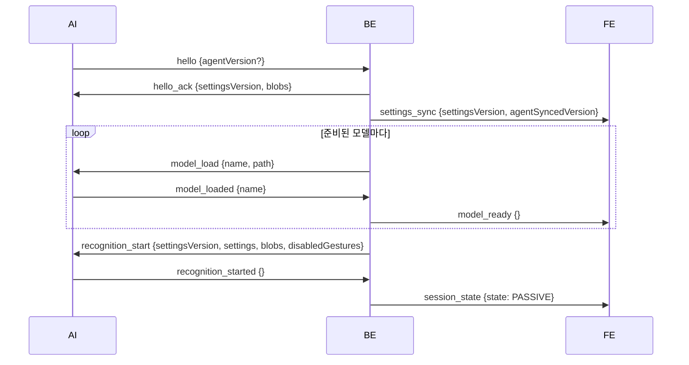

- 모델이 0개면 `hello_ack` 직후 바로 `recognition_start` 가 나간다.
- 모델 목록은 `%APPDATA%/SIA/models.json` 이다. 없으면 classpath 의 `models.json` 을 쓴다. 읽기에 실패하면 모델 0개로 처리한다.
- 모델 파일 확보(다운로드 · sha256 검증)는 BE 기동 직후 백그라운드에서 시작한다. AI 접속과 무관하다. `hello` 가 먼저 오면 준비되는 모델부터 순서대로 `model_load` 를 보낸다.
- 다운로드는 임시 파일로 받아 sha256 을 검증한 뒤 교체한다. 진행률은 FE 에 `model_progress` (5% 단위)로, 완료는 `model_downloaded {name}` 으로 간다. 다운로드 2회 실패 또는 `model_load_failed` 는 FE 에 `model_error {name, reason}` 으로 간다.
- `model_error` 뒤 재다운로드는 FE 가 `POST /api/models/{name}/redownload` 로 요청한다. 모델 상태는 `GET /api/models` 로 조회한다.

재다운로드:

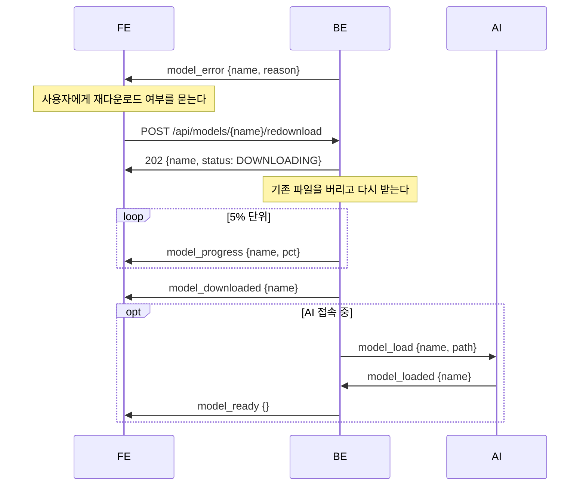

- 이미 받는 중인 모델의 재요청은 새로 큐에 넣지 않고 202 만 돌려준다.
- 다시 실패하면 `model_error` 가 다시 간다.
- AI 연결이 끊기면 부팅 상태가 리셋되고, 다음 `hello` 에서 처음부터 반복한다. FE 는 `agent_status {connected}` 로 연결 상태를 받는다.

### 8.2 호출어 → 세션 → 명령 → 만료

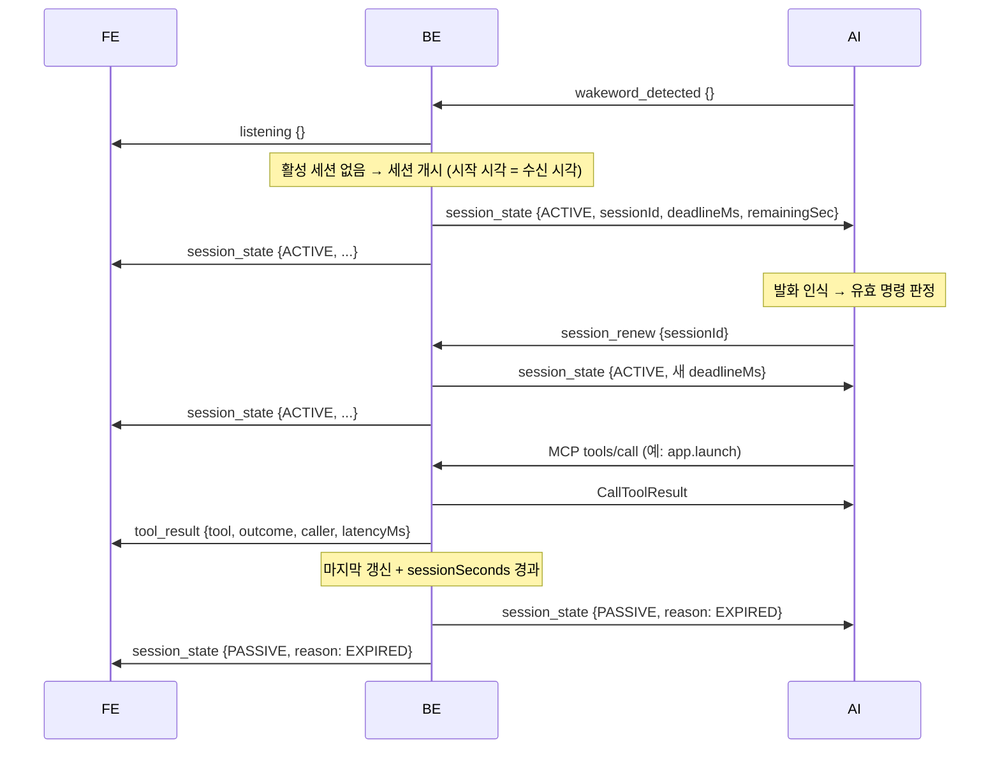

- 활성 세션 중에 `wakeword_detected` 가 다시 오면 BE 는 아무것도 하지 않는다.
- 세션 안의 후속 발화는 호출어 없이 처리되고, 유효 명령마다 `session_renew` 를 도구 호출보다 먼저 보낸다.

### 8.3 파일 삭제 — 파괴적 명령의 확인 흐름

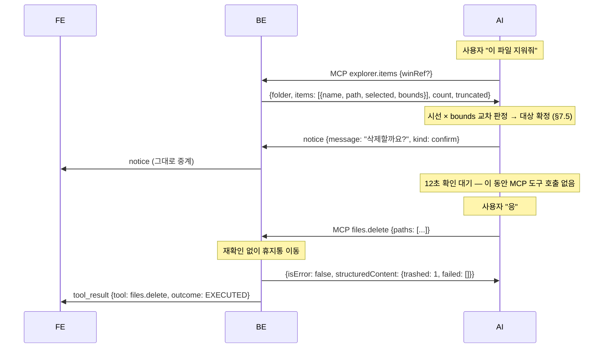

- 확인 대기 12초의 소유자는 AI 다. 부정 응답이거나 12초가 지나면 AI 가 명령을 무효화하고 BE 를 부르지 않는다.
- BE 에는 확인 게이트가 없다. C 플래그는 AI 에게 "호출 전 동의를 받아라"고 알리는 선언이다.
- `files.delete` 는 완전 삭제가 아니라 휴지통 이동만 수행한다.

### 8.4 후보 선택 — `notice(choices)` 와 `user_choice`

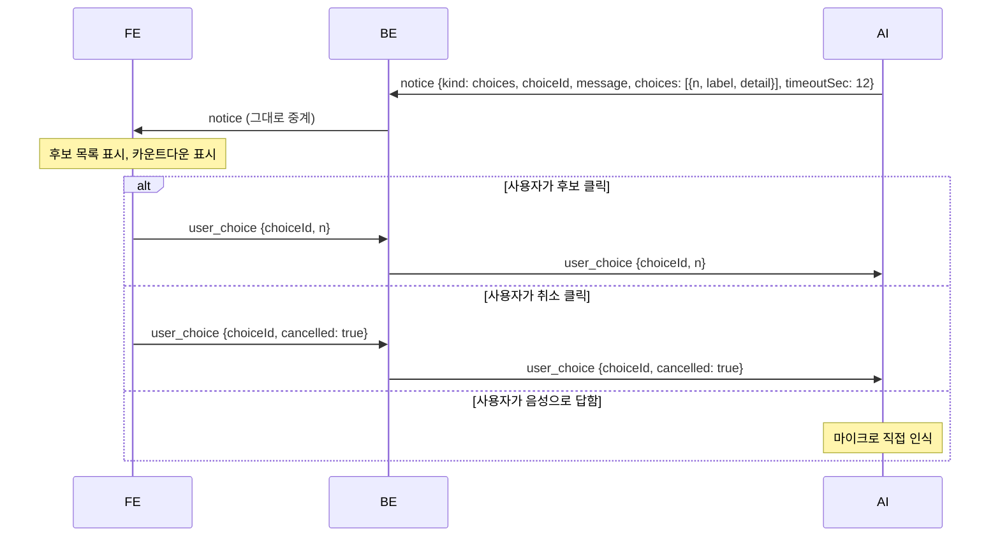

- `choiceId` 로 질문과 답을 대응시킨다. AI 는 모르는 `choiceId` 나 이미 끝난 질문의 답을 버린다.
- 음성 응답과 클릭이 경합하면 먼저 도착한 쪽이 이긴다. 판정은 AI 가 한다.
- 12초 안에 응답이 없으면 AI 가 스스로 무효화한다. BE 는 상태를 갖지 않는다.

### 8.5 커스텀 제스처 등록 — 3회 반복 촬영

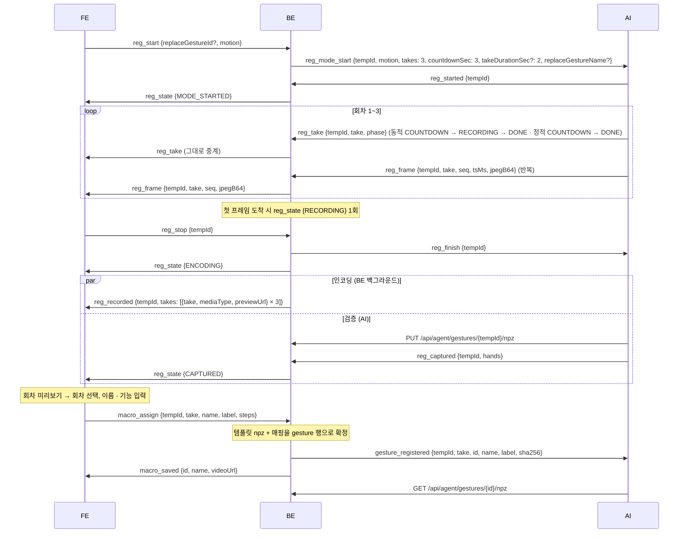

- 템플릿 npz 는 제스처별이다. AI 는 `reg_captured` 전에 `PUT /api/agent/gestures/{tempId}/npz` 로 올리고, BE 는 `macro_assign` 시점에 그 npz 를 `gesture` 행에 확정한다. 이때 npz 가 없으면 `error` 다. AI 는 `gesture_registered` 의 `id` 로 확정본을 내려받는다.
- `reg_recorded` 와 `reg_captured` 는 다른 경로에서 오므로 도착 순서가 보장되지 않는다. FE 는 둘을 독립적으로 기다린다.
- 품질 검증에 걸리면 `reg_captured` 대신 `reg_rejected` 가 오고, FE 는 `reg_state {REJECTED, reason, similarTo?, similarity?}` 를 받는다. 이때 등록 상태가 해제되므로 `reg_start` 부터 다시 시작한다.
- 선택한 회차의 미리보기는 제스처 촬영본으로 승격되어 `GET /api/gestures/{id}/video` 로 서빙된다. 나머지 회차는 임시본이다.
- 등록 창은 정적/동적으로 갈린다. **`motion` 은 사용자 입력이다** — 등록 창을 고른 FE 가 `reg_start` 로 알려 주고 BE 가 `reg_mode_start` 로 넘긴다. **`hands` 는 관측값이다** — 랜드마크를 본 AI 가 `reg_captured` 로 올린다. 둘 다 `macro_assign` 시점에 `gesture` 행의 `motion` · `hands` 로 확정된다.
- 정적 등록은 회차당 프레임이 한 장이라 BE 가 인코딩하지 않고 그 JPEG 를 `{tempId}-{take}.jpg` 로 그대로 보관한다. 승격본도 `g{id}.jpg` 다. 경로는 동적과 같고 확장자만 갈린다.
- `reg_start {replaceGestureId}` 로 시작한 등록은 `macro_assign` 에서 신규 대신 그 제스처를 갱신한다. 템플릿 npz 와 형태(`hands` · `motion`)도 그 행에서 교체되고 — 한손 정적으로 등록한 제스처를 양손 동적으로 다시 찍을 수 있다 — 이름이 바뀌면 AI 에 `gesture_renamed {id, oldName, newName}` 도 간다.

### 8.6 제스처 실행

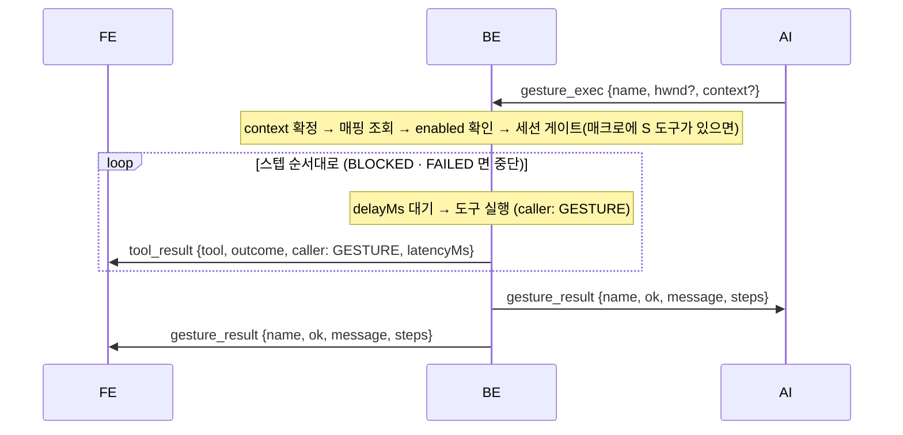

- 컨텍스트 체인은 포그라운드(또는 `hwnd`) 창 제목에 `youtube` 가 포함되면 `["youtube", "video"]`, 아니면 `[]` 다. 체인 순서대로 `context` 일치 매핑을 찾고, 없으면 `context IS NULL` 기본 매핑을 쓴다. `base` 는 조회 체인에 없다 — `context.get` 이 표시용 `contextChain` 끝에 덧붙이는 값일 뿐이다.
- `gesture_exec` 의 `context` 를 주면 그 값 하나로만 찾는다.
- 세션 게이트는 **매크로 단위**다. 매크로에 S 도구가 하나라도 있는데 활성 세션이 없으면 첫 스텝도 실행하지 않고 즉시 `gesture_result {ok: false, message: "세션이 활성화되지 않았습니다", steps: []}` 를 보낸다. 반쯤 실행된 매크로는 남지 않고, `tool_result` 도 나가지 않는다.
- S 도구가 없는 매크로(`context.get` · `explorer.items` 등 읽기 전용만으로 구성)는 세션 없이도 그대로 실행된다.
- 스텝이 `BLOCKED` · `FAILED` 로 끝나면 뒤 스텝은 실행하지 않는다. 이때 `gesture_result.ok` 는 `false`, `message` 는 그 스텝의 사유이고 `steps` 는 거기까지다.

### 8.7 온보딩 마이크 설정 — 이름 불러보기 → 명령하듯 5문장 낭독(보이스 등록)

온보딩 마이크 설정은 두 단계다. 이름 불러보기로 호출어 모델을 만들고, 이어서 "AI에게 명령하듯 말해보세요" 화면에서 5문장을 한 번 읽어 화자 임베딩(보이스 프로필)을 만든다. 두 번째 단계는 설정 화면의 보이스 추가와 같은 `voice_*` 흐름이다 — 별도의 "명령 문장" 단계나 이벤트는 없다.

호출어는 사용자가 정한다. FE 가 `wakeword_enroll_start` 에 후보 단어를 실어 보내고, BE 는 그 단어로 검사한 뒤 AI 에 넘긴다. 설정의 `wakeWord` 는 `wakeword_done` 을 받은 순간 BE 가 확정한다 — 그전까지는 옛 호출어와 옛 모델이 짝을 이룬 채로 남는다. `wakeWord` 는 `PUT /api/settings` 로 바꿀 수 없다.

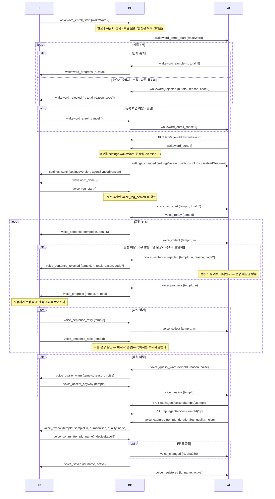

이름 불러보기 단계에서 샘플이 검사(호출어 발음 · 음질 · 앞 샘플과 같은 목소리)에 걸리면 `wakeword_rejected {n, total, reason, code?}` 가 온다. `reason` 은 그대로 보여줄 문장이고 순번은 오르지 않는다 — 같은 순번을 다시 부른다. 5/5 를 채운 뒤에 오면 호출어 모델 저장 실패이고, 다시 부르면 그 샘플들로 저장을 재시도한다. **`wakeword_progress` 가 5/5 라도 완료가 아니다** — `wakeword_done` 을 받아야 다음 단계로 넘어간다.

수집 중에 화면을 벗어나거나 중단하면 FE 가 `wakeword_enroll_cancel {}` 을 보내고 BE 는 그대로 AI 에 넘긴다. 이걸 받지 못하면 AI 는 수집 모드로 남아 이후의 모든 발화를 호출어 샘플로 먹는다 — 그동안 음성 명령이 동작하지 않는다. 중단하면 모은 샘플만 버리고 기존 호출어 템플릿과 설정은 그대로 둔다. BE 는 보관하던 후보 단어를 버린다.

후보 단어는 `wakeWord` 필드로 온다. 생략하면 지금 설정된 호출어로 등록한다 — 고를 기회가 없는 온보딩 경로다. AI 에는 언제나 단어가 실려 나간다. **완성된 한글 3~6글자**여야 하고 자모 · 영문 · 숫자 · 기호 · 공백은 쓸 수 없다. 어기면 수집을 시작하지 않고 `error {message, of: "wakeword_enroll_start"}` 로 회신한다. BE 가 재시작해 후보를 잃은 뒤 `wakeword_done` 이 오면 설정은 그대로 두고 중계만 한다.

글자 규칙은 값이 새로 정해지는 이 길목에서만 검사한다. `PUT /api/settings` 는 호출어를 바꿀 수 없으므로 저장된 값의 글자 수를 따지지 않는다.

낭독 문장 5개의 원문은 FE 와 AI 가 각각 동일한 상수로 보유한다. BE 는 `voice_sentence` · `voice_collect` 에 순번 `n` 만 싣고 원문을 보내지 않는다. FE 는 `n` 번째 문장을 화면에 표시하고, AI 는 `n` 번째 문장의 발화를 수집해 임베딩한다. 두 상수는 아래 표와 글자 단위로 같아야 한다. 호출명 설정을 바꿔도 문장은 바뀌지 않는다.

| n | 문장 (FE · AI 공통 상수) |
|---|---|
| 1 | `창문을 열자 찬 공기가 밀려 들어왔다` |
| 2 | `비가 그친 골목에 물이 고여 있었다` |
| 3 | `오래된 자전거에 기름을 칠해 두었다` |
| 4 | `여름이 지나자 풀벌레 울음이 이어졌다` |
| 5 | `눈 내린 길에 발자국 소리만 또렷했다` |

- 문장 하나가 미달이면 `voice_sentence_rejected {tempId, n, total, reason, code?}` 가 온다. `reason` 은 그대로 보여줄 문장, `code` 는 사유 분류(`TOO_SHORT` · `TOO_LONG` · `NOISY` · `INCONSISTENT`)다. `code` 가 없거나 모르는 값이면 `reason` 을 쓴다. BE 는 문장을 재발급하지 않는다 — AI 가 같은 `n` 을 계속 기다린다.
- 문장이 통과하면 `voice_progress {tempId, n, total}` 만 온다. **BE 는 다음 문장을 자동으로 발급하지 않는다** — 사용자가 문장 n 의 판독 결과를 확인하고 "다음"을 눌러야 다음 문장이 나간다. 확인 화면이 떠 있는 동안 AI 가 다음 문장을 수집하고 있으면 그 사이의 말·잡음이 다음 문장의 발화로 섞이기 때문이다.
- "다음" = `voice_sentence_next {tempId}` → 다음 문장의 `voice_sentence` · `voice_collect` 발급. 통과하지 않은 문장(거절 뒤 · 재녹음 중)에서는 무시하므로 연타로 문장을 건너뛸 수 없다. 마지막 문장(n=5) 뒤에는 보낼 필요가 없다 — AI 가 곧 `voice_captured` 를 보내 녹음 확인 화면으로 넘어간다.
- "이 문장 다시" = `voice_sentence_retry {tempId}` → 화면에 떠 있는 n 의 `voice_collect` 재발급. AI 는 그 문장을 교체 수집한다. 통과 표시가 내려가므로 다시 읽어 통과할 때까지 "다음"은 무시된다.
- "다시 녹음" = `voice_reg_retry {tempId}` → 1번 문장부터 다시. 임시 npz · 샘플은 폐기된다.
- "중단" = `voice_reg_cancel {tempId}` → 임시본 폐기 + AI 에 `voice_reg_cancel`.
- `voice_captured` 는 샘플과 npz 를 REST 로 먼저 올린 뒤 보낸다. BE 가 곧장 FE 에 `voice_review` 를 주기 때문이다.
- 말하는 동안의 **마이크 파형은 이 흐름과 별개 스위치**다 — FE 가 마이크 설정 화면에 들어갈 때 `mic_preview_start {}` 로 켜고 나갈 때 끈다. 두 단계(이름 불러보기 · 5문장 낭독)를 가로질러 켜진 채로 두면 되고, 등록 시작·종료로는 꺼지지 않는다 (§5.5).

### 8.8 시선 보정 — 재측정 3회 한도

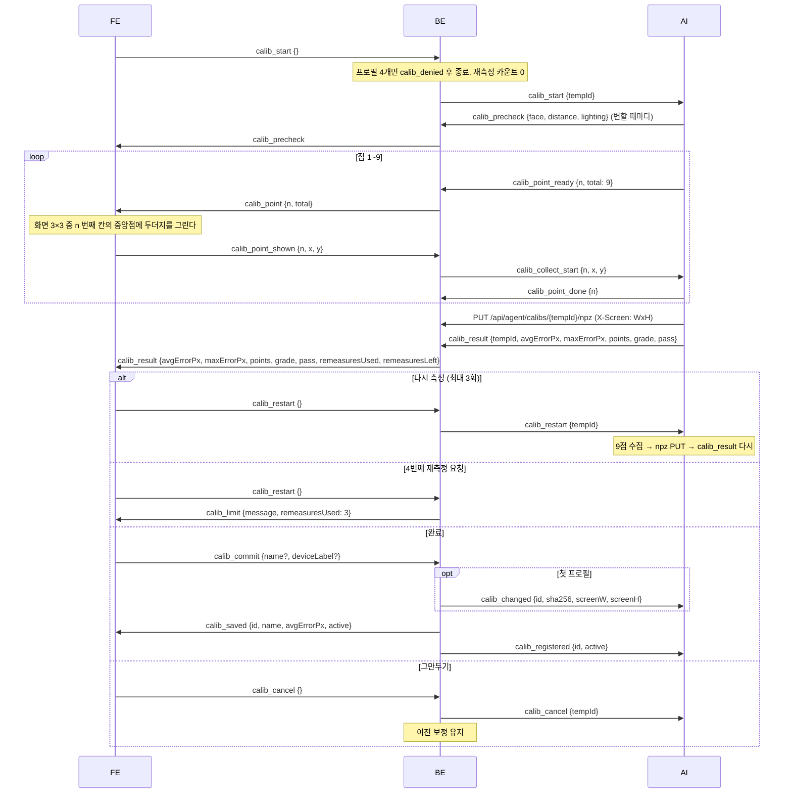

- 오차 기준은 AI 서버가 관리한다. BE 는 AI 가 보낸 `grade`(`excellent | good | poor`) 와 `pass` 를 그대로 중계하고 프로필에 적는다.
- 9점은 화면을 3×3 으로 나눈 각 칸의 중앙점이다. 점 수는 AI 가 정하고 좌표는 그 화면을 그린 FE 가 정한다. FE 가 `calib_point_shown` 에 실어 보낸 `x, y` 가 AI 의 오차 기준점이다.
- `points` 는 `[{n, dx, dy}]` 다. 목표점을 원점으로 둔 오차 벡터라 FE 는 중심점 하나에 9개를 겹쳐 찍는다. `dx = 측정 시선 x - 목표점 x`, `dy` 도 같다.
- 재측정 카운트는 BE 가 센다. 사용자 요구든 오차 초과에 따른 유도든 같은 카운트다. `remeasuresLeft` 가 0 이면 FE 는 [다시 측정] 을 비활성화한다.
- `calib_result` 는 npz 를 REST 로 먼저 올린 뒤 보낸다. `X-Screen` 은 필수다.
- BE 는 `calib_result` 수신 시 통계 이벤트 `kind: calibration` 을 스스로 기록한다. AI 가 따로 보내지 않는다.

### 8.9 페이지 본문 요청 — `browser.dom_text`

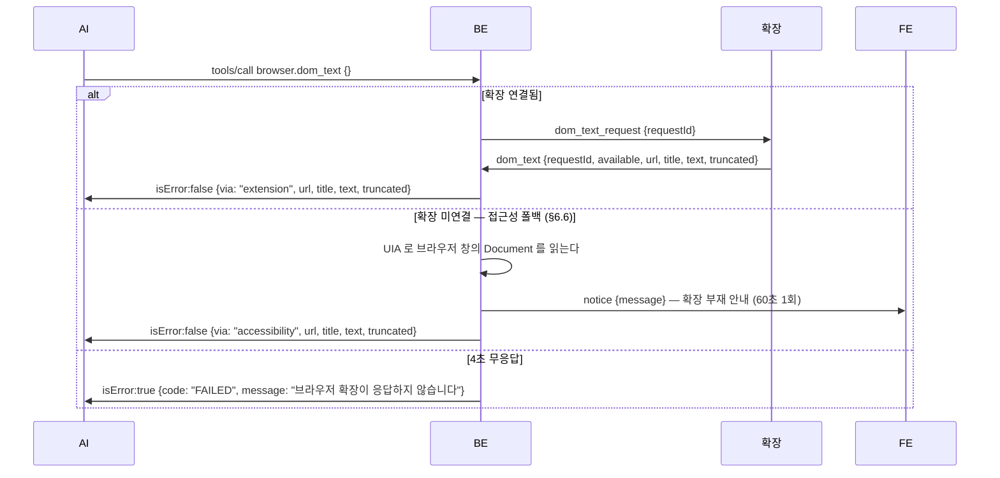

BE 는 확장 응답을 기다리는 동안 MCP 요청 스레드를 붙잡는다. 도구 호출 하나가 최대 4초(확장) · 4.5초(접근성) 걸린다.

### 8.10 설정 · 프로필 변경의 전파

| 원인 | AI 에 가는 이벤트 | FE 에 가는 이벤트 |
|---|---|---|
| `PUT /api/settings` 성공 | `settings_changed` | — (응답으로 확인) |
| `PUT /api/agent/blobs/{name}` 에서 내용이 실제로 바뀜 | `settings_changed` | — |
| WS `macro_assign` 확정 (템플릿 npz 포함) | `gesture_registered` | `macro_saved` |
| `PATCH /api/gestures/{id}` (켜기/끄기) | `gesture_toggled` → `settings_changed` | — |
| `PUT /api/gestures/{id}` 에서 이름 변경 | `gesture_renamed` | — |
| `DELETE /api/gestures/{id}` | `gesture_removed` | — |
| `POST /api/voices/{id}/activate` · `POST /api/devices/remap` (mic) | `voice_changed` → `settings_changed` | — |
| `POST /api/calibs/{id}/activate` · `POST /api/devices/remap` (camera) | `calib_changed` → `settings_changed` | — |
| WS `voice_commit` · `calib_commit` 로 **첫** 프로필이 저장됨 (자동 활성) | `voice_changed` / `calib_changed` → `settings_changed` → `voice_registered` / `calib_registered` | `voice_saved` / `calib_saved` |
| AI `hello` 로 설정 수신 | — | `settings_sync` |
| `DELETE /api/data` | `session_state {PASSIVE, reason: STOPPED}` (활성 세션이 있었을 때) → `wipe` | `session_state {PASSIVE, reason: STOPPED}` (활성 세션이 있었을 때) → `settings_sync` |

### 8.11 전체 삭제

`DELETE /api/data` 는 기록(`tool_call` · `session` · `usage_event`) · blob(호출어 모델) · 프로필 전부 · 커스텀 제스처(템플릿 npz 포함)와 등록 영상 · 등록 앱 · 활성 세션을 지우고, 설정을 시드값으로 되돌리며 기본 제공 제스처 9종(기능은 빈칸)과 Windows 기본 앱 2건(`notepad` · `calc`)을 복원한다. 활성 세션이 있었으면 `session_state {state: PASSIVE, reason: STOPPED}` 를 AI · FE 양쪽에 보내고, 이어서 AI 에 `wipe`, FE 에 `settings_sync` 를 보낸다.

### 8.12 화면 캡처 저장 · 표시

인식용 스냅샷은 AI 가 자체 센서로 찍고 메모리에만 둔다. 사용자가 보관할 캡처 결과물은 BE 가 만들어 저장하고, 표시는 FE 가 한다.

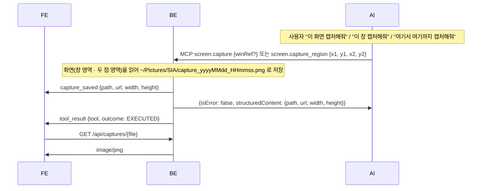

- `screen.capture` 는 `winRef` 를 생략하면 전체 가상 스크린, 주면 그 창의 화면 사각형을 캡처한다.
- `screen.capture_region` 은 좌상단 (x1, y1) · 우하단 (x2, y2) 두 점이 감싸는 사각형만 캡처한다. 두 점의 순서는 가리지 않고, 화면 밖으로 나간 부분은 잘라낸다.
- 픽셀과 좌표는 물리 픽셀이다. `explorer.items` 의 `bounds` 와 같은 좌표계다.
- 저장 위치는 사진 폴더 `~/Pictures/SIA/` 하나다. 같은 초에 두 번 찍히면 `_2`, `_3` 을 붙인다.
- 두 도구는 S 도구이고 C 가 아니다. 제스처 매크로에 넣을 수 있다.
- 캡처 파일은 사용자 화면 이미지다. 루프백 FE 만 읽고 PC 밖으로 내보내지 않는다.

---

## 9. 부록 — 상수와 열거형

### 9.1 상수 · 상한

| 항목 | 값 | 소유자 |
|---|---|---|
| 세션 유지 시간 | 설정 `sessionSeconds`, 기본 15초 | BE |
| 파괴적 명령 확인 대기 | 12초 | AI |
| 후보 선택 대기 (`notice.timeoutSec`) | 12초 | AI |
| `browser.dom_text` 확장 응답 대기 | 4초 | BE |
| `browser.dom_text` 본문 길이 | 20,000자 | 확장 · BE |
| 확장 하트비트 | 20초 주기 `ping` | 확장 |
| 등록 촬영 규칙 | 동적은 3초 카운트다운 후 2초씩 3회, 정적은 카운트다운 후 사진 3장 | BE 가 `reg_mode_start` 로 지시 |
| 등록 프레임 버퍼 | 3000장 / 256MB | BE |
| webm 인코딩 타임아웃 | 120초 | BE |
| 매크로 단계 | 최소 1개, 상한 없음 | BE |
| 프로필 개수 | 보이스 · 시선 보정 각 최대 4개 | BE |
| 시선 재측정 | 보정 세션당 최대 3회 | BE |
| 보정 오차 기준 | `grade` = `excellent \| good \| poor` 판정 | AI |
| 보정 점 수 · 위치 | 9점 = 화면 3×3 각 칸의 중앙점 | 점 수 AI · 좌표 FE |
| 호출어 샘플 | 5개 (등록할 호출어 5회) | AI |
| 호출어 글자 | 완성된 한글 3~6글자. 자모 · 영문 · 숫자 · 기호 · 공백 불가 | BE |
| 보이스 낭독 문장 | 5개 (온보딩의 "명령하듯 말해보세요" 단계와 같은 문장). 원문은 FE · AI 공통 상수 (§8.7), BE 는 순번만 중계 | FE · AI |
| 모델 다운로드 | BE 기동 직후 비동기. 실패 시 1회 재시도 후 `model_error`. 재다운로드는 `POST /api/models/{name}/redownload` | BE |
| 캡처 저장 위치 | `~/Pictures/SIA/capture_yyyyMMdd_HHmmss.png` | BE |
| `gaze_cursor` 주기 | 10~30Hz 권장 | AI |
| `mic_preview_level` 주기 | 10~30Hz 권장. 한 메시지가 진폭 하나다 — 배열로 묶지 않는다 (§5.5) | AI |
| 탐색기 항목 조회 | 8초 타임아웃, 300개 상한 | BE |
| 앱 스캔 | 20초 타임아웃, `.lnk` 600개 · 결과 200개 상한 | BE |
| 호출어 모델 npz 업로드 (`blob:wakeword`) | 1바이트 ~ 5MB | BE |
| 제스처 템플릿 npz 업로드 | 1바이트 ~ 5MB | BE |
| 보이스 npz · 샘플 오디오 업로드 | 1바이트 ~ 10MB | BE |
| 보정 npz 업로드 | 1바이트 ~ 5MB | BE |
| WS 텍스트 프레임 | 4MB | BE |
| `tool_call.args_json` | 500자 — 초과 시 `{"_truncated","_preview"}` 객체로 대체 (JSON 유지) | BE |
| `tool_call.reason` | 255자로 절단 (평문) | BE |
| `usage_event.payload` | 1000자 — 초과 시 `{"_truncated","_preview"}` 객체로 대체 (JSON 유지) | BE |
| 기록 목록 페이지 크기 | 50건 고정 | BE |
| 제스처 목록 페이지 크기 | 기본 20, 1~100 | BE |
| 기록 보존 | 400일 롤링 (`usage_event` · `tool_call` · `session`) | BE |
| 보존 정리 실행 | 기동 1회 + 매일 04:00 | BE |

### 9.2 열거형

| 자리 | 값 |
|---|---|
| 세션 상태 | `ACTIVE` · `PASSIVE` |
| 세션 종료 사유 | `EXPIRED` · `STOPPED` · `WATCHDOG` · `SHUTDOWN` |
| 세션 트리거 | `WAKEWORD` · `UI` |
| 도구 실행 결과 (`outcome`) | `EXECUTED` · `BLOCKED` · `FAILED` |
| 호출자 (`caller`) | `LLM` · `GESTURE` |
| 창 상태 | `NORMAL` · `MINIMIZED` · `MAXIMIZED` |
| 창 프리셋 | `LEFT_HALF` · `RIGHT_HALF` · `CENTER` |
| 스크롤 방향 | `up` · `down` · `left` · `right` |
| 볼륨 방향 | `up` · `down` |
| 미디어 실행 경로 (`via`) | `youtube` · `media_key` |
| 등록 단계 (`reg_state.phase`) | `MODE_STARTED` · `RECORDING` · `REJECTED` · `CAPTURED` · `ENCODING` |
| 촬영 회차 단계 (`reg_take.phase`) | `COUNTDOWN` · `RECORDING` · `DONE` |
| 제스처 종류 (`kind`) | `HAND` · `FACE` |
| 제스처 형태 (`hands` · `motion`) | `1`(한손) · `2`(양손) × `STATIC`(정적) · `DYNAMIC`(동적). `FACE` 는 둘 다 없다 |
| 컨텍스트 | `youtube` · `video` — 매핑 조회 체인. 기본 매핑은 DB 에서 `context IS NULL`. `base` 는 `context.get` 의 `contextChain` 끝에만 붙는 표시값이다 |
| blob 이름 | `wakeword` |
| 위치 확인 (`calib_precheck`) | `distance`: `ok` · `near` · `far` / `lighting`: `ok` · `low` |
| 소음 (`noise`) | `낮음` · `높음` |
| 장비 종류 (`/api/devices/remap`) | `mic` · `camera` |
| `notice.kind` | (없음) · `confirm` · `unknown_command` · `choices` |
| 통계 `kind` (대시보드 축) | `voice` · `gaze` · `gesture` · `command` · `voice-rejected` · `calibration` |
| 작업 난이도 (`complexity`) | `SIMPLE` · `COMPLEX` |
| 대시보드 기간 (`period`) | `day` · `week` · `month` · `year` |
| 버킷 단위 (`bucketUnit`) | `HOUR_3` · `DAY` · `WEEK` · `MONTH` |

---

## 10. 부록 — 흐름도 대응표

기획 확정 시퀀스 다이어그램 4장(2026-09-01 확정)에 쓰인 표현과 이 문서의 이벤트 · 엔드포인트를 짝지은 표다. 흐름도의 화살표 이름은 개념 표기이고, 계약은 이 문서의 이름이다. 흐름도와 현행 규칙이 다른 항목은 오른쪽 열이 현행 규칙이다.

### 10.1 01 기동 · 재실행

| 흐름도 | 프로토콜 |
|---|---|
| FE → BE, AI → BE "WS 연결" | `/ws/fe` · `/ws/agent` 접속. AI 는 `hello {agentVersion?}` 으로 시작한다 |
| BE → Windows "OS / 권한 / 장치 / 저장경로 점검" | BE 는 데이터 디렉터리(`%APPDATA%/SIA`)와 `runtime.json` 을 준비한다. 마이크 · 카메라 열거는 BE(`GET /api/devices`), 카메라 스트림은 AI 가 소유한다 |
| BE → SQLite "SQLite 연결 / .db 파일 생성" | Flyway 가 `sia.db` 스키마를 만든다 |
| BE → HuggingFace "모델 다운로드", BE → FE "다운로드 진행률 이벤트" | BE 기동 직후 백그라운드 다운로드. FE 에 `model_progress {name, pct}` |
| "sha256 검증 · 임시 파일로 받아 검증 후 교체" | 동일. 검증 완료 시 FE 에 `model_downloaded {name}` |
| BE → AI "모델 로딩 요청", AI → BE "모델 로드 성공" | `model_load {name, path}`, `model_loaded {name}` |
| "실패 시 사유 회신 → FE 안내 + 재다운로드 유도" | `model_load_failed {name, reason}` → FE `model_error {name, reason}` → FE 가 `POST /api/models/{name}/redownload` (§8.1) |
| BE → SQLite · FileSystem "사용자 데이터 요청" | BE 가 활성 프로필 · 커스텀 제스처 템플릿 · 호출어 모델의 참조(id · sha256)를 조회한다. npz 는 파일이 아니라 SQLite 행이다 |
| BE → AI "상시 인식 시작 이벤트 + 필요한 사용자 데이터" | `recognition_start {settingsVersion, settings, blobs, disabledGestures}`. 바이너리는 AI 가 `GET /api/agent/gestures/{id}/npz` · `GET /api/agent/blobs/wakeword` · `GET /api/agent/{voices\|calibs}/active/npz` 로 내려받는다 |
| AI → BE "상시 인식 가동 완료" → BE → FE "세션 상태 변경 이벤트 (PASSIVE)" | `recognition_started {}` → FE `session_state {state: PASSIVE}` |
| "사용자 데이터가 없으므로 캘리브레이션과 음성 임베딩 진행" | `GET /api/status` 의 `activeVoiceId` · `activeCalibId` 가 `null` 이면 FE 가 온보딩(§8.7 · §8.8)을 시작한다 |
| EXE "Process 시작" | 프로토콜 범위 밖. 프로세스 기동과 `autoStart` 는 FE 소관이다 |

### 10.2 02 발화 처리

| 흐름도 | 프로토콜 |
|---|---|
| AI → BE "호출어 감지 이벤트" → BE → FE "듣고 있어요" | `wakeword_detected {}` → FE `listening {}`. 활성 세션이 없으면 세션을 개시한다 |
| AI → BE "DOM 텍스트 요청", BE → AI "DOM 텍스트" | MCP `browser.dom_text {}` → `{via, url, title, text, truncated}`. 공급원은 브라우저 확장(`/ws/ext` 의 `dom_text_request` · `dom_text`, §6)이고 확장이 없으면 접근성 폴백이다. AI 는 `/ws/ext` 를 보지 않는다 |
| AI "화자 게이트 — 등록 목소리 아니면 폐기 (이벤트만 기록)" | AI → BE `voice_rejected {}` → FE `voice_rejected {message}`. 통계는 `POST /api/agent/events` 의 `kind: voice-rejected` |
| AI → BE "액션 JSON {action: open_app, app}", BE → AI "ok {pid}" | MCP `app.launch {appRef}` → `{ok: true, pid}` |
| AI → BE "액션 JSON (window / media / save_file …)" | MCP `window.*` · `media.*` · `files.save` 등 (§7.4) |
| AI → BE "{action: answer, say: 요약문}" | `notice {message}` → FE 중계 |
| AI → BE "세션 갱신 요청 (유효 명령 판정 후)" | `session_renew {sessionId}` 또는 MCP `session.extend` |
| BE "세션 타이머 시작/리셋" → BE → AI "세션 마감시각 회신" → BE → FE "세션 상태 이벤트 (ACTIVE)" | `session_state {state: ACTIVE, sessionId, deadlineMs, remainingSec}` 를 양쪽에 push. 유지 시간은 설정 `sessionSeconds` (기본 15초) |
| AI → BE "이벤트 (통계 필드만 — transcript 제외)" | `POST /api/agent/events` |
| BE → FE "결과 이벤트" | `tool_result {tool, outcome, caller, latencyMs}` |
| AI "대상 확정 (파일명 해석 · 응시 · 탐색기 선택)" | MCP `explorer.items {winRef?}` + 시선 × bounds 교차 규칙 (§7.5) |
| AI → BE "확인 필요 이벤트" → BE → FE "삭제할까요?" | `notice {message, kind: confirm}` → FE 중계. 12초 대기는 AI 소유 |
| AI → BE "{action: delete_file, paths}", BE → AI "ok {trashed, failed}" | MCP `files.delete {paths}` → `{trashed, failed}` |
| BE → FE "say 휴지통으로 보냈어요" | AI `notice {message}` 를 BE 가 중계 |
| "캡처 결과물의 저장 · 표시는 BE 소유" | MCP `screen.capture {winRef?}` · `screen.capture_region {x1, y1, x2, y2}` → BE 저장 → FE `capture_saved {path, url, width, height}` → `GET /api/captures/{file}` (§8.12) |
| BE "세션 타이머 만료" → BE → AI "세션 종료 이벤트" → BE → FE "PASSIVE" | `session_state {state: PASSIVE, reason: EXPIRED}` 를 양쪽에 push |

### 10.3 03 커스텀 제스처

| 흐름도 | 프로토콜 |
|---|---|
| FE → BE "촬영 전 카메라 확인" | `cam_preview_start {}` → AI `cam_preview_start {}` → AI `cam_preview_frame {seq, jpegB64}` → FE. 종료는 `cam_preview_stop {}` 이고, FE 연결 종료 · `reg_start` · `calib_start` 때 BE 가 대신 끊는다 (§5.4) |
| FE → BE "커스텀 제스처 추가 이벤트" | `reg_start {replaceGestureId?, motion?}`. `motion` 은 정적/동적 등록 창 |
| BE → AI "모션 인식 등록모드 가동 이벤트 + 임시 ID" | `reg_mode_start {tempId, motion, takes: 3, countdownSec: 3, takeDurationSec?: 2, replaceGestureName?}`. 정적은 `takeDurationSec` 를 보내지 않는다 |
| AI → BE "등록모드 가동 완료 이벤트" → BE → FE "등록모드 진행 이벤트" | `reg_started {tempId}` → FE `reg_state {phase: MODE_STARTED}` |
| AI → BE "압축한 프레임 전송" → BE "프레임 버퍼 누적" → BE → FE "프레임 전송" | `reg_frame {tempId, take, seq, tsMs, jpegB64}` → FE `reg_frame {tempId, take, seq, jpegB64}`. 회차 진행은 `reg_take` |
| (등록 구간 종료) | FE `reg_stop {tempId}` → AI `reg_finish {tempId}` → FE `reg_state {phase: ENCODING}` |
| "[합의] 미리보기 녹화 주체 = BE, 포맷 = webm" | BE 가 회차별 미리보기를 만든다 — 동적은 webm 인코딩, 정적은 JPEG 한 장을 그대로 보관 → FE `reg_recorded {tempId, takes: [{take, mediaType, previewUrl}]}` → `GET /api/previews/{tempId}-{take}.{webm\|jpg}` |
| AI → BE "등록 거절 이벤트 (사유)" → BE → FE "너무 비슷해요" | `reg_rejected {tempId, reason, similarTo?, similarity?}` → FE `reg_state {phase: REJECTED, ...}` |
| AI → BE "제스처 캡처 완료 이벤트 + npz + 임시 ID" | `PUT /api/agent/gestures/{tempId}/npz` 뒤 `reg_captured {tempId, hands}` |
| BE → FileSystem "파일 저장 (npz)" → SQLite "임시 ID, 파일 경로 저장" | npz 는 파일이 아니라 `gesture` 행의 `npz` 컬럼에 저장한다. 참조는 경로가 아니라 `id` 다 |
| FE → BE "매크로 내용 전송" → BE → SQLite "매크로 내용 저장" | `macro_assign {tempId, take, name, label?, steps}` → `gesture` · `gesture_step` 저장 |
| BE → AI "제스처 등록 이벤트 + 파일 경로" → AI "커스텀 제스처 리로드" | `gesture_registered {tempId, take, id, name, label, sha256}` → AI 가 `GET /api/agent/gestures/{id}/npz` 로 내려받아 리로드 |
| BE → FE "저장 완료 이벤트" | `macro_saved {id, name, videoUrl}` |
| AI → BE "{gestureId, hwnd: 인식 순간의 포커스 창}" | `gesture_exec {name, hwnd?, context?}`. 식별자는 이름이다 |
| BE → SQLite "매핑 조회 — 컨텍스트 판별 (hwnd 창 제목이 유튜브인가)" | 컨텍스트 체인 `youtube → video` 순으로 매핑을 찾고 `context IS NULL` 로 폴백한다 (§8.6) |
| BE → Windows "매크로 실행" → BE → AI "ok / error + message" → BE → FE "실행 결과 표시" | 스텝마다 FE `tool_result` (caller `GESTURE`), 끝나면 AI · FE 양쪽에 `gesture_result {name, ok, message, steps}` |

### 10.4 04 캘리브레이션 · 화자 등록

| 흐름도 | 프로토콜 |
|---|---|
| FE → BE "캘리브레이션 진행 이벤트" → BE → AI "캘리브레이션 실행 이벤트" | `calib_start {}` → AI `calib_start {tempId}` |
| AI → BE "점 n 수집 준비" → BE → FE "점 n UI 표시" | `calib_point_ready {n, total}` → FE `calib_point {n, total}` |
| FE → BE "점 n 표시 중 (좌표)" → BE → AI "수집 시작 신호" | `calib_point_shown {n, x, y}` → AI `calib_collect_start {n, x, y}` |
| AI → BE "점 n 완료" | `calib_point_done {n}` |
| AI → BE "calib.npz + 검증 오차 (errorPx)" | `PUT /api/agent/calibs/{tempId}/npz` (`X-Screen`) 뒤 `calib_result {tempId, avgErrorPx, maxErrorPx, points, grade, pass}` |
| BE → FileSystem · SQLite "파일 저장 + 경로 저장 + calibration 이벤트 기록" | FE `calib_commit {name?, deviceLabel?}` 뒤에 `calib_profile` 행으로 저장한다. `usage_event(kind: calibration)` 은 `calib_result` 수신 시 기록한다 |
| BE → FE "완료 — 평균 오차 ###px (과대 시 재시도 안내)" | FE `calib_result {avgErrorPx, maxErrorPx, points, grade, pass, remeasuresUsed, remeasuresLeft}`. 재측정은 `calib_restart {}` (세션당 3회), 저장은 `calib_commit`, 폐기는 `calib_cancel` |
| "캘리브레이션은 해상도 종속 — 모니터 변경 감지 시 재보정 유도" | `calib_changed {…, screenW, screenH}`. `GET /api/agent/calibs/active/npz` 의 `X-Screen` 불일치는 409 `CALIB_RESOLUTION_MISMATCH` |
| FE → BE "음성 프로필 변경 요청" → BE → AI "화자 등록 모드 진입" | `voice_reg_start {}` → AI `voice_reg_start {tempId, total: 5}` |
| AI → BE "등록 준비 완료 이벤트" → BE → FE "임베딩 준비 완료 이벤트" | `voice_ready {tempId}` → FE `voice_sentence {tempId, n: 1, total: 5}`. 별도의 준비 완료 이벤트는 없다 |
| BE → FE "낭독 문장 표시" (문장 5개 루프) | `voice_sentence {tempId, n, total: 5}`. 원문은 FE · AI 공통 상수다 (§8.7) |
| AI → BE "n/5 완료 진행 이벤트" → BE → FE "진행률 표시" | `voice_progress {tempId, n}` → FE `voice_progress {tempId, n, total}`. 다음 문장은 사용자가 판독 결과를 확인하고 보내는 `voice_sentence_next {tempId}` 에서 발급한다 — 문장 루프는 자동 진행이 아니다 |
| AI → BE "speaker.npz (음성 프로필 파일)" | `PUT /api/agent/voices/{tempId}/sample` · `PUT /api/agent/voices/{tempId}/npz` 뒤 `voice_captured {tempId, durationSec, quality, noise}` |
| BE → FileSystem · SQLite "음성 프로필 파일 저장 + 경로 저장" → BE → FE "등록 완료 표시" | FE `voice_review {...}` → FE `voice_commit {tempId, name?, deviceLabel?}` → `voice_profile` 행 저장 → FE `voice_saved {id, name, active}`, AI `voice_registered {id, name, active}` |
