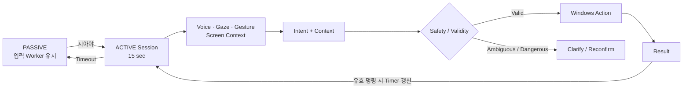
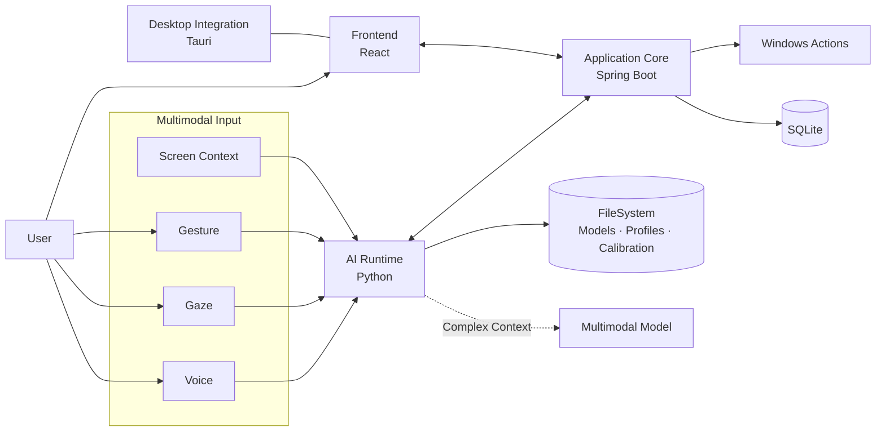

<div align="center">

# SIA

### 음성 · 시선 · 제스처 · 화면 Context를 함께 이해하는  
### Multimodal Desktop AI Assistant

사용자의 말을 듣는 데서 끝나지 않고,  
**무엇을 보고 있는지 · 어떤 제스처를 했는지 · 화면에 무엇이 있는지**를 함께 해석해 Windows 동작으로 연결합니다.

[🎨 Figma Design](https://www.figma.com/design/hLBjLhWQml0yTQxfRyf9U6/%ED%8A%B9%ED%99%94-%ED%94%84%EB%A1%9C%EC%A0%9D%ED%8A%B8?node-id=0-1&p=f&t=kic3KLFKuSlmAIfa-0)
&nbsp;·&nbsp;
[💻 Repository](https://lab.ssafy.com/s15-ai-image-sub1/S15P21D106)

</div>

---

## 👀 SIA는 무엇인가요?

기존의 음성 명령은 `"이거 저장해줘"`, `"저 창 닫아줘"`처럼 **대상이 생략된 표현**을 이해하기 어렵습니다.

SIA는 **Voice, Gaze, Gesture, Screen Context**를 하나의 사용자 의도로 결합합니다.  
사용자가 말한 내용뿐 아니라 시선이 향한 대상과 현재 화면 상태를 함께 활용해 지시 대상을 보완하고, 검증된 명령을 Windows 동작으로 연결합니다.

> **"시아야, 이거 저장해줘"**  
> Voice로 행동을 파악하고, Gaze와 Screen Context로 `"이거"`가 무엇인지 보완합니다.

---

## 💡 Why SIA?

SIA의 목표는 입력 장치를 하나 더 만드는 것이 아니라, **여러 입력을 함께 사용해 더 자연스럽고 안전하게 의도를 전달하는 것**입니다.

| 상황 | 단일 입력만 사용할 때 | SIA |
| --- | --- | --- |
| `"이거 저장해줘"` | 지시 대상이 불명확할 수 있음 | 음성 + 시선 + 화면 Context로 대상 보완 |
| 손을 자유롭게 쓰기 어려움 | 마우스·키보드 조작이 필요 | 음성·시선·제스처를 함께 활용 |
| 비슷한 발화나 동작이 감지됨 | 하나의 신호만으로 실행될 위험 | Wake Word, Session, 신뢰도·안전 검증 후 실행 |
| 화면 상황에 따라 같은 말의 의미가 달라짐 | 추가 설명이 필요 | 현재 화면 Context를 판단에 함께 사용 |

---

## ✨ Key Features

| | 기능 | 설명 |
| --- | --- | --- |
| 🎙️ | **Voice** | Wake Word와 음성 명령을 통해 사용자의 행동 의도를 입력받습니다. |
| 👀 | **Gaze Tracking** | 사용자가 바라보는 위치를 활용해 명령의 대상 후보를 좁힙니다. |
| ✋ | **Gesture Recognition** | 손 제스처를 직접 조작 또는 보조 입력으로 활용합니다. |
| 🖥️ | **Screen Context** | 현재 화면의 창과 객체 정보를 통해 실제 조작 대상을 확인합니다. |
| 🧠 | **Multimodal Intent** | Voice · Gaze · Gesture · Screen Context를 결합해 최종 의도를 판단합니다. |
| 🛡️ | **Safety Layer** | Session Gate, 사용자 검증, 신뢰도 기준, 재확인을 통해 오작동을 줄입니다. |

---

## 🎬 How SIA Works

SIA는 항상 명령을 실행 가능한 상태로 두지 않습니다.  
평상시에는 **PASSIVE**, 호출어가 인식되면 일정 시간 동안만 **ACTIVE** 상태로 전환합니다.



- PASSIVE에서도 Wake Word, VAD, 시선·제스처 관련 Worker는 유지됩니다.
- Wake Word가 인식되면 **15초 ACTIVE Session**이 시작됩니다.
- 유효한 명령이 처리되면 Session Timer를 갱신합니다.
- 시간이 만료되면 다시 PASSIVE로 전환됩니다.
- 불명확하거나 위험한 동작은 즉시 실행하지 않고 확인 절차를 거칩니다.

---

## 🧠 Multimodal Command Flow

예를 들어 사용자가 화면의 특정 대상을 바라보며 다음과 같이 말할 수 있습니다.

```text
"시아야, 이거 저장해줘"
```

```text
Voice
  └─ "저장해줘" → 수행하려는 행동

Gaze
  └─ 현재 바라보는 위치 → 대상 후보

Screen Context
  └─ 해당 위치의 창 / 객체 → 실제 대상 확인

Gesture
  └─ 필요한 경우 클릭·이동 등의 보조 입력

                ↓

        Multimodal Intent

                ↓

        Safety Validation

                ↓

          Windows Action
```

단순하고 명확한 명령은 가능한 한 로컬에서 처리하고,  
화면 문맥이나 지시 대상 해석이 복잡한 경우에는 멀티모달 모델을 활용해 판단을 보완합니다.

---

## 🏗️ Architecture

Backend를 **Application Core**로 두고 Frontend, AI Runtime, Windows 실행 영역을 연결합니다.



### Component Responsibilities

| Component | 주요 책임 |
| --- | --- |
| **Frontend** | Dashboard, 상태 표시, 설정, 캘리브레이션, 음성·제스처 관리, 결과 UI |
| **Backend** | Session/State 관리, 데이터 관리, 안전성 검증, Windows Action 연결 |
| **AI Runtime** | Wake Word, VAD/STT, 사용자 음성, 시선, 제스처, 멀티모달 입력 처리 |
| **Tauri** | Windows Desktop Application 통합 및 실행 구조 구성 |
| **SQLite** | 설정, 메타데이터, 로컬 경로 정보 관리 |
| **FileSystem** | 모델, 캘리브레이션, 사용자 프로필, 제스처 데이터 관리 |

> Tauri 기반 Desktop 통합은 현재 개발·통합 테스트 단계입니다.

---

## 🛡️ Safety by Design

SIA는 **"인식했다"와 "실행한다"를 분리**합니다.

| 안전 장치 | 역할 |
| --- | --- |
| **Wake Word + Session Gate** | 호출된 ACTIVE Session에서만 실행 판단 |
| **Speaker Verification** | 음성 프로필이 등록된 경우 사용자 검증 |
| **Gesture Confidence / Hold / Cooldown** | 순간적인 오인식을 실제 명령으로 처리하는 문제 완화 |
| **Context Validation** | 입력 신호와 현재 화면 상황이 일치하는지 확인 |
| **Unknown Handling** | 의도를 확정하기 어려우면 실행하지 않음 |
| **Reconfirmation** | 위험도가 높은 동작은 사용자에게 재확인 |
| **Safe File Handling** | 삭제 동작은 가능한 경우 휴지통을 우선 활용 |

---

## 🧰 Tech Stack

| Area | Technology | Role |
| --- | --- | --- |
| **Desktop** | Tauri | Windows Desktop Application 통합 |
| **Frontend** | React | Dashboard 및 사용자 인터페이스 |
| **Backend** | Spring Boot | Application Core, Session, Safety, Action |
| **AI Runtime** | Python | Voice · Gaze · Gesture 처리 |
| **Multimodal** | Gemini | 복합 화면 Context 및 지시 대상 판단 보완 |
| **Data** | SQLite + FileSystem | 설정·메타데이터 및 모델·프로필 저장 |
| **Platform** | Windows | 최종 실행 환경 |

---

## 🎨 Design

SIA의 프로그램 UI/UX는 **Figma 디자인 문서**를 기준으로 관리합니다.

### [→ SIA Figma Design 바로가기](https://www.figma.com/design/hLBjLhWQml0yTQxfRyf9U6/%ED%8A%B9%ED%99%94-%ED%94%84%EB%A1%9C%EC%A0%9D%ED%8A%B8?node-id=0-1&p=f&t=kic3KLFKuSlmAIfa-0)

README에는 프로젝트의 핵심 구조만 남기고, 구체적인 화면 설계와 UI 흐름은 Figma를 기준으로 확인할 수 있도록 분리했습니다.

---

## 📚 Project Documents

README는 프로젝트를 처음 보는 사람이 빠르게 이해하기 위한 **진입점**으로 유지하고, 상세 문서는 별도로 관리합니다.

| 문서 | 관리 위치 | 내용 |
| --- | --- | --- |
| **Program Design** | Figma | UI/UX, 프로그램 화면 설계 |
| **Project Overview** | Notion | 프로젝트 배경, 목표, 핵심 기능 |
| **Requirements** | Notion | 기능·비기능 요구사항 |
| **Progress** | Notion | 파트별 구현 및 통합 진행 상황 |
| **Daily Scrum** | Notion | 당일 작업 및 통합 일정 |
| **API Specification** | Repository Docs | FE/BE 등 인터페이스 명세 |
| **Protocol** | Repository Docs | 모듈 간 통신 규약 |

> 세부 설계와 개발 규칙을 README에 모두 넣기보다, README에서는 프로젝트의 핵심만 보여주고 상세 내용은 원문 문서로 분리합니다.

---

## 👥 Team Underdog

| 이름 | 담당 | 주요 역할 |
| --- | --- | --- |
| **김현호 ⭐** | Team Leader · INFRA · Integration · QA | 시스템 아키텍처/통신 흐름, FE·BE·AI 통합, 실행·배포 구조, E2E QA |
| **김도이** | AI · FE | 동작·시선 인식 파이프라인, AI/FE 연동 |
| **김수경** | FE | Dashboard, Custom Gesture, Log 등 UI/UX |
| **백화진** | BE | 로컬 데이터 구조, Application Core, Windows Backend 연동 |
| **안건석** | AI | Voice Pipeline, Wake Word 모델 학습·검증 |
| **이재훈** | AI | AI Runtime 통신, Multimodal Decision Flow |

---

## 🌿 Development Workflow

기능 단위의 Branch와 Merge Request를 통해 파트별 개발 내용을 통합합니다.

```text
master
  └── development
        ├── dev/fe
        ├── dev/be
        └── dev/ai
              └── feature/S15P21D106-{issue}-{slug}
```

README에는 핵심 흐름만 표시하며, Commit Convention과 MR 규칙 등 세부 협업 규칙은 팀 개발 문서에서 관리합니다.

---

## 🚀 Getting Started

SIA는 최종 사용자가 별도의 개발 환경을 구성하지 않아도 사용할 수 있도록  
**Windows 실행 파일(`.exe`) 형태로 GitLab Release를 통해 배포합니다.**

### 1. Download

프로젝트의 **GitLab Releases** 페이지에서 최신 버전을 확인하고 `.exe` 파일을 다운로드합니다.

[→ GitLab Releases](https://lab.ssafy.com/s15-ai-image-sub1/S15P21D106/-/releases)

### 2. Run

다운로드한 실행 파일을 실행합니다.

```text
SIA.exe
```

별도의 Frontend, Backend, AI Runtime을 각각 실행할 필요 없이  
Desktop Application에서 필요한 구성 요소를 함께 실행하고 관리하는 구조를 목표로 합니다.

### 3. First Launch

최초 실행 시 로컬에 필요한 모델이나 사용자 데이터가 없는 경우  
필요한 리소스를 확인하고 준비합니다.

```text
실행
 └─ 필요한 리소스 확인
      ├─ 존재함 → 기존 데이터 사용
      └─ 없음   → 필요한 모델/데이터 준비
```

이후 설정된 사용자 정보, 캘리브레이션 데이터, 모델 파일은 로컬에 저장되어 재사용됩니다.

### 4. Start Using SIA

SIA가 실행된 상태에서 Wake Word를 호출하면 ACTIVE Session이 시작됩니다.

```text
"시아야"
    ↓
ACTIVE Session
    ↓
Voice · Gaze · Gesture · Screen Context
    ↓
Intent 판단 및 Safety Validation
    ↓
Windows Action
```

> 배포 버전과 실행 방법은 GitLab Release Notes를 기준으로 관리합니다.

---

<div align="center">

### SIA

**Voice · Gaze · Gesture · Screen Context**

SSAFY 특화 프로젝트 · Team **Underdog**

</div>
