<p align="center">
  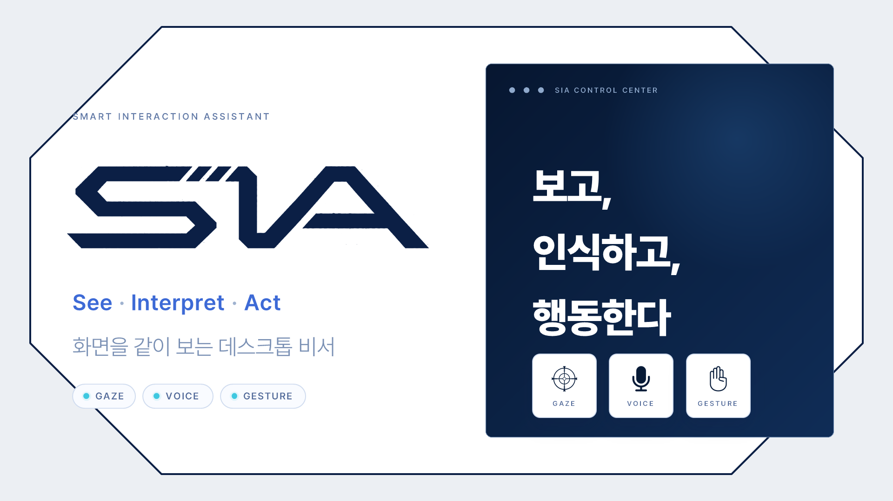
</p>

# SIA (Smart Interaction Assistant) — 화면을 같이 보는 데스크톱 비서

> **보고(See), 인식하고(Interpret), 행동한다(Act).**
> 시선·음성·제스처를 **발화 시작이라는 한 순간**으로 묶어, "이거 저장해줘"처럼 화면 위 대상을 가리키는 말을 알아듣고 실행하는 Windows 로컬 비서입니다.

| 항목 | 내용 |
|---|---|
| 기간 | 2026.08.10 ~ 2026.09.28 (7주) |
| 팀 | SSAFY 15기 특화 프로젝트 D106 (6명) |
| 형태 | Windows 설치형 데스크톱 앱 — AI · Backend · Frontend 3프로세스를 Tauri 셸이 하나로 묶음 |
| 시연 | [▶ 시연 영상 (1분 54초)](assets/demo.mp4) |

<p align="center"><a href="assets/demo.mp4">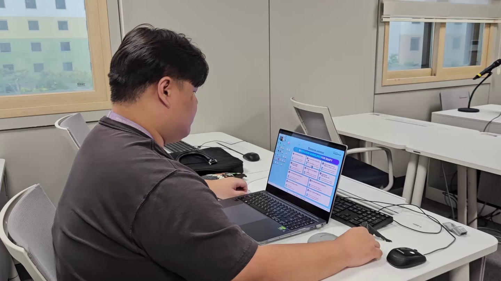</a></p>

<br>

## 1. 개요

기존 음성 비서는 말은 잘 알아듣지만 **화면을 못 봅니다.** 기사를 보며 "이 기사 3줄 요약해줘"라고 하면 "어떤 기사를 말씀하시는 건가요?"라고 되묻습니다. SIA는 사용자가 **어디를 보고 있었는지**(시선), **무엇이 떠 있는지**(화면·DOM), **무슨 말을 했는지**(음성), **어떤 손짓을 했는지**(제스처)를 같은 순간 기준으로 모아, "이거"가 무엇인지 스스로 찾아 실행합니다.

### ✨ 주요 특징

- 👁️ **시선은 커서가 아니라 기록** — 최근 3초의 응시점을 링버퍼에 쌓아 두고, 말이 시작되기 0.15초 전 응시점을 꺼내 씁니다. 커서는 절대 움직이지 않습니다.
- 🗣️ **1단 로컬 · 2단 LLM** — "계산기 열어줘" 같은 고정 명령은 GPU 음성 인식으로 **0.15초** 안에 로컬에서 끝냅니다. 지시어·화면 참조가 있는 말만 LLM으로 올립니다.
- 🔒 **호출어가 열면 ACTIVE 15초** — 호출어("시아야")와 **본인 목소리**가 확인된 15초 동안만 음성인식·LLM·실행이 돕니다. 그 밖은 PASSIVE(호출어 검사만).
- ✋ **제스처는 학습이 아니라 등록** — 세 번 촬영하면 즉시 내 손짓이 명령이 됩니다. 인식에는 영상이 아니라 손 관절 21개 좌표만 씁니다.
- 🖥️ **판단은 AI, 실행은 BE** — 실행 수단은 백엔드가 정의한 **도구 31개**뿐이고, 모든 요청이 한 관문을 지나 전수 기록됩니다.
- 🏠 **개인 데이터는 내 PC 안에** — 목소리 특징·시선 보정·제스처 좌표는 로컬 SQLite/npz에만 저장됩니다. 클라우드로 가는 것은 화면 이해가 필요한 순간의 재료뿐입니다.

### 👥 타겟 사용자

- 화면 위 대상을 두고 "이거", "저거"라고 말하고 싶은 PC 사용자
- 손이 자유롭지 않은 상황(요리·작업 중)에서 창·미디어·파일을 제어하려는 사용자
- 프라이버시 때문에 음성 비서를 꺼려 온 사용자 — 등록 데이터가 밖으로 나가지 않습니다

### 🎨 서비스 컨셉

**"같은 순간을 네 신호로 보면, '이거'가 풀린다."**
플랫폼: Windows 데스크톱 · 로컬 3프로세스(Python AI / Spring Boot BE / React FE) + Chrome 확장 · LLM은 Gemini(2단 판단에만 호출)

<br>

## 2. 기획 의도 / 배경

### 이런 경험, 있으신가요?

- 🗞️ *기사를 보며 "이거 요약해줘"라고 했더니, 비서가 "어떤 기사요?"라고 되묻는다*
- 🖼️ *화면에 뜬 사진을 저장하고 싶은데, 파일 이름도 경로도 모른다*
- 🎬 *영상 보다가 손이 젖어 있어 마우스를 못 잡는다*
- 🔐 *음성 비서를 쓰고 싶지만, 내 목소리가 어디로 가는지 불안하다*

### 시선만 붙이면 될 줄 알았습니다

처음엔 웹캠 시선으로 커서를 움직이려 했습니다. 세 개의 벽에 부딪혔습니다.

| 벽 | 실측 | 결론 |
|---|---|---|
| 오차 | 웹캠 시선 커서 약 **2.4cm**(~200px) 어긋남 — 닫기 버튼을 봐도 최소화·최대화까지 들어가는 거리 | 커서 방식 제외 |
| 시간차 | 말을 마칠 때쯤 시선은 이미 다른 곳 — 발화 시작 **0.15초 전**을 봐야 함 | 되감기 설계 |
| 상시 청취 | 호출어를 들으려면 마이크를 늘 켜야 하는데, 모든 모델을 늘 돌리면 부담이 크고 들리는 대로 움직임 | PASSIVE / ACTIVE 상태 분리 |

### SIA는

- **기준 시각을 발화 시작 하나로 고정**합니다 — 판단용 화면, 호출어 확인, 대상 창이 전부 이 한 점 기준이라 응답을 기다리는 사이 포커스가 바뀌어도 대상 창이 흔들리지 않습니다.
- **네 재료(음성 원본 · 전체 화면 · 응시 영역 · 로컬 텍스트)를 한 번의 호출**로 보내 음성 인식·명령 판단·"이거" 해석·실행 결정을 한 번에 끝냅니다.
- **남은 오차는 설계로 흡수**합니다 — 영역은 시선이 좁히고(화면 가로 32%), 대상은 LLM이 집습니다.

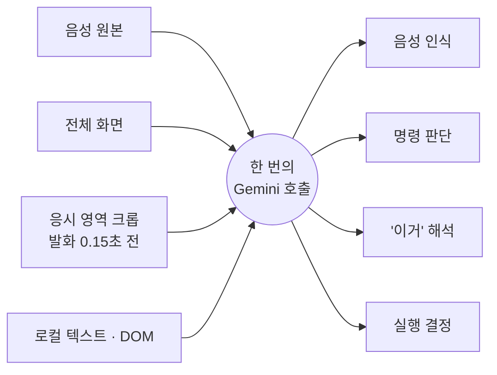
```mermaid
flowchart LR
    A[음성 원본] --> C
    B[전체 화면] --> C
    G[응시 영역 크롭<br>발화 0.15초 전] --> C
    T[로컬 텍스트 · DOM] --> C
    C((한 번의<br>Gemini 호출)) --> R1[음성 인식]
    C --> R2[명령 판단]
    C --> R3["'이거' 해석"]
    C --> R4[실행 결정]
```

<br>

## 3. 프로젝트 구성

```
SIA/
├── AI/                      # Python — 시선·음성·제스처 인식, 1단 라우터, 2단 LLM 판단 (assistant.py 단일 진입점)
│   ├── assistant.py         #   런타임 진입점 (BE 연결 → 인식 스레드 기동)
│   ├── brain.py             #   발화 파이프라인: VAD → 호출어 → 화자 → 1단 라우터 → 2단 LLM → BE 도구 호출
│   ├── gaze.py / deepgaze.py#   시선 특징(기하 12 + ETH-XGaze 2) · 링버퍼 · 교차검증 보정
│   ├── router.py            #   1단 로컬 라우터 (faster-whisper + 명령 사전 + 환각 가드)
│   ├── voice.py / speaker.py#   적응형 VAD · 화자 인증(SpeechBrain ECAPA)
│   ├── hands.py / custom_motion.py  # MediaPipe 손 랜드마크 · 커스텀 제스처 등록/DTW 판정
│   ├── evaluate_*.py        #   평가 스크립트 (STT 라우터 채점, 제스처 변형 888건 등)
│   └── test_*.py            #   단위·통합 테스트
├── Backend/                 # Spring Boot 4 — 실행 관문(MCP 도구 31개), 세션·프로필·통계, SQLite
│   ├── src/main/java/com/sia/assistant/
│   │   ├── ws/ · wsroutes/  #   /ws/agent · /ws/fe · /ws/ext 허브 (메시지 59종)
│   │   ├── mcp/ · mcp/tools/#   ToolCatalog · ToolGate · RefResolver — 실행 관문
│   │   ├── control/         #   JNA 창 제어 · SendInput · 앱 실행 · 파일 저장 · 휴지통
│   │   ├── session/         #   세션 타이머 (BE 소유, ACTIVE/PASSIVE push)
│   │   └── profile/ · registration/ · logging/ …
│   └── docs/                #   API명세서 · 프로토콜 · ERD
├── Frontend/                # React 19 + Vite — 온보딩(시선 보정·목소리 등록) · 대시보드(제스처·시선·설정·기록)
├── Extension/               # Chrome 확장 (MV3) — 활성 탭 본문(DOM) 공급 · 탭 열기
├── Integration/             # Tauri v2 셸 — BE(jpackage)·AI(PyInstaller) sidecar 오케스트레이션, Inno Setup 설치본
├── Docs/                    # 트러블슈팅 기록 (STT 1단 라우터, 제스처 정적/동적 검증, 호출어 판정 비교 …)
└── assets/                  # README 이미지·GIF·시연 영상
```

<br>

## 4. 기술 스택

### ▣ AI (Python 3.14)
- **손·얼굴 랜드마크**: MediaPipe 1.0.1 (Face Landmarker · Hand Landmarker · Gesture Recognizer)
- **시선**: 기하 특징 12차원(홍채·머리자세) + ETH-XGaze ResNet-18 시선 각도 2차원 → 2차 다항 Ridge 회귀, λ는 leave-one-point-out 교차검증으로 선택
- **음성 인식(1단)**: faster-whisper small · CUDA fp16 · beam 5 + 사전 기반 `initial_prompt` + 환각 가드
- **호출어**: openWakeWord 커스텀 모델(직접 학습 7.2만 개) · 사용자 지정 호출어는 5회 녹음 등록
- **화자 인증**: SpeechBrain 1.1.1 ECAPA 임베딩 — 호출어·명령 이중 인증
- **VAD**: 에너지 기반 적응형(최근 40초 소음 80% 백분위로 임계 갱신)
- **2단 판단**: Gemini (`google-genai`) — 음성 원본 + 전체 화면 + 응시 크롭 + DOM 텍스트를 한 호출로
- **런타임**: torch 2.11 cu128, sounddevice, pyautogui/pywin32, websockets

### ▣ Backend (Java 21)
- **Spring Boot 4.1.1** · Spring AI 2.0.1 (MCP Server, Streamable HTTP) · Spring Security · WebSocket
- **DB**: SQLite + Flyway, JdbcTemplate (JPA 미사용)
- **Windows 제어**: JNA 5.14 (User32 SendInput · EnumWindows · UIA · COM 레이트 바인딩)
- **API 표면**: WebSocket 3채널(agent/fe/ext) 메시지 59종 · REST 58개 · MCP 도구 31개 · springdoc OpenAPI
- **미디어**: JAVE2 번들 ffmpeg (제스처 등록 미리보기 webm)
- **테스트**: JUnit 380개

### ▣ Frontend
- **React 19 · Vite 5 · react-router 6 · Zustand** — 온보딩(카메라·마이크 장치 선택, 9점 시선 보정, 5문장 목소리 등록, 호출어 등록)과 대시보드(제스처 관리·시선 보정 프로필·사용 기록·설정)
- BE와 REST + WebSocket(`/ws/fe`)으로 미리보기 프레임·세션 상태·진행률 수신

### ▣ Chrome Extension
- Manifest V3 · `chrome.scripting` — `article/main/body` 순으로 본문 추출(20,000자 컷) · `browser.search` 탭 열기

### ▣ Integration / 배포
- **Tauri v2 (Rust)** 셸 — sidecar 기동 순서 제어(BE → `runtime.json` → AI), 트레이, 오버레이 토스트
- **BE jpackage**(전용 JRE 포함) · **AI PyInstaller onedir**(CUDA torch·시선 모델 포함) · **Inno Setup** 설치본

<br>

## 5. 아키텍처

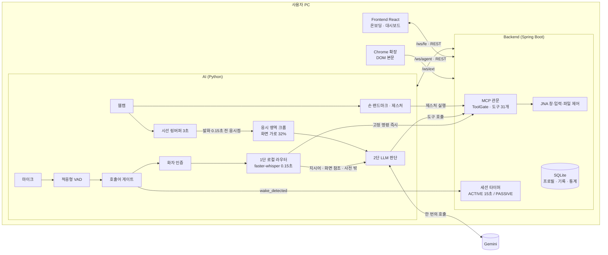
```mermaid
flowchart LR
    subgraph User["사용자 PC"]
        subgraph AI["AI (Python)"]
            CAM[웹캠] --> GZ[시선 링버퍼 3초]
            CAM --> HD[손 랜드마크 · 제스처]
            MIC[마이크] --> VAD[적응형 VAD] --> WW[호출어 게이트] --> SPK[화자 인증]
            SPK --> R1[1단 로컬 라우터<br/>faster-whisper 0.15초]
            R1 -- 지시어 · 화면 참조 · 사전 밖 --> R2[2단 LLM 판단]
            GZ -- 발화 0.15초 전 응시점 --> CROP[응시 영역 크롭<br/>화면 가로 32%]
            CROP --> R2
        end
        subgraph BE["Backend (Spring Boot)"]
            GATE[MCP 관문<br/>ToolGate · 도구 31개] --> WIN[JNA 창·입력·파일 제어]
            SES[세션 타이머<br/>ACTIVE 15초 / PASSIVE]
            DB[(SQLite<br/>프로필 · 기록 · 통계)]
        end
        FE[Frontend React<br/>온보딩 · 대시보드]
        EXT[Chrome 확장<br/>DOM 본문]
    end
    LLM[(Gemini)]

    R1 -- 고정 명령 즉시 --> GATE
    R2 -- 도구 호출 --> GATE
    R2 <-- 한 번의 호출 --> LLM
    HD -- 제스처 실행 --> GATE
    WW -- wake_detected --> SES
    EXT -- /ws/ext --> BE
    FE <-- /ws/fe · REST --> BE
    AI <-- /ws/agent · REST --> BE
```

**흐름**
1. PASSIVE: 시선 링버퍼·VAD·호출어 모델만 상시 동작. 호출어가 없는 말은 여기서 버려지고 음성인식·LLM은 부르지 않습니다.
2. 호출어 + 본인 목소리 확인 → BE가 세션을 ACTIVE(15초)로 엽니다. 세션의 주인은 BE 하나입니다.
3. 발화 시작 시각을 기준으로 전체 화면·응시 크롭·대상 창(HWND)을 고정합니다.
4. 1단 로컬 라우터가 고정 명령이면 즉시 BE 도구를 호출합니다(0.15초, 비용 0, 오프라인).
5. 지시어·화면 참조·사전에 없는 말은 네 재료(+DOM)를 한 번의 Gemini 호출로 보내 대상 특정·실행 결정을 받습니다.
6. 모든 실행은 BE의 MCP 관문(루프백 + Bearer 토큰 · 도구 31개 · 참조 기반 대상 지정 · 세션 검사 · 전수 기록)을 지납니다.

<br>

## 6. 주요 기능

#### 6-1. "이 기사 3줄 요약해줘" · "이거 저장해줘" — 시선 + 화면 + 음성 융합
- 발화 시작 0.15초 전 응시점을 중심으로 화면 가로 32%를 잘라 LLM에 함께 보냅니다. 브라우저면 확장이 본문(DOM)까지 보탭니다.
- LLM은 영역 안에서 대상을 특정하고 좌표만 돌려줍니다. 캡처와 저장은 BE가 합니다. 긴 줄글은 이미지 대신 텍스트로 저장합니다.

<p align="center">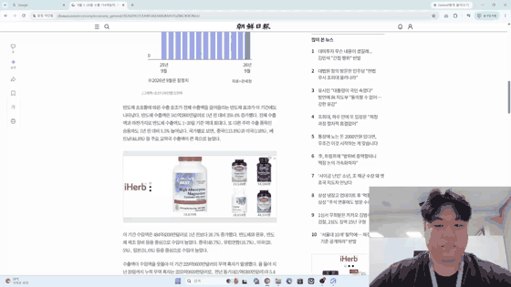</p>

| 발화 순간의 화면 (빨간 상자 = LLM이 고른 영역) | 실제 저장된 파일 |
|:---:|:---:|
| 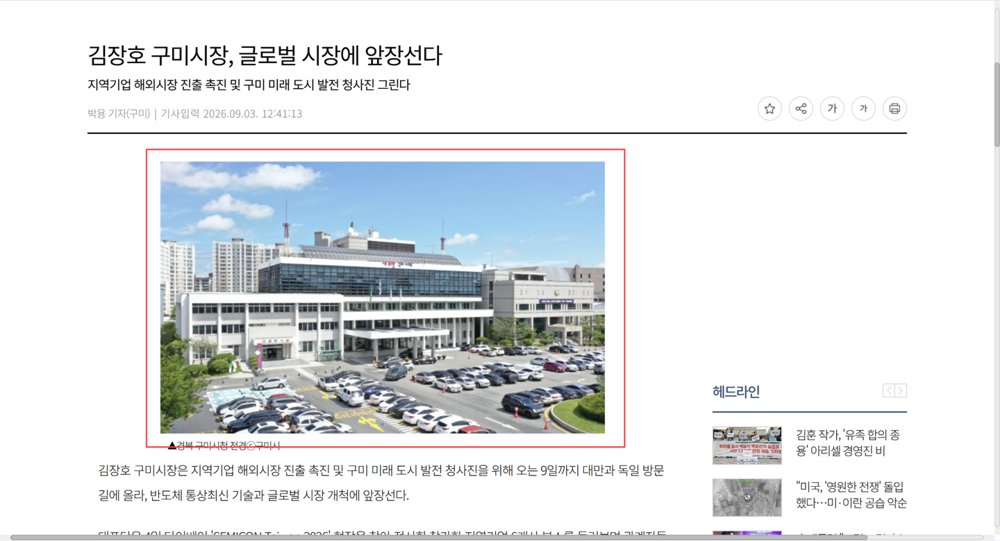 | 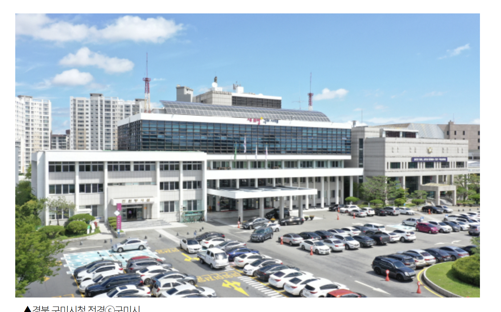 |

<p align="center">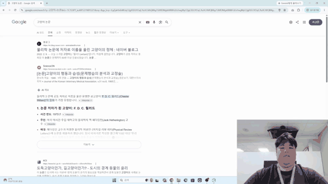</p>

* * *

#### 6-2. 시선 — 커서가 아니라 기록
- 9점 보정 · 프로필 최대 4개 · 교차검증 오차를 화면에 함께 표기
- 처음 보는 위치 오차: 기하 특징만 228px → 딥 특징 추가 183px → 교차검증 정규화 **156px(약 1.9cm), 32%↓** (실제 보정 3건 평균)
- 보정한 9개 점 위에서는 평균 25~49px(약 0.5cm)

| 단계 | 처음 보는 위치 오차 | 비고 |
|---|---:|---|
| 기하 특징만 | 228px | 회귀 기본형 |
| + 딥 특징 | 183px | 학습 오차↓, 검증 오차↑(과적합) |
| + 교차검증 정규화 | **156px (약 1.9cm)** | leave-one-point-out으로 λ 선택 |

<p align="center">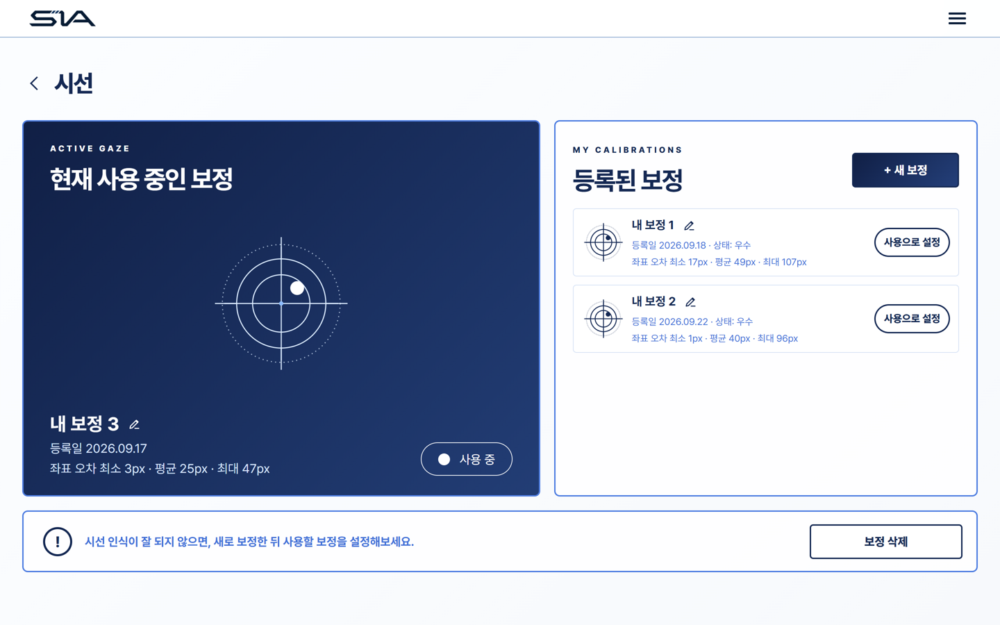</p>

* * *

#### 6-3. 음성 — 세 겹으로 거르고, 두 단으로 판단
- **소음**: 적응형 VAD — 유튜브 2시간 재생 중 불필요 처리 **45%↓**, 12초씩 이어지던 소음 오검출 **338 → 7**, 실제 호출 42/42 유지
- **단어**: 호출어 "시아야" 직접 학습(학습 7.2만 · 평가 1,513) — 놓침 **4.3%**; 사용자 호출어는 5회 녹음 후 **3초** 등록, 비호출어 310개 반응 0
- **사람**: 화자 인증 — 타인 호출 통과 88/92 → **14/92**, 녹음 재생 75/75 차단, 호출·명령 이중 인증으로 "본인 호출 + 타인 명령" 6/6 차단
- **1단 로컬 라우터**: 6~15초 → **0.15초**, 적중률 29% → **89%** (모델·프롬프트·환각 가드 재설계)

<p align="center">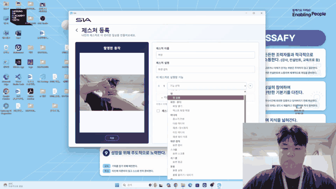</p>

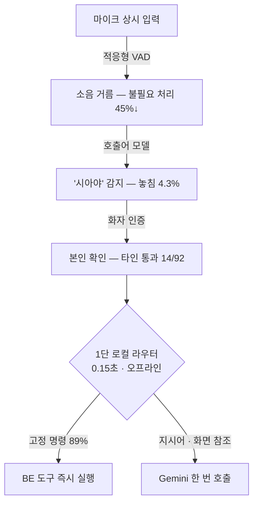
```mermaid
flowchart TD
    M[마이크 상시 입력] -->|적응형 VAD| N["소음 거름 — 불필요 처리 45%↓"]
    N -->|호출어 모델| W["'시아야' 감지 — 놓침 4.3%"]
    W -->|화자 인증| S["본인 확인 — 타인 통과 14/92"]
    S --> R{1단 로컬 라우터<br>0.15초 · 오프라인}
    R -->|고정 명령 89%| T[BE 도구 즉시 실행]
    R -->|지시어 · 화면 참조| L[Gemini 한 번 호출]
```

<p align="center">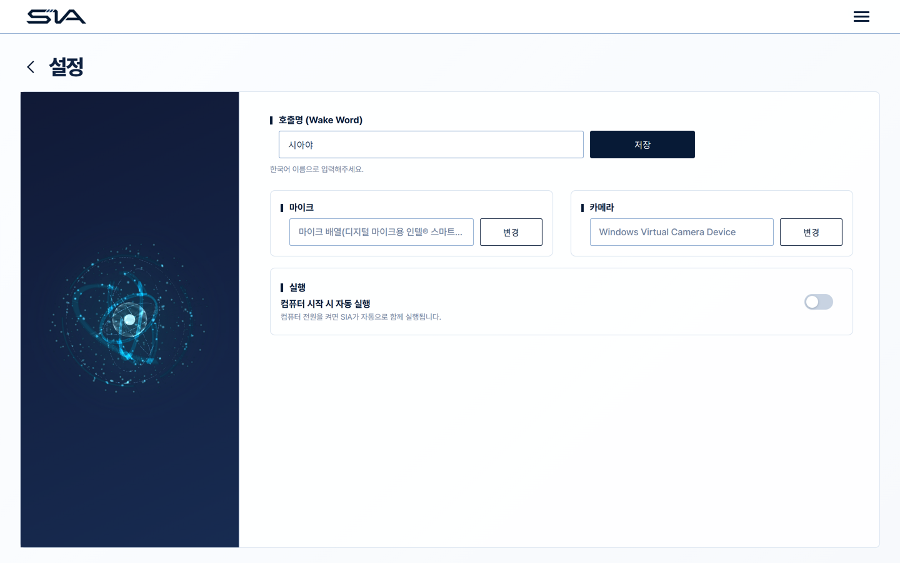</p>

* * *

#### 6-4. 제스처 — 학습이 아니라 등록
- 사전학습 모델의 손 관절 21개 좌표로 거리 비교 → 재학습 없이 세 번 촬영으로 즉시 사용
- 정적 제스처: 기울임·흔들림·노이즈 변형 888건 중 837건 통과(**94%**), 좌우 반전 비교·3D 판정 추가
- 동적 제스처: 제한된 시간 정렬(DTW) + 정지 구간 처리 — 인식률 **59% → 83%**, 반복 촬영 불일치 등록 거부 **75%↓**
- 같은 제스처가 컨텍스트에 따라 다르게 동작(기본: 앱 실행 / 유튜브: 재생·음소거·건너뛰기)

| 유튜브를 보며 제스처로 제어 | 커스텀 제스처 등록 (촬영 → 저장) |
|:---:|:---:|
| 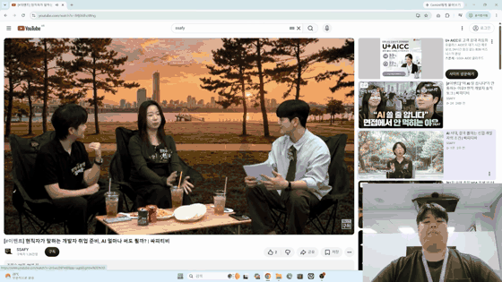 | 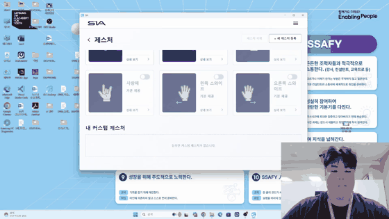 |

| 제스처 목록 | 커스텀 제스처 상세 — "빵야" → 화면 스크롤 |
|:---:|:---:|
| 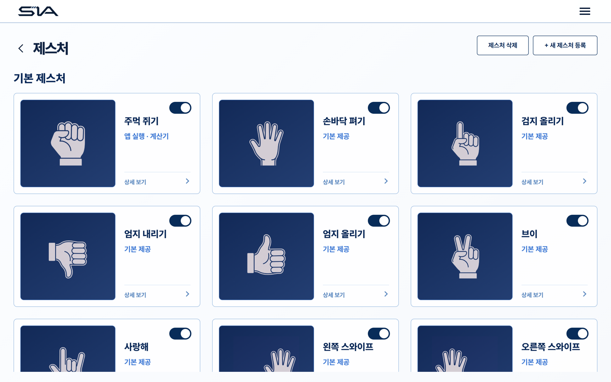 | 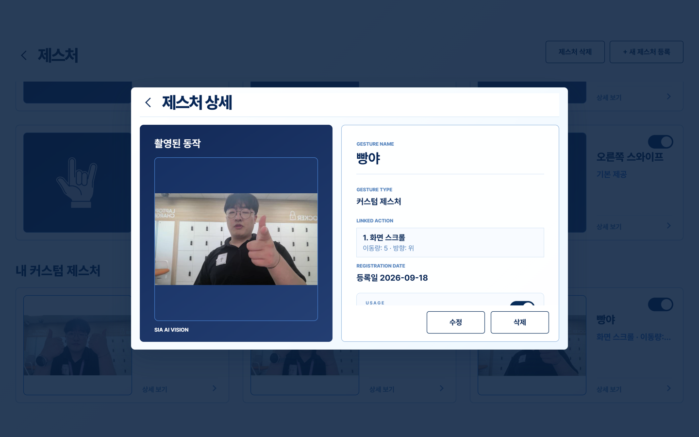 |

* * *

#### 6-5. 파이프라인 — 명령별 독립 처리
- 발화마다 남긴 로그(2,900+건)로 병목 발견: 느린 LLM 응답 뒤에 빠른 명령이 **최대 23.57초** 대기
- 명령마다 독립 스레드, 동시 최대 4개 — 빠른 명령은 기다리지 않음

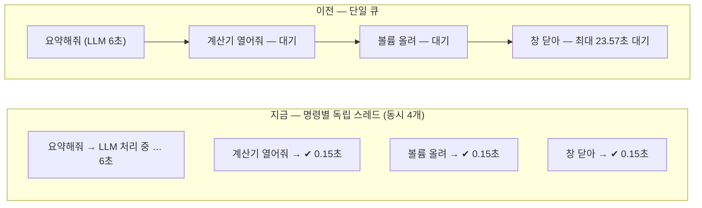
```mermaid
flowchart LR
    subgraph after["지금 — 명령별 독립 스레드 (동시 4개)"]
        direction TB
        a1["요약해줘 → LLM 처리 중 … 6초"]
        a2["계산기 열어줘 → ✔ 0.15초"]
        a3["볼륨 올려 → ✔ 0.15초"]
        a4["창 닫아 → ✔ 0.15초"]
    end
    subgraph before["이전 — 단일 큐"]
        direction LR
        b1["요약해줘 (LLM 6초)"] --> b2["계산기 열어줘 — 대기"] --> b3["볼륨 올려 — 대기"] --> b4["창 닫아 — 최대 23.57초 대기"]
    end
```

* * *

#### 6-6. 백엔드 — 다섯 겹의 방어
1. **네트워크**: 127.0.0.1 루프백 + Bearer 토큰 + 기본 잠김
2. **능력 상한**: 실행 수단은 정해진 도구 31개뿐(창·미디어·파일·시스템·화면 캡처·조회), 임의 명령 실행 없음
3. **대상 지정**: 창·파일은 BE가 발급한 참조로만 — 시스템 내부 주소 격리
4. **시간**: 호출어 없이는 조작 불가(세션 15초 안에서만), 예외는 조회 4가지뿐
5. **흔적**: 모든 요청이 한 관문을 지나 전수 기록(400일 보존)

* * *

#### 6-7. 온보딩 · 대시보드
- 온보딩: 호출명·장치 선택 → 5문장 목소리 등록 → 호출어 등록 → 9점 시선 보정
- 대시보드: 사용량·인식 정확도·응답 시간·자주 쓰는 프로그램 통계(하루/주차/한달/1년 드릴다운), 제스처 등록·매핑, 시선 보정·보이스 프로필(각 최대 4개), 설정(호출명·장치·자동 실행)

<p align="center">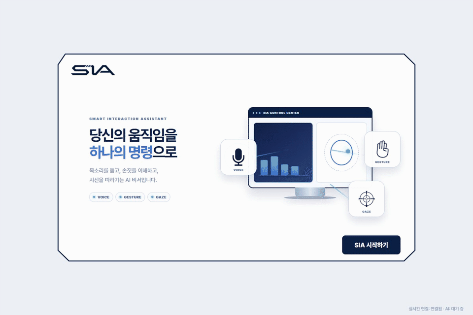</p>

| 시선 보정 시작 | 목소리 등록 | 호출어 등록 |
|:---:|:---:|:---:|
| 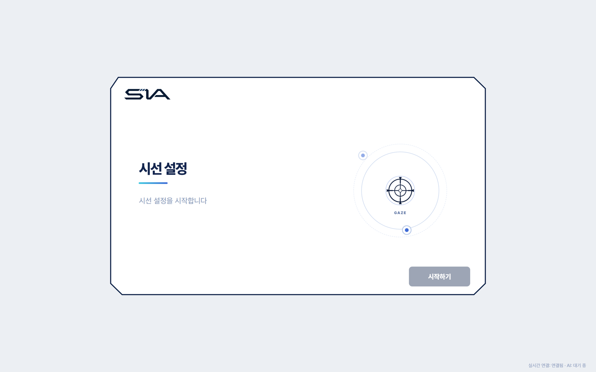 | 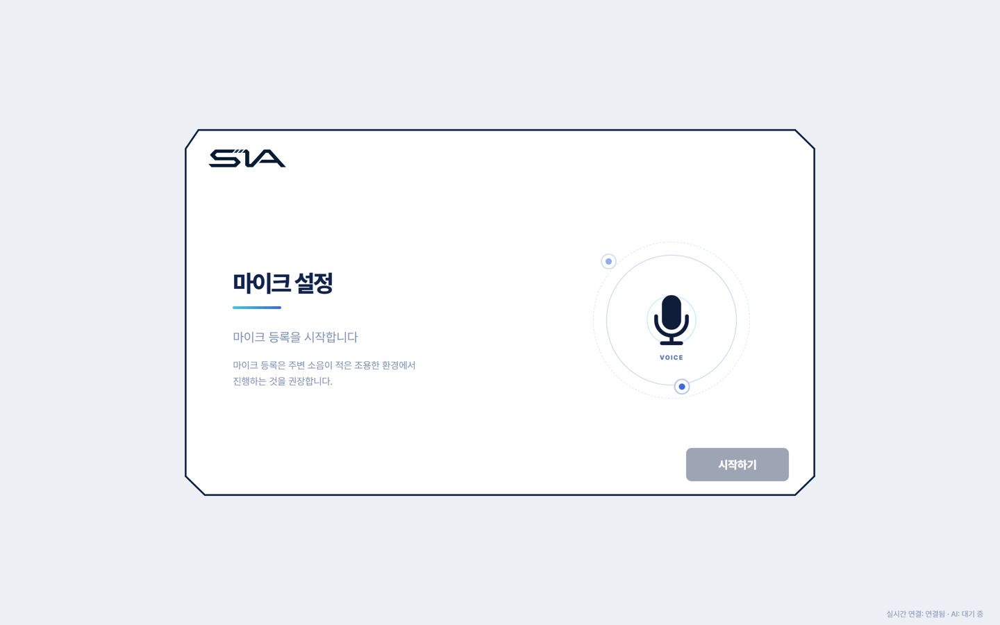 | 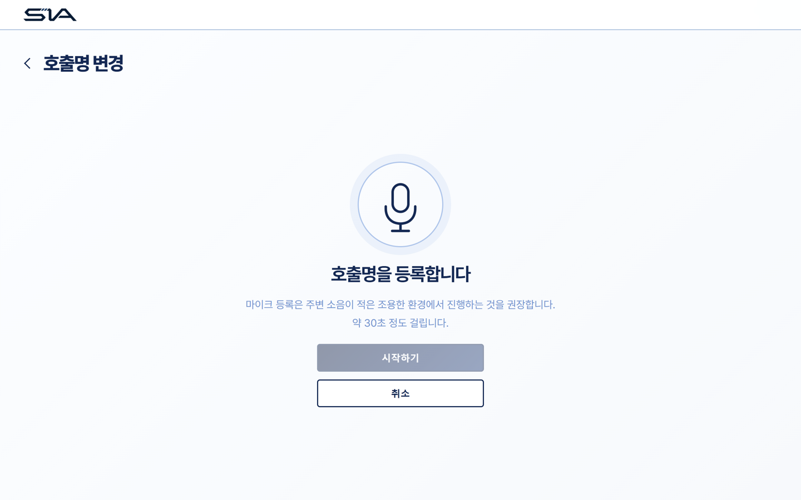 |

<p align="center">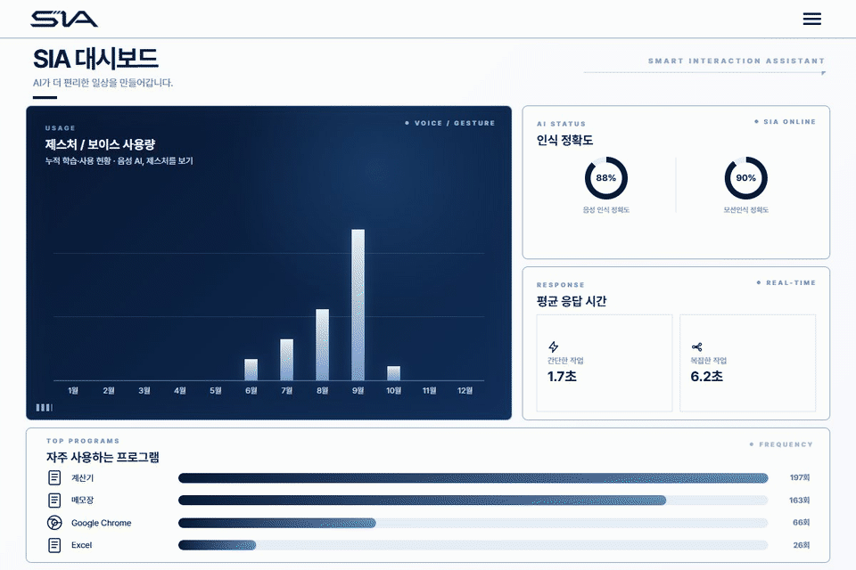</p>

| 제스처 목록 → 기본·커스텀 상세 | 시선 · 보이스 프로필 → 설정 |
|:---:|:---:|
| 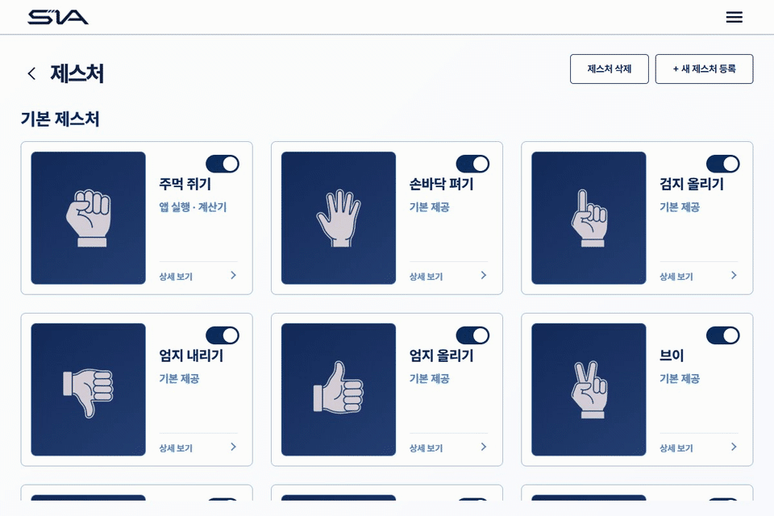 | 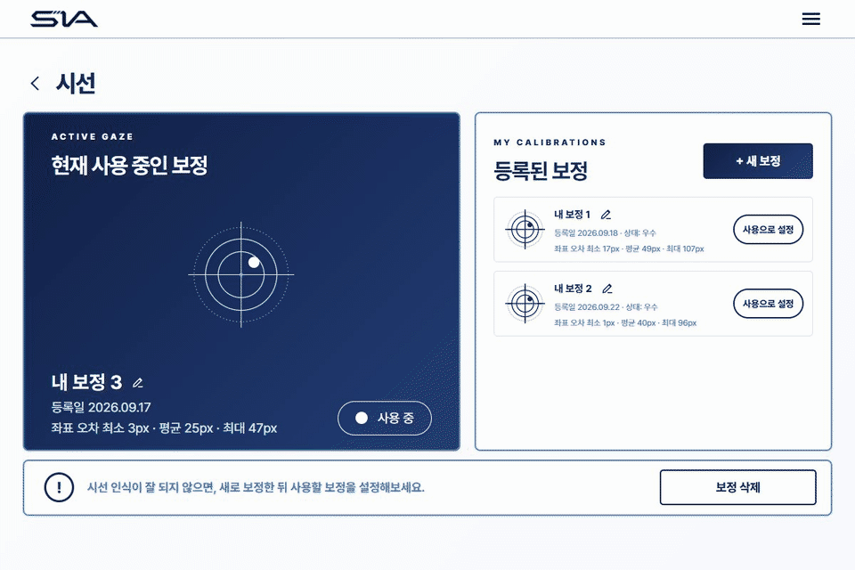 |

| 월별 사용량 | 평균 응답 시간 | 자주 사용하는 프로그램 |
|:---:|:---:|:---:|
| 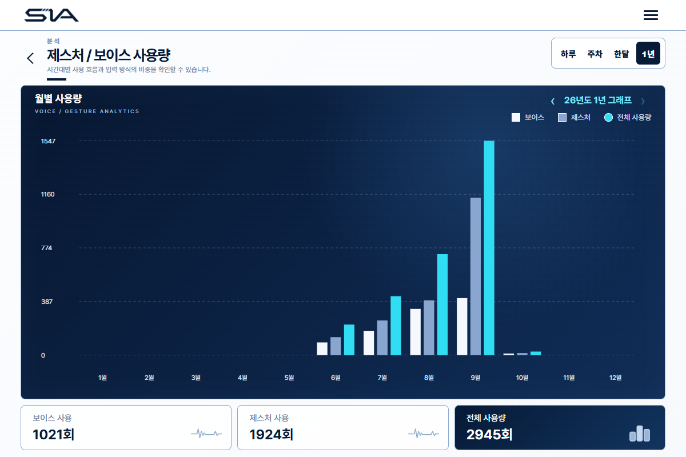 | 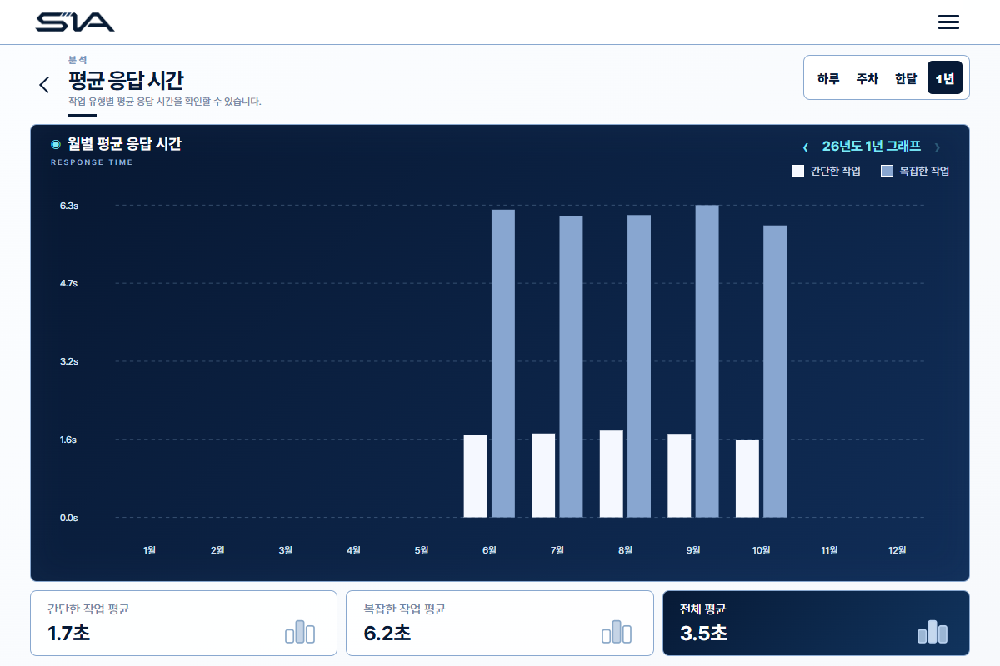 | 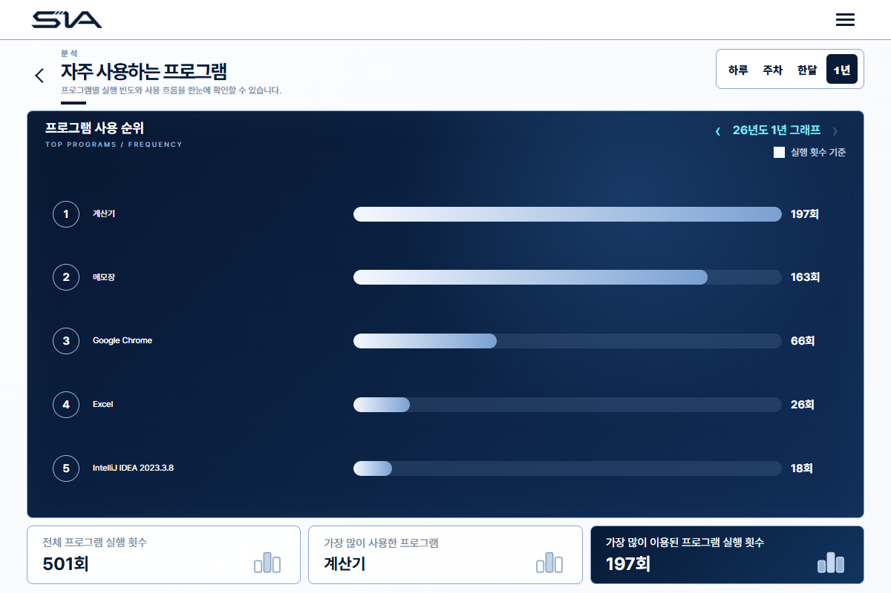 |

> 대시보드 화면의 수치는 시연용 데이터입니다. 측정값은 위 기능 설명의 수치를 기준으로 합니다.

<br>

## 7. ERD

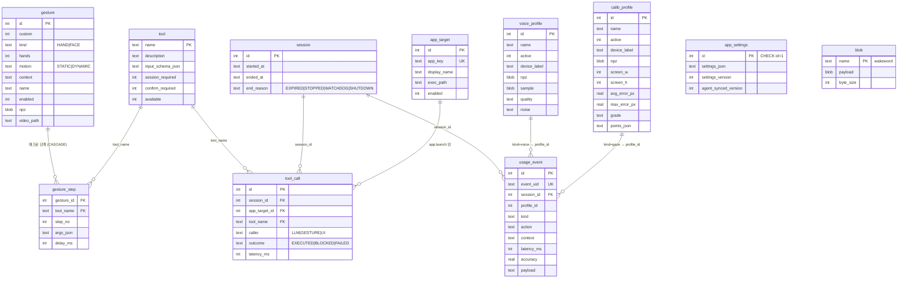
```mermaid
erDiagram
    gesture ||--o{ gesture_step : "매크로 단계 (CASCADE)"
    tool ||--o{ gesture_step : "tool_name"
    tool ||--o{ tool_call : "tool_name"
    session ||--o{ tool_call : "session_id"
    session ||--o{ usage_event : "session_id"
    app_target ||--o{ tool_call : "app.launch 만"
    voice_profile ||--o{ usage_event : "kind=voice → profile_id"
    calib_profile ||--o{ usage_event : "kind=gaze → profile_id"

    app_settings { int id PK "CHECK id=1"  text settings_json  int settings_version  int agent_synced_version }
    blob { text name PK "wakeword"  blob payload  int byte_size }
    voice_profile { int id PK  text name  int active  text device_label  blob npz  blob sample  text quality  text noise }
    calib_profile { int id PK  text name  int active  text device_label  blob npz  int screen_w  int screen_h  real avg_error_px  real max_error_px  text grade  text points_json }
    tool { text name PK  text description  text input_schema_json  int session_required  int confirm_required  int available }
    session { int id PK  text started_at  text ended_at  text end_reason "EXPIRED|STOPPED|WATCHDOG|SHUTDOWN" }
    app_target { int id PK  text app_key UK  text display_name  text exec_path  int enabled }
    gesture { int id PK  int custom  text kind "HAND|FACE"  int hands  text motion "STATIC|DYNAMIC"  text context  text name  int enabled  blob npz  text video_path }
    gesture_step { int gesture_id FK  text tool_name FK  int step_no  text args_json  int delay_ms }
    tool_call { int id PK  int session_id FK  int app_target_id FK  text tool_name FK  text caller "LLM|GESTURE|UI"  text outcome "EXECUTED|BLOCKED|FAILED"  int latency_ms }
    usage_event { int id PK  text event_uid UK  int session_id FK  int profile_id  text kind  text action  text context  int latency_ms  real accuracy  text payload }
```

- 전부 JdbcTemplate · Flyway V1~V3 — 상세는 [`Backend/docs/ERD.md`](Backend/docs/ERD.md)
- 보이스·시선 프로필은 각 최대 4개(사용 1 + 스톡 3), 기록 보존 400일

<br>

## 8. 트러블슈팅

### 이재훈 (AI 총괄 — 멀티모달 융합·판단 · 시선 · 파트 연동)

**문제**
- 고정 명령("계산기 열어줘")도 6~15초 뒤 실행 — 1단 로컬 라우터가 있어도 전부 LLM으로 승격. 운영 로그 1,331건 중 1단 적중 3건.
- 시선 회귀에 딥 특징을 더했더니 학습 오차는 줄고 검증 오차는 나빠짐(과적합).
- 느린 LLM 응답 뒤에 빠른 명령이 줄을 서 최대 23.57초 대기.

**원인**
- STT가 base 모델·CPU·int8·beam 1·어휘 힌트 없음으로 돌아 짧은 한국어 명령이 음절 단위로 무너짐(실녹음 46건 전부 전사 상이). ctranslate2가 `cublas64_12.dll`을 못 찾아 CUDA 로드 실패 → CPU 기본. 게이트 이중 검사와 명령 사전 결함이 겹침.
- 특징 차원이 14로 늘었는데 정규화 강도 λ가 고정.
- 발화 처리가 단일 큐라 LLM 왕복(4~6초) 동안 뒤 명령이 대기.

**해결**
- small·CUDA·fp16·beam 5 + 사전에서 생성한 `initial_prompt` + 환각 가드 → 1단 적중 18% → **89%**, STT 0.15초. `import torch`를 먼저 해 cuBLAS DLL을 공유하도록 하고, GPU 로드 실패 시 CPU 폴백. 평가 도구 `eval_prompt.py --tier1`로 실녹음 46 + 합성 25 클립을 오프라인 채점(오답 1건이면 실패). → [`Docs/AI_STT_1단라우터_트러블슈팅.md`](Docs/AI_STT_1단라우터_트러블슈팅.md)
- leave-one-point-out으로 λ를 고르는 `fit_base()` 도입 → 처음 보는 점 오차 228 → **156px**. 앱 표기 오차(학습 점 재예측)와 교차검증 오차를 둘 다 FE에 전달.
- 명령별 독립 스레드(동시 4개) + 발화 시작 시각으로 세션·대상 창 판정. 모든 개선은 `logs/utterances.jsonl` 발화 로그에서 시작.

### 안건석 (AI — 음성 파이프라인 · 호출어 · 화자 인증)
- **문제/원인/해결 작성 필요** — 후보: 적응형 VAD(유튜브 재생 중 12초 소음 오검출 338→7), 호출어 모델 직접 학습(7.2만/1,513), 사용자 지정 호출어 판정 방식 비교([`Docs/사용자_선정호출어_판정방식_비교.md`](Docs/사용자_선정호출어_판정방식_비교.md)), 화자 이중 인증

### 김도이 (AI — 제스처 인식)
- **문제/원인/해결 작성 필요** — 후보: 정적 제스처 변형 888건 스트레스와 좌우 반전·3D 판정([`Docs/static-2d-vs-3d-comparison.md`](Docs/static-2d-vs-3d-comparison.md)), 동적 제스처 DTW + 정지 구간(59→83%), 반복 촬영 불일치 등록 거부 75%↓

### 백화진 (Backend)
- **문제/원인/해결 작성 필요** — 후보: 세션 상태의 단일 소유(AI가 판정을 복제해 1초마다 확인하던 문제를 BE로 회수), Jackson 3 통일, MCP 관문·참조 기반 대상 지정, 확장 미연결 시 UIA 폴백

### 김수경 (Frontend)
- **문제/원인/해결 작성 필요** — 후보: HiDPI 환경 시선 보정 좌표(screenX) 불일치, 온보딩 카메라 거울 화면 통일, 대시보드 그래프 상태 유지

### 김현호 (팀장 — 시스템 통합 · 배포)
- **문제/원인/해결 작성 필요** — 후보: Tauri sidecar 기동 순서(BE → runtime.json → AI), NSIS/WiX 32비트 컴파일러의 mmap 한계로 Inno Setup 채택, CUDA torch·시선 모델 포함 설치본

<br>

## 9. 회고

### 이재훈
- **배운 점**: 개선은 측정에서 시작한다. 발화마다 남긴 로그가 없었다면 "왜 느린지"를 짐작만 했을 것이다. 잰 것만 말하고, 재는 방법이 다른 수치는 나란히 두지 않는다는 원칙이 발표와 Q&A 모두를 지켜 줬다.
- **아쉬운 점**: 시선 오차 재측정이 한 사람·노트북 한 대·보정 3건이다. 여러 사용자·해상도에서의 분포는 재지 못했다. 저장 캡처가 호출 시점이 아니라 실행 시점에 찍히는 한계도 남았다.
- **다음 개선**: 발화 순간 이미지를 그대로 넘기는 저장 경로, 배포판 GPU 미탑재 환경에서의 1단 라우터 지연(CPU 2.4초) 개선.

### 안건석 · 김도이 · 백화진 · 김수경 · 김현호
- **작성 필요** (배운 점 / 아쉬운 점 / 다음 개선)

<br>

## 10. 팀원 소개

| 이름 | 파트 | 담당 |
|---|---|---|
| **이재훈** | AI 총괄 | 멀티모달 융합·판단 파이프라인(`brain.py`) · 시선 인식(보정·링버퍼·되감기·교차검증) · 1단 로컬 라우터 최적화 · BE 연동(`be_link`)·파이프라인 병렬화 · 평가 도구 |
| **안건석** | AI | 음성 파이프라인 — 적응형 VAD · 호출어 모델 학습·사용자 지정 호출어 · 화자 인증 |
| **김도이** | AI | 제스처 인식 — 정적·동적 판정(DTW), 커스텀 제스처 등록, 변형 검증 |
| **백화진** | Backend | Spring Boot BE — MCP 실행 관문·도구 31개, 세션·프로필·통계, Windows 제어(JNA), Chrome 확장 |
| **김수경** | Frontend | 온보딩·대시보드 UI/UX, 시선·음성 등록 화면, 사용 기록 |
| **김현호** | 팀장 · 통합 | PM · Tauri 셸·sidecar 오케스트레이션 · 설치본(jpackage/PyInstaller/Inno Setup) · FE 설정 화면 |

<br>

## 실행

```bash
# Backend (작업 디렉터리는 반드시 Backend/)
cd Backend && ./gradlew bootRun          # 127.0.0.1:61015

# Frontend
cd Frontend && npm install && npm run dev -- --port 5173

# AI (GPU 권장 — requirements.txt 상단의 torch cu128 설치 안내 참고)
cd AI && python -m venv .venv && .venv\Scripts\pip install -r requirements.txt
.venv\Scripts\python assistant.py

# Chrome 확장: chrome://extensions → 개발자 모드 → Extension/ 폴더 로드
```

설치본 빌드는 [`Integration/README.md`](Integration/README.md) 참고 (`npm run build:sidecars` → Inno Setup).

<br>

## 문서

- [AI 트러블슈팅 — STT 1단 라우터](Docs/AI_STT_1단라우터_트러블슈팅.md) · [제스처 정적 2D/3D 비교](Docs/static-2d-vs-3d-comparison.md) · [동적 3D 일관성](Docs/dynamic-3d-consistency.md) · [호출어 판정 방식 비교](Docs/사용자_선정호출어_판정방식_비교.md)
- [Backend API 명세서](Backend/docs/API명세서.md) · [프로토콜](Backend/docs/프로토콜.md) · [ERD](Backend/docs/ERD.md)
- [Chrome 확장](Extension/README.md) · [Integration (Tauri)](Integration/README.md) · [AI 런타임](AI/README.md)
